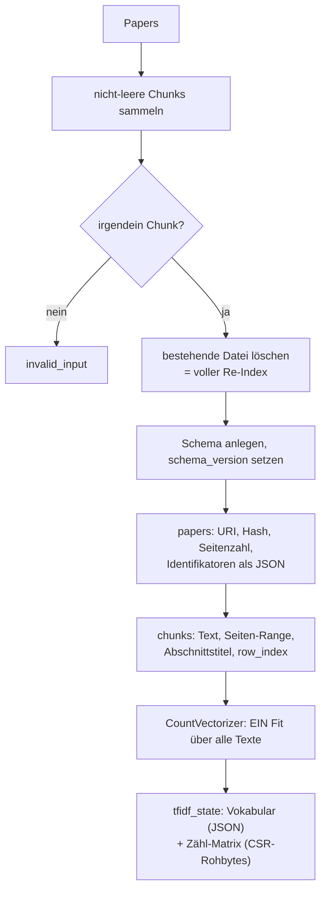
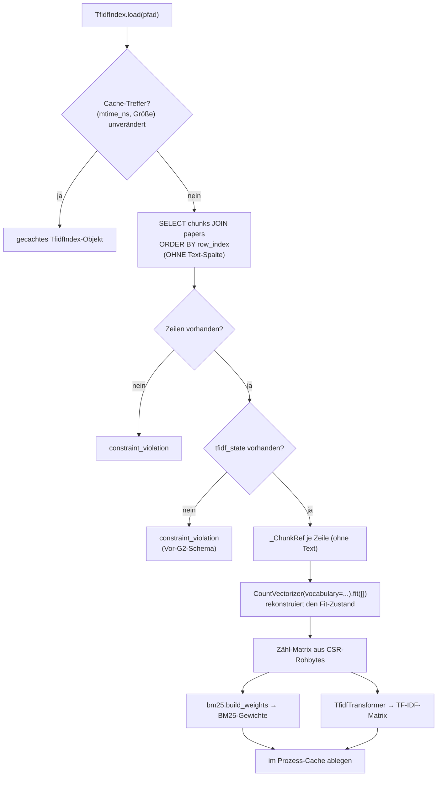
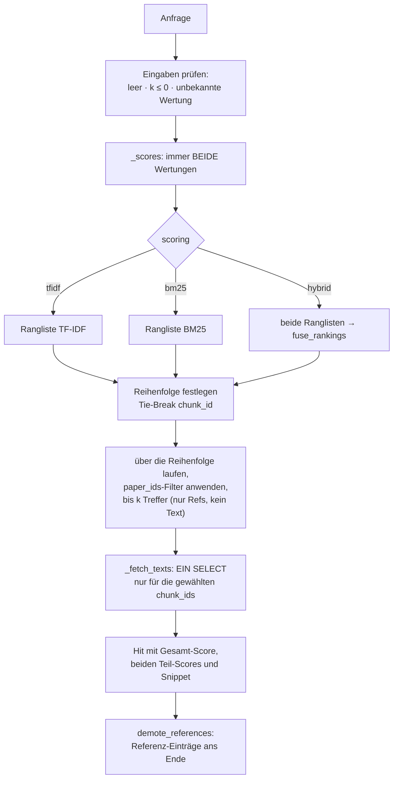
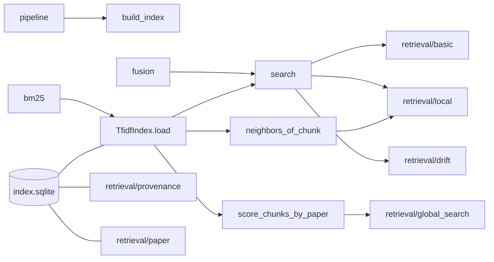

# Modul-Doku: `tfidf_index.py`

| Feld | Wert |
| --- | --- |
| **Modul** | `src/research_graphrag/indexing/tfidf_index.py` |
| **Paket** | `indexing` – Canonical JSON zum Offline-Hybrid-Index |
| **Phase** | 0b (eingeführt), 4 + 5 + 7 / A3 + A4 (erweitert), 13 / R2 (Dokumentart), 15 / G2 (Cache + persistierter Zustand), 10 / V4 (`score_chunks_by_paper`) |
| **Grundlagen** | [ADR 0005](../../../../docs/adr/0005-graphrag-index-backend-open.md), [ADR 0014](../../../../docs/adr/0014-hybrid-retrieval-bm25-tfidf-phase7.md), [ADR 0033](../../../../docs/adr/0033-response-latency-cache-and-persisted-tfidf-state-phase15.md), [ADR 0036](../../../../docs/adr/0036-global-community-ranking-over-member-chunks-phase10.md) |

---

## 1. Zweck

Das Herzstück des Retrievals: Es **schreibt** die Chunks samt Provenienz nach SQLite und
**lädt** sie zur Abfragezeit in zwei Bewertungsräume – TF-IDF-Kosinus und BM25 –, die es per
Rang-Fusion zu einer Wertung verbindet.

Die tragende Entwurfsentscheidung bleibt: **SQLite ist die alleinige Quelle der Wahrheit.** Seit
Phase 15 / G2 wird zusätzlich der **fertig tokenisierte Zustand** additiv persistiert (Vokabular
als JSON, Zähl-Matrix als Rohbytes fester Breite) – bewusst **kein** `pickle` eines
`scikit-learn`-Objekts, sondern reine Zahlen, aus denen `CountVectorizer`/`TfidfTransformer`
beim Laden denselben Raum **rekonstruieren**, den ein frischer Fit über denselben Text ergäbe.
Ein **Prozess-Cache** in `TfidfIndex.load()` erspart diese Rekonstruktion zusätzlich bei
unverändertem Index (Schlüssel: Dateigröße + Änderungszeit, nie eine Zeitspanne) – die
On-Read-Frische bleibt dadurch wörtlich erhalten. Details und Zahlen:
[ADR 0033](../../../../docs/adr/0033-response-latency-cache-and-persisted-tfidf-state-phase15.md).

## 2. Öffentliche Schnittstelle

| Symbol | Art | Aufgabe |
| --- | --- | --- |
| `build_index` | Funktion | Papers → SQLite-Index (voller Re-Index) |
| `TfidfIndex` | Klasse | Geladener Index mit `load()`, `search()`, `score_chunks_by_paper()`, `neighbors_of_chunk()`, `size` |
| `Hit` | Dataclass | Ein Treffer mit Provenienz, Gesamt-Score, beiden Teil-Scores, `identifiers`, `citation_key` und `document_kind` |
| `demote_references` | Funktion | Guardrail: sortiert Referenz-Einträge hinter die Volltext-Treffer |
| `Scoring` | Typ-Alias | `hybrid` · `tfidf` · `bm25` |
| `DEFAULT_SCORING` | Konstante | Die Standard-Wertung |
| `SCHEMA_VERSION` | Konstante | Version des Index-Schemas (**0.6.0**: additive Tabelle `tfidf_state` – Vokabular + Zähl-Matrix) |

## 3. Ablauf

### 3.1 Aufbau

`row_index` ist lückenlos und bestimmt später die Zeilenreihenfolge der Matrix – dadurch sind
Zeilenindex und Chunk fest verknüpft. Seit Phase 15 / G2 wird die Tokenisierung **hier, einmal**
durchgeführt statt bei jedem späteren Laden neu.

Der Index wird **immer vollständig** neu gebaut. Bei dieser Korpusgröße ist das günstiger als
inkrementelle Pflege und schließt Inkonsistenzen zwischen Text und Vektorraum aus.

### 3.2 Laden

**Rekonstruktion statt Neu-Fit.** Der pro Aufbau persistierte Vokabular-/Zähl-Zustand macht das
frühere Tokenisieren beim Laden überflüssig; `CountVectorizer`/`TfidfTransformer` bauen denselben
Raum aus reinen Zahlen nach, den ein frischer Fit ergäbe (byte-genau nachgewiesen, siehe
[ADR 0033](../../../../docs/adr/0033-response-latency-cache-and-persisted-tfidf-state-phase15.md)).
BM25 bekommt weiterhin dieselben rohen Termhäufigkeiten und dasselbe Vokabular wie TF-IDF – ein
Unterschied zwischen den Verfahren ist damit garantiert ein Unterschied der Bewertung, nicht der
Vorverarbeitung.

**Der Prozess-Cache ist über den Dateizustand ungültig, nie über eine Zeitspanne.** Ein nach dem
Laden neu gebauter Index (atomarer Swap) wirkt beim nächsten Aufruf sofort – ohne Serverneustart,
ohne Wartezeit.

Es werden bewusst **keine Stoppwörter** entfernt: Für exakte Fakt-Fragen können auch häufige
Wörter tragend sein. Die Keyword-Politik wirkt an anderer Stelle, als Nachfilter.

### 3.3 Suche

Vier Details, die das Verhalten prägen:

**Beide Score-Vektoren werden immer berechnet.** Das kostet wenig und sorgt dafür, dass jeder
Treffer seine Teil-Scores ausweisen kann – unabhängig davon, welche Wertung gewählt wurde.

**Der Filter wirkt nach der Sortierung.** `paper_ids` schneidet nicht den Suchraum, sondern
überspringt beim Einsammeln. Die Rangfolge innerhalb der gefilterten Menge ist dadurch identisch
zur ungefilterten Rangfolge – genau das brauchen Local-Fan-out und DRIFT.

**Der Score der Hybrid-Wertung ist ein Fusionswert.** Er stammt aus Rängen, nicht aus
Ähnlichkeiten, und ist nur innerhalb einer Antwort vergleichbar.

**Referenz-Einträge sind nachrangig, nicht ausgeschlossen.** `demote_references` sortiert sie
ans Ende der fertigen Trefferliste – ihr Score ist mit dem eines Volltext-Chunks nicht
vergleichbar, weil die Längennormierung kurze Texte bevorzugt. Die **Auswahl** der Top-k bleibt
unangetastet: Ohne passenden Volltext steht der Referenz-Eintrag weiterhin vorn. Ein stubfreier
Korpus merkt von der Regel nichts (die Sortierung ist dann die Identität), weshalb sie die
eingefrorenen Baselines nicht bewegt ([ADR 0031](../../../../docs/adr/0031-reference-contract-and-guardrail-phase13.md)).

**Der Text wird erst für die fertige Top-k-Auswahl nachgeladen** (`_fetch_texts`, seit Phase 15 /
G2) – nie für alle Chunks des Index. `_ChunkRef` selbst trägt keinen Text mehr; die Wertung
braucht ihn nicht.

### 3.4 Chunk-Bewertung ohne Top-k-Grenze (`score_chunks_by_paper`)

Seit Phase 10 / V4 ([ADR 0036](../../../../docs/adr/0036-global-community-ranking-over-member-chunks-phase10.md))
teilt sich `search` seinen Bewertungskern mit einer zweiten Methode: `score_chunks_by_paper`
liefert **alle** positiv bewerteten Chunks einer Anfrage, gruppiert nach Paper – ohne
Top-k-Grenze und ohne den Text nachzuladen. Beide Methoden rufen intern denselben privaten
Baustein (`_all_scores`, ein Query-Vektor, eine Fusion) auf; `search` sortiert und begrenzt
zusätzlich, `score_chunks_by_paper` gruppiert nur. Grundlage für Aggregationen über
Chunk-**Mengen** statt über Einzeltreffer – bislang der einzige Aufrufer ist das
Community-Ranking in `retrieval/global_search.py`.

### 3.5 Chunk-Nachbarschaft

`neighbors_of_chunk` bewertet einen **Chunk gegen alle anderen** und bleibt bewusst beim reinen
Kosinus: BM25 ist ein Anfrage-Dokument-Modell und für Dokument-Dokument-Ähnlichkeit nicht
gedacht. Der Ausgangs-Chunk wird ausgeschlossen; `score_bm25` ist in diesen Treffern `0.0`.
Die Guardrail und das Nachladen der Texte wirken hier genauso wie in `search`.

## 4. Zusammenspiel

Andere Leser der Index-Datei – `provenance`, `paper`, `citations`, `graph_index` – greifen
**direkt per SQL** zu und rekonstruieren den Vektorraum nicht. Nur Modi, die tatsächlich
Ähnlichkeit brauchen, zahlen die Ladekosten.

## 5. Fehler und Grenzfälle

| Situation | Fehlercode |
| --- | --- |
| keine indexierbaren Chunks beim Aufbau | `invalid_input` |
| leere Anfrage, `k <= 0`, unbekannte Wertung | `invalid_input` |
| `score_chunks_by_paper`: leere Anfrage, unbekannte Wertung (kein `k`) | `invalid_input` |
| Index-Datei fehlt | `not_found` |
| Index vorhanden, aber ohne Chunks | `constraint_violation` |
| Index vorhanden, aber ohne `tfidf_state` (Vor-G2-Schema) | `constraint_violation` |
| `neighbors_of_chunk` mit unbekannter Chunk-ID | `not_found` |

Kein Treffer ist **kein** Fehler: Die Suche liefert eine leere Liste. Ein Chunk erscheint nur,
wenn mindestens ein Verfahren ihn positiv bewertet.

## 6. Determinismus

- Feste Zeilenreihenfolge über `row_index`.
- Sortierung nach Score **mit Tie-Break über `chunk_id`** – bei Gleichstand entscheidet nie die
  Speicherreihenfolge.
- Der Vektorraum entsteht aus dem einmalig persistierten Vokabular-/Zähl-Zustand; gleicher Bau
  ergibt gleiche Matrizen – unabhängig davon, ob ein Cache-Treffer vorliegt oder neu geladen wird
  (byte-genau geprüft, siehe [ADR 0033](../../../../docs/adr/0033-response-latency-cache-and-persisted-tfidf-state-phase15.md)).
- Identifikatoren werden mit sortierten Schlüsseln serialisiert.

## 7. Grenzen

- **Rein lexikalisch.** Ohne Embeddings findet der Index keine Synonyme; Paraphrasen sind die
  schwächste Fragenklasse.
- **Voller Neuaufbau.** Kein inkrementelles Update.
- **Der Prozess-Cache ist prozesslokal.** Mehrere getrennte Prozesse (z. B. mehrere CLI-Aufrufe
  hintereinander) teilen ihn nicht – nur ein langlebiger Prozess (MCP-Server) profitiert über
  mehrere Anfragen hinweg.
- **Kein Feld-Ranking.** Titel, Abschnitt und Fließtext werden gleich gewichtet.
