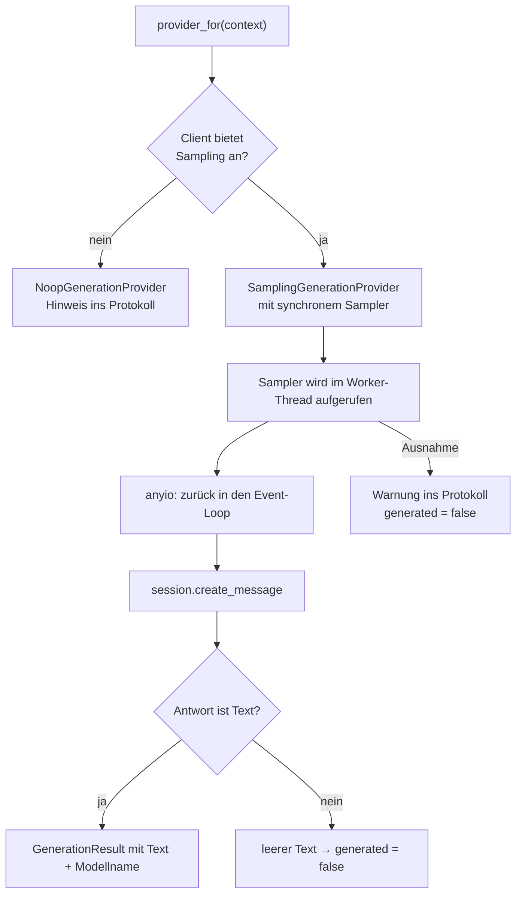
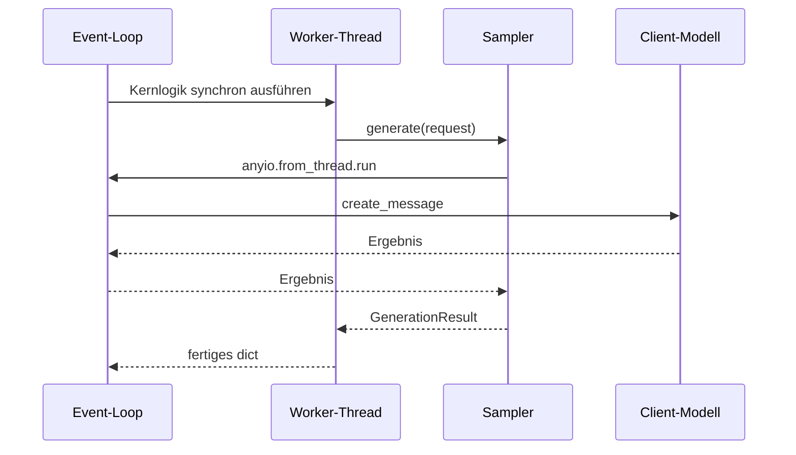
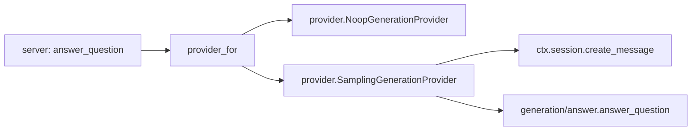

# Modul-Doku: `sampling.py`

| Feld | Wert |
| --- | --- |
| **Modul** | `src/research_graphrag/mcp_server/sampling.py` |
| **Paket** | `mcp_server` – MCP-Server über `stdio` |
| **Phase** | 7 / A1 |
| **Grundlagen** | [ADR 0004](../../../../docs/adr/0004-llm-bridge-via-mcp-sampling.md), [ADR 0012](../../../../docs/adr/0012-llm-bridge-and-answer-synthesis-phase7.md) |

---

## 1. Zweck

Die **Modell-Grenze** des Systems. Dieses Modul ist die einzige Stelle im gesamten Code, die
tatsächlich ein Sprachmodell anspricht – und zwar nie ein eigenes, sondern immer das des
verbundenen Clients.

Es übersetzt außerdem zwischen zwei Welten: Die Generierungslogik ist synchron, der Modellaufruf
ist asynchron.

## 2. Öffentliche Schnittstelle

| Symbol | Art | Aufgabe |
| --- | --- | --- |
| `provider_for` | Funktion | Liefert für die laufende Anfrage den passenden Generierungs-Port |

## 3. Ablauf

### Fähigkeit prüfen, nicht hoffen

Bevor irgendetwas versucht wird, wird die Sampling-Fähigkeit des Clients **abgefragt**. Kann der
Client es nicht, gibt es sofort den Noop-Port – kein Versuch, kein Timeout, kein Fehler. Die
Antwort degradiert sichtbar, und die Evidenz bleibt vollständig.

### Die Brücke zwischen synchron und asynchron

Das ist der technisch heikelste Teil:

Das Werkzeug lagert die synchrone Kernlogik in einen Worker-Thread aus; von dort reicht der
Sampler den Modellaufruf über `anyio` in den Event-Loop zurück.

Der Nutzen rechtfertigt den Aufwand: Die gesamte Generierungslogik bleibt synchron und lässt
sich mit einem einfachen Funktions-Stub prüfen – ohne Event-Loop, ohne Client, ohne Modell.

### Sampling darf niemals den Aufruf abbrechen

Jeder Fehler im Sampler wird abgefangen, protokolliert und in ein nicht generiertes Ergebnis
übersetzt. Das gilt für alle Ursachen: Der Client lehnt ab, das Modell antwortet nicht, es kommt
eine Nicht-Text-Antwort zurück.

Der Grund ist der Projektgrundsatz: Die Belege sind die eigentliche Leistung. Sie wegen einer
fehlgeschlagenen Formulierung zu verlieren wäre der schlechteste mögliche Ausgang.

Auch eine **Bild-Antwort** endet in leerem Text – ein Bild ist keine belegte Antwort.

### Der Prompt

Die Nutzernachricht enthält die Frage und den nummerierten Belegblock; der Zitier-Contract geht
als System-Prompt mit. Angefordert wird mit Temperatur null und einer Obergrenze für die Länge –
beide Werte sind Konstanten des Generierungs-Ports, nicht dieses Moduls.

### Keine Zugangsdaten, kein gebundenes Modell

Der Server kennt weder Anbieter noch Schlüssel. Er fragt das Modell, das der Client ohnehin
betreibt. Damit gibt es hier nichts, was in eine Konfigurationsdatei geraten könnte.

## 4. Zusammenspiel

Aufgerufen wird das Modul **nur** aus dem Werkzeug `answer_question`, und dort nur, wenn Sampling
ausdrücklich angefordert wurde.

## 5. Fehler und Grenzfälle

Keine `DomainError` – das Modul wirft grundsätzlich nicht.

| Situation | Ergebnis |
| --- | --- |
| Client ohne Sampling-Fähigkeit | Noop-Port, Hinweis im Protokoll |
| Client lehnt die Anfrage ab | `generated = false`, Warnung |
| Modell liefert Nicht-Text | leerer Text, `generated = false` |
| Modell liefert leeren Text | `generated = false` |
| Ausnahme im Sampler | abgefangen, `generated = false` |

## 6. Determinismus

Die Anfrage wird mit Temperatur null gestellt; mehr lässt sich von hier aus nicht erzwingen. Der
tatsächliche Nichtdeterminismus liegt beim Modell und ist am `generated`-Flag erkennbar.

> **Messhinweis:** Die Zeilenabdeckung dieses Moduls fällt niedriger aus, als sie tatsächlich ist
> – die eingesetzte Coverage-Messung sieht keinen Code, der in einem Worker-Thread läuft. Das ist
> ein Messartefakt, keine Testlücke.

## 7. Grenzen

- **Nur Text.** Andere Inhaltsarten werden verworfen.
- **Ein Versuch.** Keine Wiederholung, kein Ausweichmodell.
- **Keine Werkzeugaufrufe durch das Modell.** Der Sampling-Aufruf ist eine reine Textanfrage.
- **Kein Zeitlimit im Modul.** Ein Timeout obliegt dem Client bzw. dem Protokoll.
- **Nur `answer_question`.** Die übrigen Werkzeuge bleiben modellfrei – ausdrücklich
  ([ADR 0009](../../../../docs/adr/0009-mcp-server-stdio-phase5.md)).
