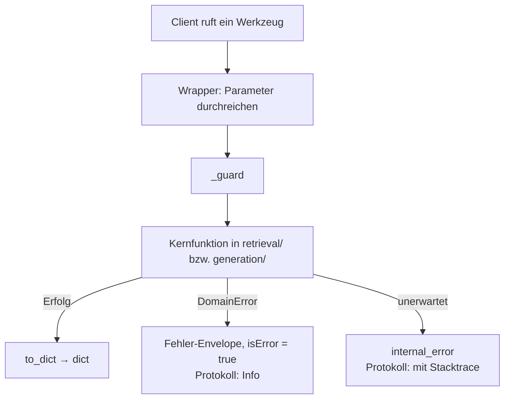
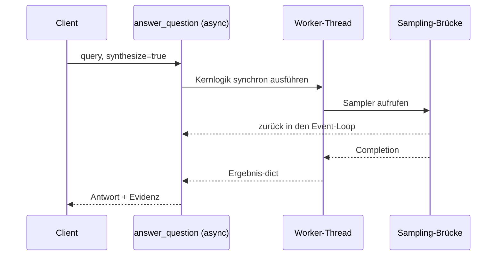
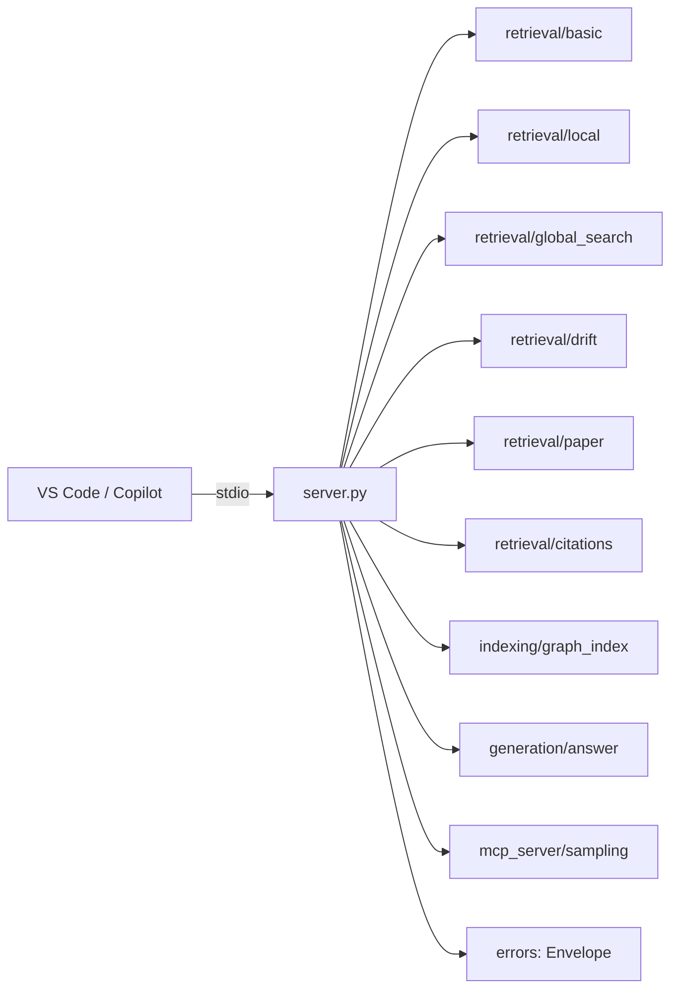

# Modul-Doku: `server.py`

| Feld | Wert |
| --- | --- |
| **Modul** | `src/research_graphrag/mcp_server/server.py` |
| **Paket** | `mcp_server` – MCP-Server über `stdio` |
| **Phase** | 5 (eingeführt), 7 / A1 + A2 (zwei Werkzeuge ergänzt), 12 / K1 (`get_reference` ergänzt) |
| **Grundlagen** | [ADR 0009](../../../../docs/adr/0009-mcp-server-stdio-phase5.md), [ADR 0012](../../../../docs/adr/0012-llm-bridge-and-answer-synthesis-phase7.md), [ADR 0025](../../../../docs/adr/0025-citable-paper-metadata.md) |

---

## 1. Zweck

Die **Außengrenze** des Systems: Hier werden neun Werkzeuge für GitHub Copilot registriert, hier
werden Fehler in eine strukturierte Ausgabe übersetzt, und hier wird der `stdio`-Transport
gestartet.

Der Server enthält **keine** Fachlogik. Jedes Werkzeug ist ein dünner Wrapper um eine Funktion aus
`retrieval/` oder `generation/` – ein eigenes Werkzeug-Verzeichnis gibt es bewusst nicht.

## 2. Öffentliche Schnittstelle

| Symbol | Art | Aufgabe |
| --- | --- | --- |
| `mcp` | Objekt | Die FastMCP-Instanz mit den registrierten Werkzeugen |
| `main` | Funktion | Startet den `stdio`-Transport |

Die neun Werkzeuge: `search_basic`, `search_local`, `search_global`, `search_drift`, `get_paper`,
`get_citations`, `get_reference`, `answer_question`, `list_topics`. Ihre Verträge stehen in
[`specs/`](../specs); die Werkzeugnamen werden explizit gesetzt und weichen daher von den
Python-Funktionsnamen ab.

Der Einstiegspunkt `python -m research_graphrag.mcp_server` liegt in `__main__.py` und ruft
lediglich `main()` auf.

## 3. Ablauf

### Die Fehlerübersetzung

`_guard` ist die einzige Stelle, an der Fehler die Systemgrenze überschreiten:

| Fehlerart | Behandlung |
| --- | --- |
| fachlicher Fehler | in den Envelope übersetzt, als Information protokolliert |
| unerwartete Ausnahme | in `internal_error` übersetzt, mit Stacktrace protokolliert |

Der Envelope wird **doppelt** ausgeliefert – als JSON-Text und als strukturierter Inhalt –, weil
Clients unterschiedlich darauf zugreifen.

Wichtig ist die letzte Sicherung: Eine unerwartete Ausnahme darf **nie** ungefiltert nach außen
gelangen. Ihr Text könnte Pfade oder interne Details preisgeben; nach außen geht nur eine
allgemeine Meldung, die Einzelheiten bleiben im Protokoll.

### On-Read: der Index wird pro Anfrage geladen

Kein Werkzeug hält einen geladenen Index. Jeder Aufruf liest die Index-Datei neu.

Das ist die Voraussetzung für den Drop-in-Workflow: Neue Paper werden sofort sichtbar, ohne den
Server neu zu starten. Der Preis ist Ladezeit je Aufruf – bewusst akzeptiert, weil ein Cache die
Freshness-Garantie bräche. Zusammen mit dem atomaren Index-Swap kann eine Anfrage auch während
eines laufenden Neuaufbaus keinen halbfertigen Zustand sehen.

### Der Index-Pfad

Der Pfad kommt aus einer Umgebungsvariablen, sonst aus einem Standardwert. Es gibt **keinen**
Pfad-Parameter an den Werkzeugen: Ein Client soll nicht bestimmen können, welche Datei gelesen
wird.

### Nur ein asynchrones Werkzeug

Acht Werkzeuge sind synchron. Nur `answer_question` ist asynchron – und auch das nur, weil
optionales Sampling einen laufenden Event-Loop braucht:

Die Kernlogik bleibt dadurch synchron und offline testbar – die Asynchronität existiert
ausschließlich an dieser Grenze.

### Logging auf stderr

Beim `stdio`-Transport ist stdout dem Protokoll vorbehalten. Eine Protokollzeile auf stdout würde
die Verbindung beschädigen. Die Protokollierung geht deshalb ausnahmslos auf stderr; der
Schwellenwert ist über eine Umgebungsvariable einstellbar.

### Modellfrei per Voreinstellung

Alle Evidenz-Werkzeuge liefern ausschließlich Belege und Provenienz; formuliert wird beim Client.
Die einzige Ausnahme ist `answer_question` mit ausdrücklich angefordertem Sampling – die
Voreinstellung ist auch dort „nicht formulieren". Für Copilot ist das richtig: Der Client ist
selbst ein Modell.

## 4. Zusammenspiel

Die Einbindung beschreibt [docs/vscode-integration.md](../../../../docs/vscode-integration.md);
die Werkzeug-Verträge stehen in [`specs/`](../specs).

## 5. Fehler und Grenzfälle

Alle Fehler verlassen den Server als Envelope mit gesetztem Fehler-Flag – nie als Ausnahme.

| Situation | Code im Envelope |
| --- | --- |
| leere Anfrage, unbekannter Modus, ungültige Zahl | `invalid_input` |
| Index oder Paper nicht vorhanden | `not_found` |
| Index ohne Chunks, Graph oder Zitationskanten | `constraint_violation` |
| unerwarteter Fehler | `internal_error` |
| Sampling schlägt fehl | **kein** Fehler – `generated = false` |

## 6. Determinismus

Der Server fügt keinen Nichtdeterminismus hinzu: Er reicht Parameter durch und serialisiert
Ergebnisse. Der einzige variable Anteil ist die optionale Formulierung.

## 7. Grenzen

- **Nur `stdio`.** Kein HTTP-Transport, kein Mehrbenutzerbetrieb; ein Wechsel wäre
  ADR-pflichtig.
- **Keine Authentifizierung, keine Ratenbegrenzung.** Der Server läuft als lokaler
  Unterprozess des Clients.
- **Keine Wertungs-Umschaltung an den Werkzeugen.** Die Wahl zwischen den Wertungen ist ein
  Analyse-Schalter der Kommandozeile
  ([ADR 0014](../../../../docs/adr/0014-hybrid-retrieval-bm25-tfidf-phase7.md)).
- **Keine Schreiboperationen.** Der Server indexiert nicht; die Ingestion bleibt ein bewusst
  angestoßener Vorgang.
