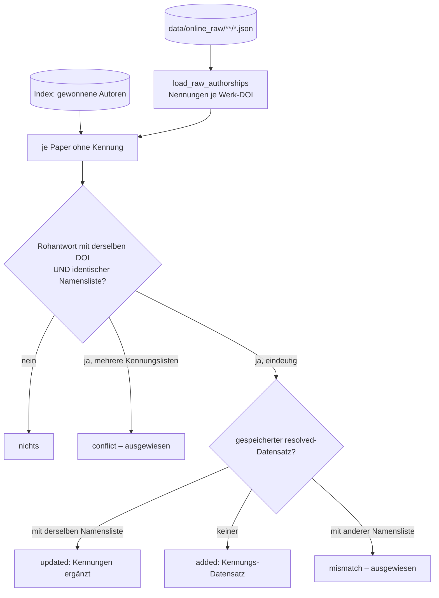

# Modul-Doku: `backfill.py`

| Feld | Wert |
| --- | --- |
| **Modul** | `src/research_graphrag/online/backfill.py` |
| **Paket** | `online` – Netzzugang hinter einem Port (dieses Modul selbst greift **nicht** aufs Netz zu) |
| **Phase** | 17 / A2, Punkt 3 |
| **Grundlagen** | [ADR 0041](../../../../docs/adr/0041-author-identity-and-schema.md) |

---

## 1. Zweck

Holt die Personenkennungen (OpenAlex-Autor-ID, ORCID) der bereits aufgelösten Paper **ohne
Netzzugriff** nach. Sie stehen schon in den abgelegten OpenAlex-Rohantworten unter
`data/online_raw/` (Roadmap Phase 17, Befund 5); gespeichert wurde bis Phase 17 nur der Name.
Einstiegspunkt ist `python -m scripts.backfill_author_ids`.

## 2. Öffentliche Schnittstelle

| Symbol | Art | Aufgabe |
| --- | --- | --- |
| `load_raw_authorships` | Funktion | alle `*.json`-Rohantworten lesen; Nennungen je Werk-DOI (Einzelwerk und Trefferliste) |
| `work_keys` | Funktion | Werk-Schlüssel eines Papers: eigene DOI und DataCite-DOI eines Preprints |
| `backfill_identities` | Funktion | Kennungen nachtragen, wo die Zuordnung belegt ist; neuer Datenstand + Entscheidungen |
| `render_backfill` | Funktion | Abschnitt für `data/metadata_log.md` |
| `RawAuthorship` / `BackfillDecision` / `BackfillRun` | Dataclasses | Nennungen einer Rohantwort, Entscheidung, Ergebnis |
| `ACTION_*` | Konstanten | `updated`, `added`, `conflict`, `mismatch` |

## 3. Ablauf

### Warum ein Kennungs-Datensatz statt einer geänderten Stub-Datei

Ein Referenz-Eintrag trägt seine Autoren aus der Stub-Datei. Diese Datei zu ändern, würde ihren
sha256 und damit die **Paper-ID** ändern. Stattdessen entsteht in `metadata/paper_metadata.json`
ein `resolved`-Datensatz, der nur Namen und Kennungen trägt. Über die Regel „identische
Namensliste“ in [`bibliography/resolve`](../../bibliography/doc/resolve.md) reichert er die
gewonnene Autorenliste an, ohne ein anderes Feld zu verändern. `origins.author_ids` weist aus,
woher die Kennungen stammen.

## 4. Zusammenspiel

Die Rohantworten liest `metadata.authorships_of_work`, dieselbe Lesart wie beim Auflösungslauf.
Gespeichert wird über `store.save_records`; der Prüfstand bleibt dabei erhalten.

## 5. Fehler und Grenzfälle

| Situation | Verhalten |
| --- | --- |
| Ablageort fehlt | leeres Ergebnis, kein Fehler |
| unlesbare Rohantwort | gezählt, übersprungen |
| arXiv-Rohantwort (`*.xml`) | nicht gelesen – trägt keine Kennung |
| gleiche DOI, abweichende Namensliste | keine Zuordnung, nichts übernommen |
| zwei Rohantworten mit verschiedenen Kennungen | `conflict`, nichts übernommen |
| Paper trägt bereits Kennungen | übersprungen (ein zweiter Lauf nach dem Ingest ändert nichts) |

## 6. Determinismus

Die Rohantworten werden in sortierter Pfadreihenfolge gelesen, die Paper nach `paper_id`
verarbeitet.

## 7. Grenzen

- Nur Paper, deren gewonnene Autorenliste **wörtlich** aus einer OpenAlex-Antwort stammt, werden
  erreicht. Autoren aus dem arXiv-Feed oder aus Handpflege mit abweichender Schreibweise bleiben
  ohne Kennung, bis ein Auflösungslauf sie neu liefert.
