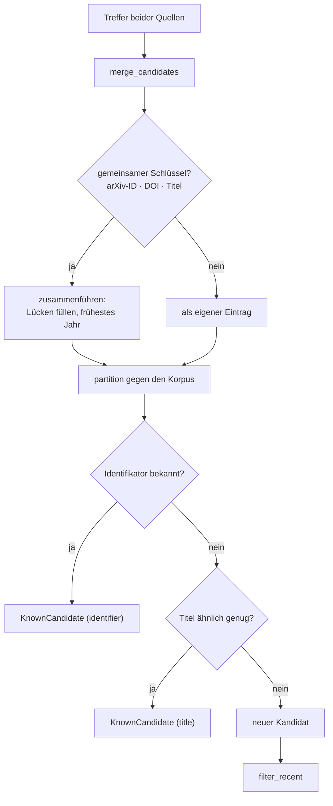

# Modul-Doku: `candidates.py`

| Feld | Wert |
| --- | --- |
| **Modul** | `src/research_graphrag/online/candidates.py` |
| **Paket** | `online` – Kandidatensuche im Netz |
| **Phase** | 9 / S1 |
| **Grundlagen** | [ADR 0020](../../../../docs/adr/0020-online-candidate-search-phase9.md), [ADR 0019](../../../../docs/adr/0019-corpus-intake-new-papers-phase8.md) |

---

## 1. Zweck

Hält den quellenunabhängigen Datentyp eines Vorschlags und beantwortet die Frage, die den
eigentlichen Wert des Online-Modus ausmacht: **Ist dieses Paper schon im Korpus?**

Die Antwort wird nicht neu erfunden, sondern von der Duplikatprüfung des Intake übernommen.

## 2. Öffentliche Schnittstelle

| Symbol | Art | Aufgabe |
| --- | --- | --- |
| `Candidate` | Dataclass | Ein Vorschlag: Titel, Jahr, Quellen, Identifikatoren, Abstract, Verweis, Begründung |
| `KnownCandidate` | Dataclass | Ein bereits vorhandenes Paper samt Belegart und Beleg |
| `merge_candidates` | Funktion | Führt Dubletten **innerhalb** einer Trefferliste zusammen |
| `classify` | Funktion | Prüft einen Kandidaten gegen den Korpus |
| `partition` | Funktion | Trennt neue von bereits vorhandenen Kandidaten |
| `filter_recent` | Funktion | Wendet die Jahresgrenze an |
| `SOURCE_ARXIV`, `SOURCE_OPENALEX` | Konstanten | Quellenkennungen |
| `MATCH_IDENTIFIER`, `MATCH_TITLE` | Konstanten | Belegarten |

## 3. Ablauf

### Die quellenübergreifende Zusammenführung

Der Anlass ist gemessen: In der Vorabprobe erschienen drei von 51 Papern **doppelt**, weil arXiv
sie unter ihrer arXiv-ID und OpenAlex dieselben unter einem DOI führte. Ein Abgleich allein über
Identifikatoren findet solche Paare nicht – deshalb ist der normalisierte **Titel** ein
gleichrangiger Schlüssel.

Beim Zusammenführen führt die zuerst gefundene Sicht; leere Felder werden aus der zweiten gefüllt,
der längere Abstract gewinnt, und beide Quellen werden ausgewiesen.

### Warum das früheste Jahr gewinnt

Erscheint ein Preprint von 2019 später in einem Sammelband, meldet OpenAlex möglicherweise das
Jahr der Zweitveröffentlichung. Für die Frage „ist das aktuell?" ist die **Erstveröffentlichung**
maßgeblich – sonst umginge ein Nachdruck den Aktualitätsfilter.

### Warum die Prüfung nicht selbst gebaut ist

`classify` nutzt `identifier_to_paper` und `best_title_match` aus dem Intake. Damit gilt für einen
Netzvorschlag exakt dieselbe Regel wie für eine Datei in `new_papers/` – einschließlich der dort
gemessenen Härtungen (Frontmatter-Beleg, Eindeutigkeit) und der Schwelle `TITLE_SIMILARITY`. Zwei
Wahrheiten über „ist das schon im Korpus" wären eine Fehlerquelle.

## 4. Zusammenspiel

Aufgerufen von [`search`](search.md); die Kandidaten entstehen in [`sources`](sources.md) und
werden von [`report`](report.md) ausgegeben. Die Prüfgrundlage stammt aus
`research_graphrag.intake.load_corpus`, die Normalisierung aus `indexing.citation_graph`.

## 5. Fehler und Grenzfälle

Das Modul wirft keine Fehler. Grenzfälle: Titel unterhalb der Mindestmaße
(`MIN_TITLE_CHARS`/`MIN_TITLE_WORDS`) taugen weder als Zusammenführungs- noch als Belegschlüssel;
ein Kandidat ohne Jahresangabe (`year == 0`) überlebt den Aktualitätsfilter, weil eine fehlende
Angabe kein Beleg für Veralterung ist.

## 6. Determinismus

Vollständig deterministisch: Die Reihenfolge des ersten Auftretens bleibt erhalten, die
Quellenliste wird case-insensitiv sortiert, und alle Vergleiche laufen über normalisierte
Zeichenketten. Gleiche Eingabe ergibt gleiche Ausgabe.

## 7. Grenzen

Der Titelabgleich arbeitet auf Zeichenketten, nicht auf Bedeutung: Stark abweichende
Schreibweisen desselben Papers bleiben zwei Kandidaten. Das ist der bewusste Preis für Präzision
vor Recall, dieselbe Abwägung wie im Zitationsgraphen
([ADR 0011](../../../../docs/adr/0011-intra-corpus-citation-graph-phase7.md)).
