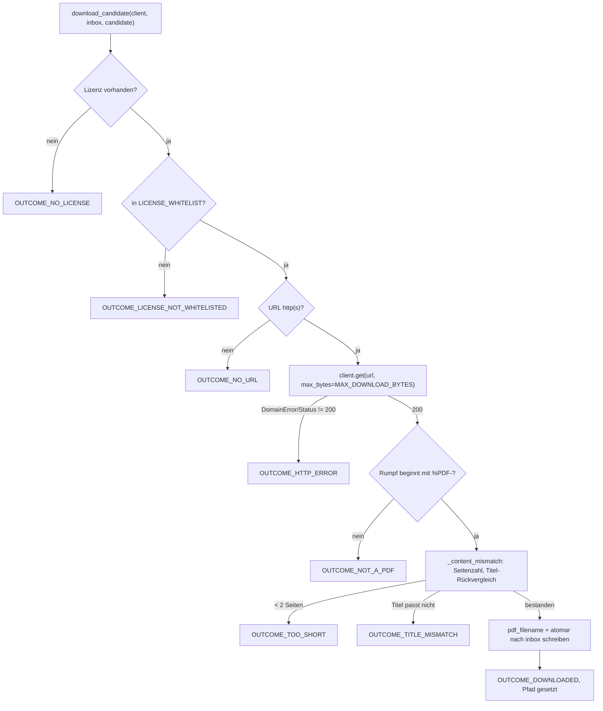

# Modul-Doku: `download.py`

| Feld | Wert |
| --- | --- |
| **Modul** | `src/research_graphrag/online/download.py` |
| **Paket** | `online` – Kandidatensuche und (opt-in) Volltext-Download im Netz |
| **Phase** | 9 / S2 |
| **Grundlagen** | [ADR 0035](../../../../docs/adr/0035-fulltext-download-phase9-s2.md), [ADR 0020](../../../../docs/adr/0020-online-candidate-search-phase9.md), [ADR 0019](../../../../docs/adr/0019-corpus-intake-new-papers-phase8.md) |

---

## 1. Zweck

Lädt für einen Kandidaten aus der Online-Suche automatisch einen Volltext herunter – aber nur,
wenn eine Lizenz aus der Whitelist vorliegt **und** der Inhalt nachweislich zum Kandidaten gehört.
Beide Prüfungen sind bewusst eng (Präzision vor Recall): Alles, was nicht besteht, bleibt ein Link
im Bericht statt eines Download-Versuchs.

## 2. Öffentliche Schnittstelle

| Symbol | Art | Aufgabe |
| --- | --- | --- |
| `download_candidate` | Funktion | Prüft und lädt **einen** Kandidaten |
| `download_all` | Funktion | Versucht es für eine Liste von Kandidaten, mit Rate-Limit zwischen echten Abrufen |
| `is_whitelisted_license` | Funktion | Prüft eine Lizenzangabe gegen `LICENSE_WHITELIST` |
| `pdf_filename` | Funktion | Bildet einen selbst erzeugten Dateinamen (Titel-Slug + Identifikator) |
| `describe_outcome` | Funktion | Menschenlesbare Bezeichnung eines `OUTCOME_*`-Werts (von `report` und der CLI geteilt) |
| `DownloadOutcome` | Dataclass | Ergebnis eines Versuchs: Kandidat, Outcome, Begründung, ggf. Pfad |
| `LICENSE_WHITELIST` | Konstante | `{"public-domain", "cc-by", "cc-by-sa"}` |
| `MAX_DOWNLOAD_BYTES` | Konstante | 100 MiB – größte Korpus-Datei zum Entscheidungszeitpunkt × 2, gerundet |
| `MIN_DOWNLOAD_PAGES` | Konstante | 2 – ein Abstract-Blatt allein ist kein Volltext |
| `DOWNLOAD_DELAY_SECONDS` | Konstante | Pause zwischen echten Netzabrufen (kein Bulk-Crawl) |
| `OUTCOME_*` | Konstanten | Mögliche Werte von `DownloadOutcome.outcome` |

## 3. Ablauf

Die Reihenfolge ist bewusst gewählt: Lizenz- und URL-Prüfung laufen **vor** jedem Netzzugriff, damit
aussichtslose Kandidaten kein Kontingent verbrauchen. `download_all` ruft `download_candidate` je
Kandidat auf und pausiert `DOWNLOAD_DELAY_SECONDS` – aber nur **zwischen** Aufrufen, die tatsächlich
einen GET ausgelöst haben (`_NETWORK_OUTCOMES`); ein an Lizenz oder URL gescheiterter Kandidat
verzögert die folgenden nicht.

### Die Inhaltsprüfung ist kein neuer Mechanismus

`_content_mismatch` nutzt `read_front_pages` und `title_candidates` aus
`research_graphrag.intake` – dieselben Funktionen, mit denen der Intake seine eigene
Titel-Verdachtsstufe bildet. Der einzige Unterschied ist die Blickrichtung: Der Intake vergleicht
Titelkandidaten einer neuen Datei gegen **viele** Korpus-Titel (`best_title_match(guesses,
corpus.titles)`), dieses Modul vergleicht sie gegen **einen** bekannten Kandidaten-Titel
(`best_title_match(guesses, {normalized_title: candidate.title})`). Dieselbe Schwelle
`TITLE_SIMILARITY = 0.85` entscheidet in beiden Fällen.

Eine volle `extract_pdf`-Kanonisierung (Chunking, Qualitäts-Gates) findet hier **nicht** statt –
das leistet der Intake ohnehin erneut, sobald die Datei aus `new_papers/` übernommen wird.

## 4. Zusammenspiel

Aufgerufen von `scripts/discover.py` (nur mit `--download`) nach einem Lauf aus
[`search`](search.md); verarbeitet `Candidate` aus [`candidates`](candidates.md), schreibt über
den injizierten `HttpClient` aus [`transport`](transport.md) (mit der größeren
`MAX_DOWNLOAD_BYTES`-Grenze) und nutzt `read_front_pages`/`title_candidates`/`best_title_match`/
`PDF_MAGIC`/`TITLE_SIMILARITY` aus `research_graphrag.intake` sowie `title_slug` aus
[`references`](references.md). [`report`](report.md) zeigt das Ergebnis über `describe_outcome`
an, ohne selbst etwas über Lizenzen oder PDFs zu wissen.

## 5. Fehler und Grenzfälle

| Fall | Verhalten |
| --- | --- |
| Keine Lizenz / nicht in der Whitelist | `OUTCOME_NO_LICENSE` / `OUTCOME_LICENSE_NOT_WHITELISTED`, kein Netzzugriff |
| Kein `http(s)`-Link | `OUTCOME_NO_URL`, kein Netzzugriff |
| Netzfehler (`DomainError` aus dem Transport) | `OUTCOME_HTTP_ERROR`, der Lauf wird fortgesetzt |
| Statuscode ≠ 200 | `OUTCOME_HTTP_ERROR` mit dem Status im Grund |
| Antwort ohne `%PDF-`-Signatur | `OUTCOME_NOT_A_PDF` – der `Content-Type`-Header allein zählt nicht |
| PDF nicht parsebar | `OUTCOME_NOT_A_PDF` mit der `pypdf`-Fehlermeldung |
| Weniger als `MIN_DOWNLOAD_PAGES` Seiten | `OUTCOME_TOO_SHORT` |
| Titel-Ähnlichkeit unterhalb `TITLE_SIMILARITY` | `OUTCOME_TITLE_MISMATCH` |
| Kandidaten-Titel zu kurz für einen Vergleich | `OUTCOME_TITLE_MISMATCH` (konservativ verworfen, kein Fehlalarm-Risiko) |

Ein Fehlschlag bei einem Kandidaten bricht `download_all` nicht ab; jeder Kandidat erhält genau
ein Ergebnis.

## 6. Determinismus

Netzantworten sind nicht deterministisch (wie im gesamten Paket). Die Prüf- und Schreiblogik ist
es: Dieselbe Antwort ergibt immer denselben `DownloadOutcome` und denselben Dateinamen. Der
Dateiname entsteht ausschließlich aus einer Zeichen-Whitelist über Titel und Identifikator – nie
aus einer Server-Kopfzeile (Schutz vor Pfad-Traversal).

## 7. Grenzen

Die Titelprüfung schützt vor einer **falschen Zuordnung** (Landing-Page, Fehlverweis, vertauschte
Antwort), nicht vor einer inhaltlich fehlerhaften, aber korrekt zugeordneten Datei – dafür bleibt
das Robustheits-Gate des Intake zuständig. Die Whitelist ist bewusst eng (`public-domain`,
`cc-by`, `cc-by-sa`); eine Erweiterung (z. B. `cc-by-nc`) ist nicht Gegenstand dieses Moduls
(ADR 0035). Es gibt kein Verbindungs-Pooling und kein `HEAD`-Request zur Vorprüfung – ein Request
pro Datei, keine Wiederholungen.
