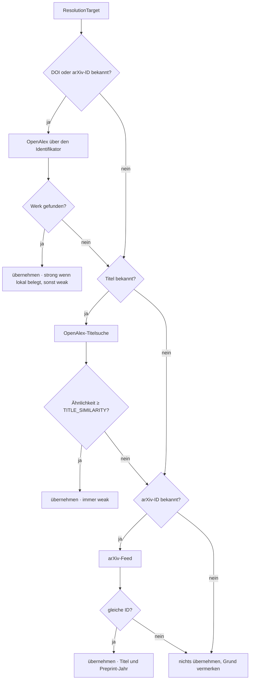
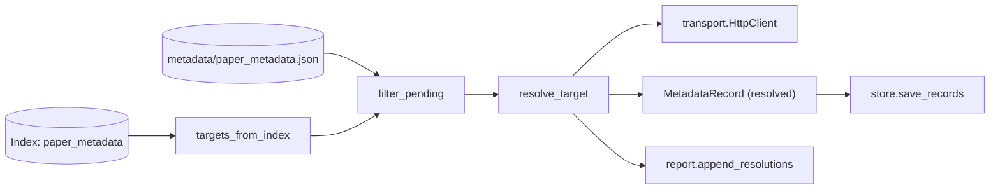

# Modul-Doku: `metadata.py`

| Feld | Wert |
| --- | --- |
| **Modul** | `src/research_graphrag/online/metadata.py` |
| **Paket** | `online` – Netzzugang hinter einem Port |
| **Phase** | 12 / K2 |
| **Grundlagen** | [ADR 0026](../../../../docs/adr/0026-online-metadata-resolution.md) · [ADR 0020](../../../../docs/adr/0020-online-candidate-search-phase9.md) |

---

## 1. Zweck

Beschafft die lokal **nicht** gewinnbaren Felder einer Literaturangabe – Autoren, Venue und den
Publikationsjahrgang – über OpenAlex, mit dem arXiv-Feed als Rückfall. Die Kernidee ist eine
Kette von Wegen, die nach **Beweiskraft** geordnet ist: eindeutiger Identifikator vor
Titel-Ähnlichkeit.

## 2. Öffentliche Schnittstelle

| Symbol | Art | Aufgabe |
| --- | --- | --- |
| `resolve_target` | Funktion | ein Paper auflösen (probiert alle Wege) |
| `targets_from_index` | Funktion | Auswahl der aufzulösenden Paper aus dem Index |
| `filter_pending` | Funktion | bereits gespeicherte Ergebnisse ausblenden |
| `ResolutionTarget` | Dataclass | ein Paper samt lokal bekannter Angaben |
| `Resolution` | Dataclass | Ergebnis inkl. Belegart, Begründung und Rohantworten |
| `openalex_id_url` / `openalex_title_url` | Funktionen | Abfrage-URLs |
| `parse_openalex_work` / `authors_of` / `venue_of` | Funktionen | Antwort-Auswertung |
| `MATCH_DOI` / `MATCH_ARXIV` / `MATCH_TITLE` | Konstanten | Belegarten |
| `METADATA_FIELDS` / `MAX_AUTHORS` / `MAX_FIELD_CHARS` / `TITLE_SEARCH_LIMIT` / `ARXIV_DOI_PREFIX` | Konstanten | Abfrage- und Bereinigungsgrenzen |

## 3. Ablauf

### Warum der Identifikator vor dem Titel kommt

Eine ID-Abfrage ist **eindeutig**, eine Titel-Suche ist eine Ähnlichkeitsaussage. Deshalb ist die
Reihenfolge fest verdrahtet und nicht konfigurierbar. Die arXiv-ID wird dabei über ihren
DataCite-DOI (`10.48550/arXiv.…`) abgefragt – so genügt **ein** Abfrageweg für beide
Identifikatorarten.

### Automatisch übernehmen, aber die Belegkraft ausweisen

| Beleg | Konfidenz |
| --- | --- |
| Treffer über einen lokal **belegten** Identifikator | `strong` |
| Treffer über einen **nicht** belegten oder mehrdeutigen Identifikator | `weak` (Begründung nennt das) |
| Titel-Ähnlichkeit ≥ Schwelle | `weak` |
| Titel-Ähnlichkeit darunter | nichts – der Grund steht in `note` |

Die Schwelle ist `intake.TITLE_SIMILARITY` und damit **dieselbe**, die der Korpus-Intake am
realen Bestand kalibriert hat. Eine zweite Zahl wäre eine zweite Wahrheit.

### Fremde Zeichenketten werden entschärft

Titel, Autorennamen und Venue sind fremde Eingaben und landen in einer versionierten Datei und
später in Modell-Prompts. `_clean` entfernt nicht druckbare Zeichen, verdichtet Leerraum und
begrenzt die Länge; die Autorenliste wird auf `MAX_AUTHORS` gedeckelt (Physik-Kollaborationen
nennen Tausende).

### Warum es `filter_pending` gibt

Die Auswahl stammt aus dem **Index**, das Ergebnis geht in eine **Datei** – und wirksam wird es
erst beim nächsten Ingest. Ohne diesen Filter würde ein zweiter Lauf vor dem nächsten Ingest
exakt dieselben Paper erneut abfragen. Der Filter vergleicht die fehlenden Felder des Ziels mit
dem, was ein gespeicherter `resolved`- oder `manual`-Datensatz bereits abdeckt.

## 4. Zusammenspiel

Netz berührt ausschließlich der Port; alles Übrige ist offline testbar.

## 5. Fehler und Grenzfälle

| Situation | Verhalten |
| --- | --- |
| Index-Datei fehlt | `not_found` (aus dem Metadaten-Lesen) |
| Titelsuche ohne Titel | `invalid_input` |
| Antwort ist kein JSON | `parse_error` |
| HTTP-Fehlerstatus | kein Abbruch – Status und Notiz landen im Ergebnis |
| Antwort ohne Werk | nächster Weg wird versucht |
| arXiv antwortet mit anderer ID | nichts übernehmen, Grund vermerken |
| weder Titel noch Identifikator | **kein** Netzaufruf, Befund `keine Abfragemöglichkeit` |

Die Begründungen aller gescheiterten Versuche werden gesammelt und in `note` verkettet – der
Bericht soll den Grund nennen, nicht nur das Scheitern.

## 6. Determinismus

Die Auswertung ist deterministisch; nicht deterministisch ist naturgemäß die **Antwort des
Dienstes**. Deshalb legt der Lauf die Rohantworten ab (`--ohne-rohdaten` schaltet das aus).

## 7. Grenzen

- **Nur OpenAlex und arXiv.** Crossref und Semantic Scholar bleiben außen vor (siehe ADR 0026).
- **Keine Werktyp-Erkennung**; Venue ist der Anzeigename der Primärquelle.
- **Preprint statt Version of Record.** Für ein arXiv-Paper liefert OpenAlex häufig nur den
  DataCite-DOI; der Publisher-DOI kommt dann aus der kuratierten Übersicht (die in der
  Auflösungskette darüber steht).
- **Ohne Identifikator und mit kurzem Titel** bleibt nur die Handpflege.
