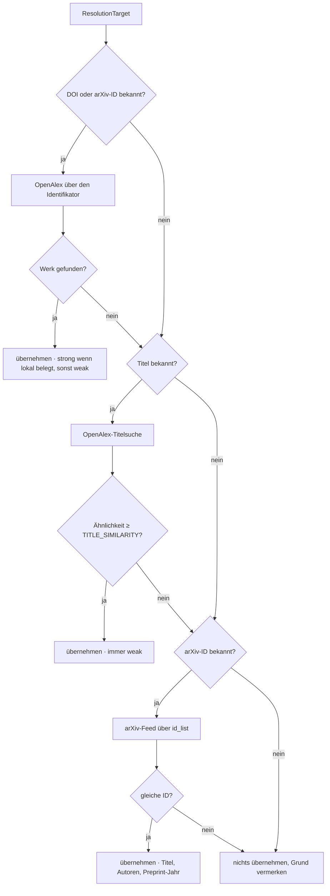
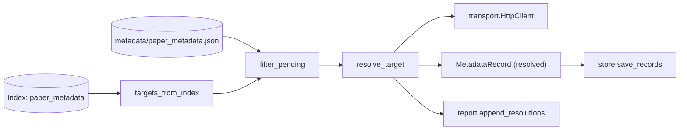

# Modul-Doku: `metadata.py`

| Feld | Wert |
| --- | --- |
| **Modul** | `src/research_graphrag/online/metadata.py` |
| **Paket** | `online` – Netzzugang hinter einem Port |
| **Phase** | 12 / K2, erweitert in 17 / A1 + A2 |
| **Grundlagen** | [ADR 0026](../../../../docs/adr/0026-online-metadata-resolution.md) · [ADR 0020](../../../../docs/adr/0020-online-candidate-search-phase9.md) · [ADR 0041](../../../../docs/adr/0041-author-identity-and-schema.md) · [ADR 0042](../../../../docs/adr/0042-title-page-evidence-and-rejections.md) |

---

## 1. Zweck

Beschafft die lokal **nicht** gewinnbaren Felder einer Literaturangabe – Autoren, Venue und den
Publikationsjahrgang – über OpenAlex, mit dem arXiv-Feed als Rückfall. Die Kernidee ist eine
Kette von Wegen, die nach **Beweiskraft** geordnet ist: eindeutiger Identifikator vor
Titel-Ähnlichkeit.

## 2. Öffentliche Schnittstelle

| Symbol | Art | Aufgabe |
| --- | --- | --- |
| `resolve_target` | Funktion | ein Paper auflösen (probiert alle Wege); seit Phase 17 mit Ablehnungsvermerken und Seite-1-Beleg |
| `skip_settled` | Funktion | Paper mit ausgewiesenem Prüfstatus („nicht auflösbar“) ausblenden |
| `Verifier` | Typ | Prüffunktion eines Treffers gegen die Titelseite |
| `targets_from_index` | Funktion | Auswahl der aufzulösenden Paper aus dem Index |
| `filter_pending` | Funktion | bereits gespeicherte Ergebnisse ausblenden |
| `ResolutionTarget` | Dataclass | ein Paper samt lokal bekannter Angaben |
| `Resolution` | Dataclass | Ergebnis inkl. Belegart, Begründung und Rohantworten |
| `openalex_id_url` / `openalex_title_url` | Funktionen | Abfrage-URLs |
| `parse_openalex_work` / `authors_of` / `venue_of` | Funktionen | Antwort-Auswertung |
| `authorships_of` / `authorships_of_work` | Funktionen | Autorennennungen samt geprüfter OpenAlex-ID und ORCID (Phase 17 / A2) |
| `author_identifier_lists` | Funktion | Nennungen → positionsgleiche Kennungslisten (leer, wenn keine Kennung vorliegt) |
| `fetch_openalex_url` | Funktion | eine OpenAlex-URL abrufen (auch von der Referenz-Auflösung genutzt) |
| `MATCH_DOI` / `MATCH_ARXIV` / `MATCH_TITLE` | Konstanten | Belegarten |
| `METADATA_FIELDS` / `MAX_AUTHORS` / `MAX_FIELD_CHARS` / `TITLE_SEARCH_LIMIT` / `ARXIV_DOI_PREFIX` | Konstanten | Abfrage- und Bereinigungsgrenzen |

## 3. Ablauf

### Warum der Identifikator vor dem Titel kommt

Eine ID-Abfrage ist **eindeutig**, eine Titel-Suche ist eine Ähnlichkeitsaussage. Deshalb ist die
Reihenfolge fest verdrahtet und nicht konfigurierbar. Die arXiv-ID wird dabei über ihren
DataCite-DOI (`10.48550/arXiv.…`) abgefragt – so genügt **ein** Abfrageweg für beide
Identifikatorarten.

### Der arXiv-Rückfall fragt nach der Kennung, nicht nach dem Text

Der Feed wird über `id_list` abgerufen (`fetch_arxiv_by_id`). Die naheliegende Volltextsuche
`search_query=all:"<id>"` durchsucht den **Volltext** und liefert dadurch fremde Werke – in
Phase 13 / R1 nachgewiesen: `1706.03762` ergab `2002.05202`. Die ID-Prüfung hätte den Fehlgriff
zwar verworfen, doch damit wäre der Rückfall **wirkungslos** gewesen statt falsch. Er liefert
außerdem die **Autoren** (`authors_from_feed`) – ohne sie bliebe der Datensatz genau bei den
Papern unvollständig, für die dieser Weg gedacht ist
([ADR 0026](../../../../docs/adr/0026-online-metadata-resolution.md), Nachtrag).

### Automatisch übernehmen, aber die Belegkraft ausweisen

| Beleg | Konfidenz |
| --- | --- |
| Treffer über einen lokal **belegten** Identifikator | `strong` |
| Treffer über einen **nicht** belegten oder mehrdeutigen Identifikator | `weak` (Begründung nennt das) |
| Titel-Ähnlichkeit ≥ Schwelle | `weak` |
| Titel-Ähnlichkeit darunter | nichts – der Grund steht in `note` |

Die Schwelle ist `intake.TITLE_SIMILARITY` und damit **dieselbe**, die der Korpus-Intake am
realen Bestand kalibriert hat. Eine zweite Zahl wäre eine zweite Wahrheit.

### Fremde Zeichenketten werden entschärft

Titel, Autorennamen und Venue sind fremde Eingaben und landen in einer versionierten Datei und
später in Modell-Prompts. `_clean` entfernt nicht druckbare Zeichen, verdichtet Leerraum und
begrenzt die Länge; die Autorenliste wird auf `MAX_AUTHORS` gedeckelt (Physik-Kollaborationen
nennen Tausende).

### Warum es `filter_pending` gibt

Die Auswahl stammt aus dem **Index**, das Ergebnis geht in eine **Datei** – und wirksam wird es
erst beim nächsten Ingest. Ohne diesen Filter würde ein zweiter Lauf vor dem nächsten Ingest
exakt dieselben Paper erneut abfragen. Der Filter vergleicht die fehlenden Felder des Ziels mit
dem, was ein gespeicherter `resolved`- oder `manual`-Datensatz bereits abdeckt – über
`MetadataRecord.has()`, dieselbe Methode, die auch die Präzedenzauflösung nutzt. Ein Feld, das
über `correct_paper_metadata`s `clear_fields` **explizit als leer bestätigt** wurde (ADR 0040,
[bibliography/doc/model.md](../../bibliography/doc/model.md)), gilt deshalb ebenfalls als
"abgedeckt": Ein bereits geprüftes, absichtlich leeres Feld wird nicht erneut online abgefragt.

### Personenkennung aus `authorships` (Phase 17 / A2)

OpenAlex liefert je Autor neben `display_name` auch `author.id` und `author.orcid`. Bis Phase 17
wurde nur der Name übernommen. Jetzt speichert `_record_from` beide Kennungen **positionsgleich** zu
den Namen im Datensatz ([ADR 0041](../../../../docs/adr/0041-author-identity-and-schema.md)). Jede
Kennung wird geprüft; eine ungültige wird leer. Der arXiv-Feed kennt keine Kennung, sein Datensatz
bleibt ohne. `authorships_of_work` ist öffentlich, weil der Nachtrag aus den abgelegten
Rohantworten dieselbe Lesart braucht.

### Vermerk und Seite-1-Beleg in der Auflösung (Phase 17 / A1)

Jeder Treffer durchläuft zwei Prüfungen, bevor er übernommen wird
([ADR 0042](../../../../docs/adr/0042-title-page-evidence-and-rejections.md)):

1. Entspricht er einem **Ablehnungsvermerk** (DOI, arXiv-ID oder Titel), wird er übersprungen,
   und der nächste Weg wird versucht.
2. Mit `verify` wird er gegen die Titelseite geprüft. `foreign` erzeugt einen neuen Vermerk (in
   `Resolution.rejected`), und der nächste Weg wird versucht. `confirmed` wertet auf `strong`
   auf. Sonst bleibt der Treffer, wie er ist, und der Befund reist als `Resolution.check` mit.

## 4. Zusammenspiel

Netz berührt ausschließlich der Port; alles Übrige ist offline testbar.

## 5. Fehler und Grenzfälle

| Situation | Verhalten |
| --- | --- |
| Index-Datei fehlt | `not_found` (aus dem Metadaten-Lesen) |
| Titelsuche ohne Titel | `invalid_input` |
| Antwort ist kein JSON | `parse_error` |
| HTTP-Fehlerstatus | kein Abbruch – Status und Notiz landen im Ergebnis |
| Antwort ohne Werk | nächster Weg wird versucht |
| arXiv antwortet mit anderer ID | nichts übernehmen, Grund vermerken |
| weder Titel noch Identifikator | **kein** Netzaufruf, Befund `keine Abfragemöglichkeit` |

Die Begründungen aller gescheiterten Versuche werden gesammelt und in `note` verkettet – der
Bericht soll den Grund nennen, nicht nur das Scheitern.

## 6. Determinismus

Die Auswertung ist deterministisch; nicht deterministisch ist naturgemäß die **Antwort des
Dienstes**. Deshalb legt der Lauf die Rohantworten ab (`--ohne-rohdaten` schaltet das aus).

## 7. Grenzen

- **Nur OpenAlex und arXiv.** Crossref und Semantic Scholar bleiben außen vor (siehe ADR 0026).
- **Keine Werktyp-Erkennung**; Venue ist der Anzeigename der Primärquelle.
- **Preprint statt Version of Record.** Für ein arXiv-Paper liefert OpenAlex häufig nur den
  DataCite-DOI; der Publisher-DOI kommt dann aus der kuratierten Übersicht (die in der
  Auflösungskette darüber steht).
- **Ohne Identifikator und mit kurzem Titel** bleibt nur die Handpflege.
