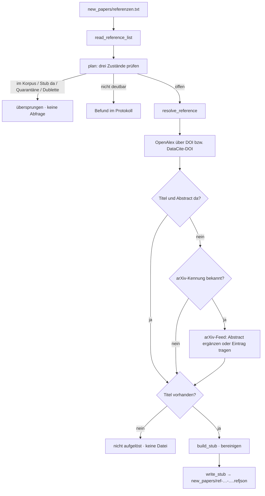

# Modul-Doku: `references.py`

| Feld | Wert |
| --- | --- |
| **Modul** | `src/research_graphrag/online/references.py` |
| **Paket** | `online` – Netzzugang hinter einem Port |
| **Phase** | 13 / R1, erweitert in 17 / A2 |
| **Grundlagen** | [ADR 0029](../../../../docs/adr/0029-reference-stub-resolution-phase13.md) · [ADR 0026](../../../../docs/adr/0026-online-metadata-resolution.md) · [ADR 0020](../../../../docs/adr/0020-online-candidate-search-phase9.md) · [ADR 0019](../../../../docs/adr/0019-corpus-intake-new-papers-phase8.md) · [ADR 0041](../../../../docs/adr/0041-author-identity-and-schema.md) |

---

## 1. Zweck

Verwandelt eine kuratierte Liste von DOI- und arXiv-Kennungen in **Stub-Dateien** `*.refjson` im
Eingangsordner `new_papers/`. Ein Stub enthält Titel, Autoren, Jahr, Venue, Identifikatoren und –
der eigentliche Zweck – den **Abstract** eines Papers, dessen Volltext nicht beschaffbar ist.

Das Modul schreibt **nie** nach `papers/`. Der Weg in den Korpus führt ausschließlich über
`python -m scripts.intake` (ab Phase 13 / R2); bis dahin bleiben die Dateien im Eingang liegen.

## 2. Öffentliche Schnittstelle

| Symbol | Art | Aufgabe |
| --- | --- | --- |
| `read_reference_list` | Funktion | Kennungsliste lesen (die Datei bleibt unverändert) |
| `normalize_identifier` | Funktion | eine Kennung in beliebiger Schreibweise deuten |
| `stub_identifiers` | Funktion | Kennungen der vorhandenen Stub-Dateien (Eingang + Quarantäne) |
| `plan` | Funktion | trennt abzufragende von bereits erledigten Einträgen |
| `resolve_reference` | Funktion | eine Kennung auflösen (OpenAlex, arXiv-Feed) |
| `process` | Funktion | auflösen **und** die Stub-Datei schreiben |
| `build_stub` / `write_stub` | Funktionen | Inhalt bauen (bereinigt) und atomar ablegen |
| `title_slug` / `stub_filename` | Funktionen | sprechender Dateiname mit Kennungs-Anker |
| `ReferenceRequest` / `ReferenceLookup` / `ReferenceOutcome` | Dataclasses | Listeneintrag, Abfrageergebnis, Laufergebnis |
| `ACTION_WRITTEN` / `ACTION_SKIPPED` / `ACTION_UNRESOLVED` / `ACTION_INVALID` | Konstanten | Ergebnisarten |
| `REASON_IN_CORPUS` / `REASON_STUB_EXISTS` / `REASON_QUARANTINED` / `REASON_DUPLICATE_LINE` | Konstanten | Gründe des Überspringens |
| `KIND_DOI` / `KIND_ARXIV` | Konstanten | Kennungsarten |
| `REFERENCE_LIST_NAME` | Konstante | Dateiname der Kennungsliste |
| `STUB_SUFFIX` / `STUB_SCHEMA_VERSION` / `DOCUMENT_KIND_REFERENCE` | Konstanten (importiert) | Endung, Formatversion und Dokumentart – definiert in [`extraction/refstub`](../../extraction/doc/refstub.md) bzw. `extraction/model` |
| `REFERENCE_FIELDS` / `DEFAULT_LIMIT` / `MAX_ABSTRACT_CHARS` / `MAX_URL_CHARS` | Konstanten | Abfrage- und Bereinigungsgrenzen |
| `MAX_TITLE_SLUG_CHARS` / `MAX_ID_SLUG_CHARS` / `TITLE_SLUG_WORDS` / `COLON_PREFIX_WORDS` | Konstanten | Grenzen der Namensbildung |

## 3. Ablauf

### Warum die Idempotenz **vor** der ersten Abfrage steht

Ein Wiederholungslauf soll weder fremdes Kontingent verbrauchen noch eine zweite Datei erzeugen.
Geprüft wird deshalb gegen drei Zustände, bevor überhaupt eine Verbindung geöffnet wird:

| Zustand | Grundlage |
| --- | --- |
| Korpus | `intake.load_corpus(...).identifier_to_paper` – die **bestehende** Dedup-Grundlage |
| Eingang | Kennungen **aus** jeder `new_papers/*.refjson` |
| Quarantäne | ebenso aus `new_papers/_duplikate/*.refjson` |

Die Prüfung ist **inhaltsbasiert**, nicht namensbasiert: Auch eine von Hand umbenannte Stub-Datei
wird wiedererkannt. Eine unlesbare Datei wird protokolliert und übersprungen.

> **Bewusst getragene Grenze:** Die Korpus-Prüfung nutzt den **gehärteten** Schlüsselsatz
> (Frontmatter-Beleg und Eindeutigkeit, [ADR 0019](../../../../docs/adr/0019-corpus-intake-new-papers-phase8.md)).
> Ein Korpus-Paper, dessen Identifikator diesen Guard nicht passiert, wird erneut als Stub
> erzeugt – dieselbe Grenze wie bei der Kandidatensuche. Die Prüfung hier ist Bequemlichkeit; die
> Absicherung ist der Intake.

### Warum der arXiv-Feed zweimal in Frage kommt

Er ist nicht nur Rückfall, wenn OpenAlex nichts kennt, sondern auch **Abstract-Quelle**, wenn
OpenAlex zwar Metadaten, aber keinen Abstract liefert. Genau diese Kombination hat die
Vorabmessung R0 gemessen (Ausbeute 93 %); ohne sie wäre der gemessene Wert nicht reproduzierbar.
Die übrigen Felder bleiben in diesem Fall von OpenAlex.

Abgefragt wird der Feed über `id_list`, **nicht** über die Volltextsuche: `all:"1706.03762"`
liefert am realen Dienst ein fremdes Paper. Aus demselben Feed kommen auch die **Autoren** – ohne
sie wäre ein Eintrag nicht zitierfähig, und OpenAlex schweigt gerade in den Fällen, in denen der
Feed einspringt.

### Titel Pflicht, Abstract nicht

| Lage | Folge |
| --- | --- |
| Titel **und** Abstract vorhanden | Stub-Datei entsteht vollständig |
| Titel vorhanden, Abstract fehlt | Stub-Datei entsteht mit leerem `abstract` und einem Hinweis in `note`; der Abstract wird von Hand **in diese Datei** nachgetragen |
| Titel fehlt | **keine** Datei, nur ein Befund – ein Eintrag ohne Titel wäre weder zitierfähig noch als Zitationsziel brauchbar |

### Dateiname: sprechend **und** eindeutig

`ref-<titelwort>-<kennung>.refjson`, zum Beispiel `ref-graphrag-arxiv-2404.16130.refjson`.
Der Titelteil entsteht über eine **Whitelist** (`a`–`z`, `0`–`9`) aus dem Titel der Antwort; ein
kurzer Vorspann vor dem Doppelpunkt gilt als System-/Modellname. Ein fremder Wert kann den Namen
dadurch weder verlassen noch verlängern. Die Kennung bleibt der eindeutige Anker.

### Personenkennung im Stub (Format 0.2.0, Phase 17 / A2)

`build_stub` schreibt je Autor `author_ids` (OpenAlex) und `author_orcids`, positionsgleich zu
`authors` ([ADR 0041](../../../../docs/adr/0041-author-identity-and-schema.md)). Entfällt ein Name
bei der Bereinigung, entfällt seine Kennung mit ihm. Passt eine übergebene Liste nicht zur
Namensliste, wird sie leer geschrieben. Die Formatkonstanten stammen seit ADR 0041 aus dem
lesenden Adapter; vorher waren sie hier dupliziert.

## 4. Sicherheit

Titel, Autoren, Venue und Abstract sind **nicht vertrauenswürdige Eingaben**: Sie werden auf
druckbare Zeichen reduziert, in Whitespace verdichtet und längenbegrenzt. Ein Verweis wird nur
übernommen, wenn er ein `http(s)`-Schema trägt und die Längengrenze hält. Die Härtung ist bewusst
enger und anders als `report.safe_url` – Ziel ist hier eine JSON-Datei, kein Markdown; eine
Maskierung von Markdown-Steuerzeichen würde den Wert verfälschen.

Der Netzzugang läuft ausschließlich über den injizierbaren Port
[`transport.HttpClient`](transport.md); Parsen, Planen, Benennen und Schreiben sind netzfrei und
damit offline getestet.

## 5. Grenzen

- Bis Phase 13 / R2 nimmt der Intake nur `*.pdf` an – die erzeugten Stub-Dateien bleiben bis
  dahin **wirkungslos** im Eingang liegen.
- Steht dasselbe Werk mit **DOI und** arXiv-Kennung in der Liste, entstehen zwei Abfragen; nur
  der DataCite-Fall (`10.48550/arXiv.…`) wird vorab zusammengeführt. Die Dublette fällt spätestens
  im Intake auf.
- Der Abrufzeitpunkt steht in der Datei. Ein erneuter Abruf ergäbe damit eine Datei mit anderem
  Hash – genau das verhindert die Idempotenzprüfung.
