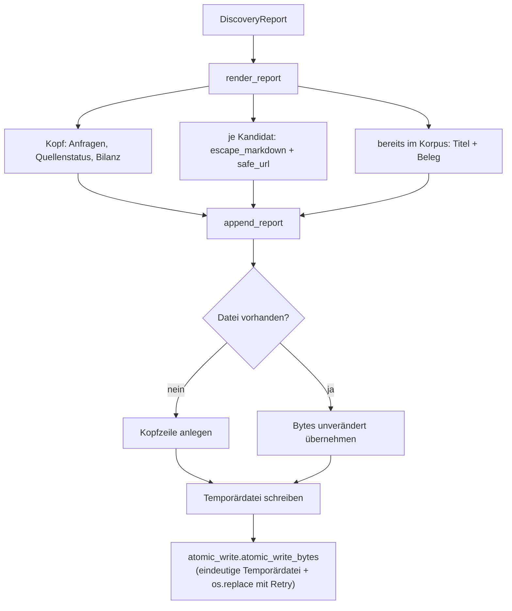

# Modul-Doku: `report.py`

| Feld | Wert |
| --- | --- |
| **Modul** | `src/research_graphrag/online/report.py` |
| **Paket** | `online` – Kandidatensuche im Netz |
| **Phase** | 9 / S1+S2 |
| **Grundlagen** | [ADR 0020](../../../../docs/adr/0020-online-candidate-search-phase9.md), [ADR 0010](../../../../docs/adr/0010-drop-in-workflow-and-qa-phase6.md), [ADR 0035](../../../../docs/adr/0035-fulltext-download-phase9-s2.md) |

---

## 1. Zweck

Hält das Ergebnis eines Laufs und schreibt es anhängend nach `data/online_candidates.md`. Zwei
Eigenschaften sind dabei nicht verhandelbar: Der Bericht ist **append-only**, und fremder Text
darf seine Struktur nicht verändern.

Über `append_section` teilen sich drei Vorgänge denselben Anhänge-Mechanismus: die
Kandidatensuche (`data/online_candidates.md`), die Metadaten-Auflösung (`data/metadata_log.md`)
und die Referenz-Auflösung (`data/references_log.md`, Phase 13 / R1).

Mit `--download` (Phase 9 / S2) trägt `DiscoveryReport.downloads` zusätzlich ein Ergebnis je
frischem Kandidaten aus [`download`](download.md); `render_report` zeigt es als eigene Zeile,
Identifikator und Link bleiben davon unabhängig immer sichtbar. Ohne das Flag bleibt
`downloads` leer und der Bericht identisch zu S1.

## 2. Öffentliche Schnittstelle

| Symbol | Art | Aufgabe |
| --- | --- | --- |
| `DiscoveryReport` | Dataclass | Ergebnis eines Laufs (Anfragen, Quellen, Bilanz, Kandidaten) |
| `render_report` | Funktion | Rendert einen Lauf als Markdown-Abschnitt |
| `append_report` | Funktion | Hängt den Abschnitt byte-erhaltend und atomar an |
| `append_section` | Funktion | gemeinsamer Anhänge-Mechanismus aller drei Protokolle |
| `render_resolutions` / `append_resolutions` | Funktionen | Bericht der Metadaten-Auflösung (`data/metadata_log.md`) |
| `render_references` / `append_references` | Funktionen | Protokoll der Referenz-Auflösung (`data/references_log.md`) |
| `store_raw` | Funktion | Legt die Rohantworten datiert ab |
| `escape_markdown` | Funktion | Entschärft fremden Text |
| `safe_url` | Funktion | Prüft einen fremden Verweis |
| `REPORT_NAME`, `METADATA_REPORT_NAME`, `REFERENCES_REPORT_NAME`, `RAW_DIR_NAME` | Konstanten | Dateinamen der Protokolle und Ablageverzeichnis der Rohantworten |
| `MAX_TITLE_CHARS`, `MAX_ABSTRACT_CHARS`, `MAX_URL_CHARS` | Konstanten | Längengrenzen |

## 3. Ablauf

### Fremder Text ist Eingabe, keine Formatierung

Titel und Abstracts stammen aus fremden Diensten. Ohne Behandlung könnte ein Titel die
Berichtstruktur zerstören oder einen anklickbaren Verweis erzeugen:

| Angriff | Wirkung ohne Behandlung | Behandlung |
| --- | --- | --- |
| `[klick](javascript:…)` | anklickbarer Link im Bericht | `[` und `]` werden maskiert |
| Zeilenumbruch plus `## …` | fremde Überschrift im Bericht | Umbrüche entfallen |
| `\|` in einem Titel | zerlegt eine Tabellenzeile | maskiert |
| Steuerzeichen | unlesbare Datei | entfernt |
| sehr langer Abstract | Bericht wird geflutet | gekürzt mit `…` |

Gekürzt wird **vor** dem Maskieren, damit die Grenze auf den Inhalt wirkt und nicht auf die
Escape-Zeichen. Verweise werden nur ausgegeben, wenn sie mit `http(s)` beginnen und die Länge
einhalten – und dann als Klartext in Backticks, nicht als Markdown-Link.

### Warum byte-erhaltend angehängt wird

`write_text` würde unter Windows alle Zeilenenden auf CRLF drehen und damit jede vorhandene Zeile
verändern. Der Bericht wächst über viele Läufe; ein Verfahren, das bei jedem Lauf die ganze Datei
umschreibt, macht Änderungen unlesbar. Deshalb dasselbe Muster wie bei `Übersicht.md`:
vorhandene Bytes übernehmen, Zeilenende erkennen, über
[`atomic_write.atomic_write_bytes`](../../doc/atomic_write.md) schreiben (geteilt mit
`bibliography.store.save_records`, ADR 0039 Nachtrag): eindeutige Temporärdatei je Aufruf plus
`os.replace` mit kurzem Retry gegen eine gemessene, transiente `PermissionError` bei
konkurrierenden Schreibversuchen auf dieselbe Zieldatei.

### Was der Bericht ausweist

Neben den Vorschlägen enthält jeder Abschnitt die **Bilanz** (Treffer, bereits im Korpus, zu alt,
neu), den **Status jeder Quelle** und – für jeden Vorschlag – die **Begründung**, aus welcher
Anfrage er stammt. Zusätzlich werden die bereits vorhandenen Paper **mit Beleg** aufgeführt: Ohne
sie ließe sich die Dedup-Entscheidung nicht nachprüfen.

## 4. Zusammenspiel

Aufgerufen von `scripts/discover.py` nach einem Lauf aus [`search`](search.md); verarbeitet
`Candidate` und `KnownCandidate` aus [`candidates`](candidates.md) sowie `SourceResult` aus
[`sources`](sources.md). Mit `--download` zusätzlich `DownloadOutcome` aus
[`download`](download.md) (nur die Bezeichnung über `describe_outcome`, keine eigene Download-
Logik). Schreibt ausschließlich unterhalb von `data/`.

## 5. Fehler und Grenzfälle

Das Modul wirft keine fachlichen Fehler; eine `OSError` aus `atomic_write_bytes` wird **nicht**
abgefangen, sondern an den Aufrufer weitergereicht (`bibliography.corrections` übersetzt sie beim
Korrektur-Protokoll in einen `internal_error` mit Exception-Details, ADR 0039 Nachtrag). Ein Lauf
ohne Treffer wird ausdrücklich als solcher vermerkt statt einen leeren Abschnitt zu erzeugen.
Bricht das Schreiben ab, bleibt der bisherige Bericht dank `os.replace` unversehrt, und die
Temporärdatei wird entfernt.

## 6. Determinismus

Für ein gegebenes `DiscoveryReport` ist die Ausgabe zeichengenau reproduzierbar. Der Zeitstempel
stammt aus dem Lauf, nicht aus dem Rendern – dasselbe Ergebnis lässt sich also erneut rendern.

## 7. Grenzen

Der Bericht ist **kein** Bestand: Es wird nicht nach `papers/` oder `new_papers/` geschrieben und
nicht in `Übersicht.md`. Der Weg in den Korpus führt ausschließlich über den Intake
([ADR 0019](../../../../docs/adr/0019-corpus-intake-new-papers-phase8.md)). Alte Abschnitte werden
nie verändert oder entfernt – Aufräumen ist Sache des Menschen.
