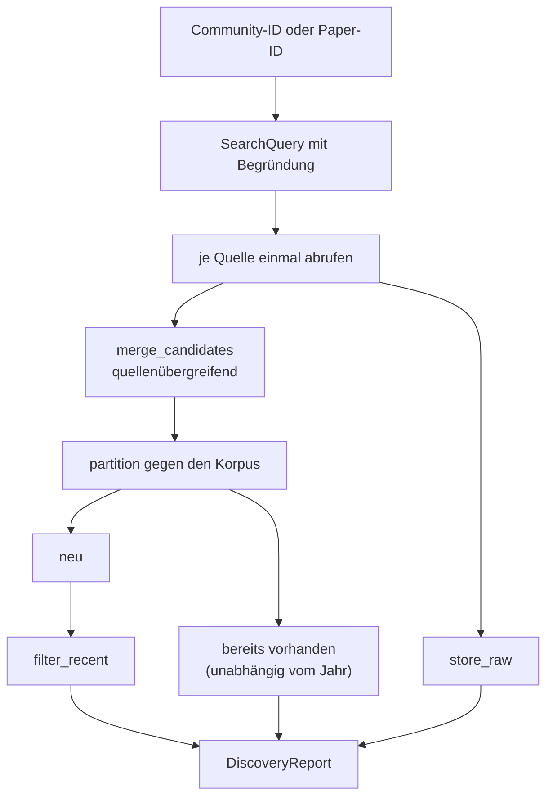

# Modul-Doku: `search.py`

| Feld | Wert |
| --- | --- |
| **Modul** | `src/research_graphrag/online/search.py` |
| **Paket** | `online` – Kandidatensuche im Netz |
| **Phase** | 9 / S1 |
| **Grundlagen** | [ADR 0020](../../../../docs/adr/0020-online-candidate-search-phase9.md), [ADR 0007](../../../../docs/adr/0007-graphrag-index-phase3-option-b.md) |

---

## 1. Zweck

Verbindet die Teile zu einem Lauf und beantwortet die Frage, die den Modus vom gewöhnlichen
Websuchen unterscheidet: **Wonach wird eigentlich gesucht?** Die Antwort kommt aus dem eigenen
Bestand – aus den Keywords einer Community oder aus dem Titel eines Seed-Papers.

`discover` ist die Single Source of Truth des Ablaufs; die CLI ist nur eine Hülle darum.

## 2. Öffentliche Schnittstelle

| Symbol | Art | Aufgabe |
| --- | --- | --- |
| `query_from_community` | Funktion | Anfrage aus den Keywords einer Community |
| `query_from_seed` | Funktion | Anfrage aus dem Titel eines Seed-Papers |
| `title_terms` | Funktion | Zerlegt einen Titel in inhaltstragende Begriffe |
| `discover` | Funktion | Führt einen Lauf aus und liefert das Ergebnis |
| `default_min_year` | Funktion | Jahresgrenze des Aktualitätsfilters |
| `DEFAULT_TERM_COUNT`, `DEFAULT_RECENT_YEARS`, `MIN_TERM_CHARS` | Konstanten | Zuschnitt |

## 3. Ablauf

### Warum die Reihenfolge so ist

Der Korpus-Abgleich läuft **vor** dem Aktualitätsfilter. Andernfalls verschwände ein bereits
vorhandenes, aber älteres Paper stillschweigend aus der Bilanz – und die Dedup-Entscheidung wäre
nicht mehr nachvollziehbar. So erscheint jedes erkannte Paper mit Beleg im Bericht, auch wenn es
den Jahresfilter ohnehin nicht überstanden hätte.

### Zwei Wege zu einer Anfrage

**Community.** Die Keywords stammen aus dem beim Ingest gebauten Ähnlichkeitsgraphen und sind
bereits rauschgefiltert. Übernommen werden die stärksten `DEFAULT_TERM_COUNT`.

**Seed-Paper.** Der Titel wird aus der `source_uri` abgeleitet und in inhaltstragende Begriffe
zerlegt: Stopwords, sehr kurze Wörter und die kuratierten Rausch-Terme entfallen, die
Titelreihenfolge bleibt erhalten. Die Auswahl „die ersten übrig gebliebenen Wörter" ist bewusst
simpel – sie ist deterministisch, nachvollziehbar und braucht keinen zweiten Mechanismus.

Eine **freie Suchanfrage** ist nicht vorgesehen: Sie hätte keinen Bezug zum eigenen Bestand und
wäre damit nichts, was eine gewöhnliche Websuche nicht besser könnte.

### Der Aktualitätsfilter

Standard sind die letzten `DEFAULT_RECENT_YEARS` Jahre. Das ist kein Geschmacksurteil, sondern
das Ergebnis der Vorabmessung: Das Publikationsjahr war der **wirksamste** Rauschfilter, weil
OpenAlex nach Zitationszahl rankt und dadurch alte, thematisch unpassende Klassiker hochspült.

## 4. Zusammenspiel

Aufgerufen von `scripts/discover.py`. Liest Communities über `indexing.graph_index`, Paper über
`retrieval.paper`, die Prüfgrundlage über `intake.load_corpus`; nutzt [`sources`](sources.md),
[`candidates`](candidates.md) und aus [`report`](report.md) den Ergebnistyp sowie die Ablage der
Rohantworten. Der Netzzugang kommt ausschließlich über den injizierten Port.

## 5. Fehler und Grenzfälle

| Fall | Verhalten |
| --- | --- |
| Unbekannte Community oder Paper-ID | `not_found` |
| Community ohne Keywords, Titel ohne brauchbare Begriffe | `constraint_violation` |
| Leere Anfrageliste | `invalid_input` |
| Netz nicht erreichbar | `dependency_error` aus dem Transport, durchgereicht |
| Eine Quelle antwortet mit Fehler | Lauf läuft weiter, Status steht im Bericht |

`discover` schreibt **keinen** Bericht – das entscheidet der Aufrufer. Nur die Rohantworten werden
abgelegt, und auch das lässt sich abschalten.

## 6. Determinismus

Der Ablauf ist deterministisch; nicht deterministisch sind allein die Netzantworten. Reproduzierbar
bleibt der Befund über die datierte Ablage. Die Jahresgrenze hängt vom Kalenderjahr ab und ist
deshalb über `min_year` explizit setzbar – die Tests nutzen das.

## 7. Grenzen

Keine freie Suchanfrage, keine Paginierung, kein Download. Der Modus ist ausdrücklich **kein**
MCP-Werkzeug: Netzverkehr soll beobachtet angestoßen werden, nicht beiläufig durch einen Agenten
([ADR 0020](../../../../docs/adr/0020-online-candidate-search-phase9.md), Punkt 7).
