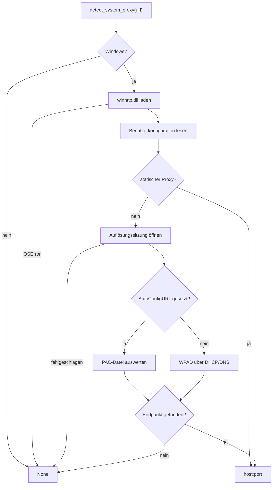

# Modul-Doku: `systemproxy.py`

| Feld | Wert |
| --- | --- |
| **Modul** | `src/research_graphrag/online/systemproxy.py` |
| **Paket** | `online` – Kandidatensuche im Netz |
| **Phase** | 9 / S1 (Nachtrag) |
| **Grundlagen** | [ADR 0032](../../../../docs/adr/0032-system-proxy-autodetection.md), [ADR 0020](../../../../docs/adr/0020-online-candidate-search-phase9.md) |

---

## 1. Zweck

Beantwortet genau eine Frage: **„Über welchen Proxy erreicht dieser Rechner die angegebene
URL?"** – und zwar dann, wenn niemand es konfiguriert hat.

Die Zielumgebung hinterlegt keinen statischen Proxy, sondern eine **PAC-Datei**. Deren
`FindProxyForURL` ist JavaScript; Python kann es nicht auswerten, Windows schon. Das Modul
kapselt den dafür zuständigen Aufruf `WinHttpGetProxyForUrl` über `ctypes` – ohne neue
Abhängigkeit, ohne JavaScript-Engine.

Es ist damit die einzige Stelle im Repository, die eine plattformgebundene Windows-Schnittstelle
direkt anspricht. Der Rest des Pakets sieht davon nichts: [`transport`](transport.md) ruft eine
Funktion auf, die `str | None` liefert.

## 2. Öffentliche Schnittstelle

| Symbol | Art | Aufgabe |
| --- | --- | --- |
| `detect_system_proxy` | Funktion | `url` → Endpunkt `host:port` oder `None` |
| `WINHTTP_ACCESS_TYPE_NO_PROXY` | Konstante | Die Auflösungssitzung braucht selbst keinen Proxy |
| `WINHTTP_AUTOPROXY_CONFIG_URL` | Konstante | PAC-Datei aus `AutoConfigURL` auswerten |
| `WINHTTP_AUTOPROXY_AUTO_DETECT` | Konstante | WPAD-Suche |
| `WINHTTP_AUTO_DETECT_TYPE_DHCP`, `…_DNS_A` | Konstanten | Suchwege der WPAD-Erkennung |

Alles Weitere ist privat: die drei `ctypes`-Strukturen, das Laden der DLL, das Lesen und
Freigeben der von Windows belegten Zeichenketten.

## 3. Ablauf

### Warum die Zeiger als `c_void_p` deklariert sind

Deklariert man die `lpsz*`-Felder als `LPWSTR`, wandelt `ctypes` sie beim Lesen sofort in einen
Python-`str` um – der von Windows belegte Zeiger ist dann verloren und kann nicht mehr
freigegeben werden. Als `c_void_p` bleibt er erhalten: gelesen wird mit `wstring_at`,
freigegeben mit `GlobalFree`, wie die Schnittstelle es verlangt.

### Warum ein Fehlschlag kein Fehler ist

Die Funktion gibt **nie** eine Ausnahme nach außen. Für einen Rechner ohne Proxy ist „kein
Endpunkt" die richtige und häufige Antwort; ein `DomainError` würde ein Werkzeug an genau den
Standorten unbrauchbar machen, an denen der Online-Modus ohnehin direkt funktioniert. Auch
`DIRECT` und jeder unerwartete Rückgabewert führen zu `None`.

### Warum die Reihenfolge festliegt

Sie entspricht der, die Windows selbst verwendet: statischer Proxy vor PAC-Datei vor WPAD. Ist
eine PAC-Adresse hinterlegt und WPAD abgeschaltet, entfällt der WPAD-Versuch – er würde nur eine
Zeitgrenze verbrauchen.

## 4. Zusammenspiel

Einziger Aufrufer ist [`transport`](transport.md), und zwar nur, wenn weder `--proxy` noch
`RESEARCH_GRAPHRAG_PROXY` gesetzt ist. Das Ergebnis wird dort gegen `host:port` geprüft und je
Zielhost gemerkt. Das Modul berührt keine Dateien, keinen Index und keine Konfiguration.

## 5. Fehler und Grenzfälle

| Fall | Verhalten |
| --- | --- |
| Nicht-Windows-System | `None` ohne jeden Aufruf |
| `winhttp.dll` fehlt oder ist defekt | `None` (abgefangenes `OSError`) |
| Benutzerkonfiguration nicht lesbar | Rückfall auf WPAD |
| Auflösungssitzung nicht zu öffnen | `None` |
| PAC liefert `DIRECT` | `None` – Direktverbindung ist gewollt |
| Liste mehrerer Endpunkte | erster Eintrag der Form `host:port`; kein Rückfall auf die weiteren |
| Eintrag mit Präfix (`http://`, `https=`) | Präfix wird abgeschnitten |
| Eintrag ohne Port | übergangen – für einen `CONNECT`-Tunnel unbrauchbar |

## 6. Determinismus

Das Ergebnis hängt von der Umgebung ab und ist **nicht** reproduzierbar: Eine geänderte PAC-Datei
liefert morgen einen anderen Endpunkt – genau deshalb existiert das Modul. Deterministisch und
getestet ist die Auswertung eines **gegebenen** Windows-Rückgabewerts (`_first_endpoint`) sowie
die Reihenfolge der Auflösungsversuche (`_attempts`).

## 7. Grenzen

Keine Bypass-Liste (`lpszProxyBypass` wird gelesen, aber nicht ausgewertet – interne Ziele
werden vom Online-Modus nicht angefragt), kein Rückfall auf den zweiten Endpunkt einer Liste,
keine Auswertung von `HTTPS_PROXY`/`HTTP_PROXY`. Der `ctypes`-Aufruf selbst ist plattform- und
netzgebunden und offline nicht testbar; die daraus folgende Unterschreitung des
Coverage-Richtwerts ist in
[ADR 0032](../../../../docs/adr/0032-system-proxy-autodetection.md) begründet.
