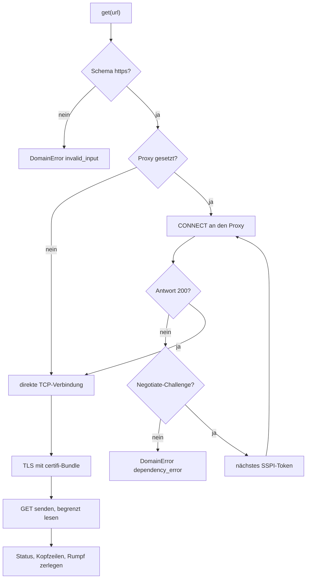

# Modul-Doku: `transport.py`

| Feld | Wert |
| --- | --- |
| **Modul** | `src/research_graphrag/online/transport.py` |
| **Paket** | `online` – Kandidatensuche im Netz |
| **Phase** | 9 / S1 |
| **Grundlagen** | [ADR 0020](../../../../docs/adr/0020-online-candidate-search-phase9.md), [ADR 0004](../../../../docs/adr/0004-llm-bridge-via-mcp-sampling.md) |

---

## 1. Zweck

Dies ist die **einzige Stelle im gesamten Repository, die eine Netzverbindung öffnet**. Das Modul
definiert dafür einen Port mit genau einer Methode und liefert eine Implementierung, die den
Weg über einen authentifizierenden Unternehmens-Proxy beherrscht.

Die Beschränkung auf ein Modul ist die eigentliche Entwurfsentscheidung: Alles andere im Paket
`online` arbeitet gegen den Port und bleibt dadurch ohne Netz testbar.

## 2. Öffentliche Schnittstelle

| Symbol | Art | Aufgabe |
| --- | --- | --- |
| `HttpClient` | Protocol | Der Port: `get(url, accept) -> HttpResponse` |
| `ProxyHttpClient` | Klasse | Einzige Implementierung – direkt oder über einen Proxy |
| `HttpResponse` | Dataclass | Status, Kopfzeilen, Rumpf (bereits entchunkt) |
| `create_client` | Funktion | Erzeugt den Client; liest den Proxy aus der Umgebung |
| `PROXY_ENV` | Konstante | Name der Umgebungsvariablen mit dem Proxy-Endpunkt |
| `USER_AGENT`, `DEFAULT_TIMEOUT` | Konstanten | Identifikation und Zeitgrenze |
| `MAX_RESPONSE_BYTES`, `MAX_AUTH_ROUNDS` | Konstanten | Obergrenzen gegen Fremdantworten |

## 3. Ablauf

### Warum der Tunnel selbst gebaut wird

Der gemessene Proxy beantwortet `CONNECT` mit **HTTP 407** und verlangt `Negotiate` oder `NTLM`.
Weder `requests` noch `httpx` beherrschen das; die passenden Zusatzpakete sind offline nicht
verfügbar. Der Handshake läuft deshalb über `sspi` aus pywin32 und nutzt den **bestehenden
Windows-Anmeldekontext** – es gibt keine Zugangsdaten im Code und keine Abfrage zur Laufzeit.

### Warum certifi und nicht der Windows-Speicher

Das Wurzelzertifikat der ausstellenden CA von arXiv fehlt im gemessenen Windows-Speicher; dieselbe
Anfrage scheitert dort mit `certificate verify failed` und gelingt mit dem certifi-Bundle. Die
Verifikation wird an keiner Stelle abgeschaltet.

### Drei Härtungen gegen fremde Antworten

1. **Nur `https`.** Andere Schemata werden abgewiesen, bevor eine Verbindung entsteht – das
   schließt `file://` und Klartextverbindungen aus.
2. **Keine Weiterleitungen.** Ein 3xx-Status wird unverändert zurückgegeben, statt einem
   fremdbestimmten Ziel zu folgen.
3. **Größengrenze.** Nach `MAX_RESPONSE_BYTES` wird abgebrochen, statt eine beliebig große
   Antwort in den Speicher zu lesen.

## 4. Zusammenspiel

Aufgerufen von [`sources`](sources.md) (Quellen-Adapter) über den injizierten Port;
[`search`](search.md) reicht den Client lediglich durch. Berührt keine Dateien und keinen Index.
Der Proxy-Endpunkt kommt ausschließlich aus der Umgebung.

## 5. Fehler und Grenzfälle

| Fall | Verhalten |
| --- | --- |
| Fremdes URL-Schema | `invalid_input`, bevor eine Verbindung entsteht |
| Proxy-Angabe nicht `host:port` | `invalid_input` bereits im Konstruktor |
| Keine Verbindung möglich | `dependency_error`; die Meldung nennt `PROXY_ENV` als Lösungsweg |
| Proxy lehnt ab / Auth scheitert | `dependency_error` mit der Statuszeile des Proxys |
| pywin32 fehlt (Nicht-Windows) | `dependency_error` statt eines rohen `ImportError` |
| Antwort zu groß | `constraint_violation` |
| Antwort ohne Statuszeile, defektes Chunking | `parse_error` |

Damit ist die Akzeptanzbedingung „ohne Netz bricht der Modus sauber ab" erfüllt: Jeder Fall endet
in einer benannten Fehlerkategorie mit handlungsleitender Meldung, nie in einem Stacktrace.

## 6. Determinismus

Netzantworten sind **nicht** deterministisch – dieselbe Anfrage kann morgen ein anderes Ergebnis
liefern. Reproduzierbar ist deshalb nicht der Lauf, sondern der **Befund**: Die Rohantworten
werden datiert abgelegt ([`report.store_raw`](report.md)). Die Zerlegung einer gegebenen Antwort
ist dagegen vollständig deterministisch und getestet.

## 7. Grenzen

Kein Verbindungs-Pooling, keine Wiederholungen, keine Weiterleitungen, kein `POST`, keine
PAC-Auswertung (ohne JavaScript-Engine nicht möglich – der Endpunkt wird konfiguriert). Der
Proxy-Pfad ist an Windows gebunden und offline nicht testbar; die daraus folgende Unterschreitung
des Coverage-Richtwerts ist in
[ADR 0020](../../../../docs/adr/0020-online-candidate-search-phase9.md) begründet.
