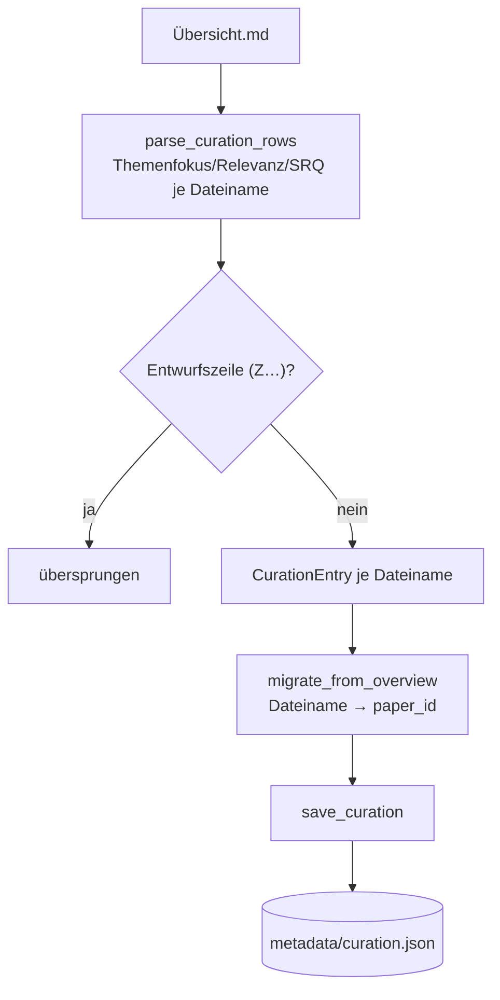

# Modul-Doku: `curation.py`

| Feld | Wert |
| --- | --- |
| **Modul** | `src/research_graphrag/overview/curation.py` |
| **Paket** | `overview` – Entwürfe und Ablösung der kuratierten Literaturübersicht |
| **Phase** | 15 / G4 (eingeführt) |
| **Grundlagen** | [ADR 0034](../../../../docs/adr/0034-decommission-uebersicht-and-inflow-stop-rule-phase15.md) |

---

## 1. Zweck

Rettet das **einzige menschliche Relevanzurteil** des Repos, bevor `Übersicht.md` außer Dienst
geht: die kuratierten Spalten `Themenfokus`, `Relevanz fuer Expose` und `SRQ-Zuordnung` von
131 Zeilen, die aus keiner anderen Quelle rekonstruierbar sind. Das Modul liest sie **verlustfrei**
aus der Markdown-Tabelle und überführt sie nach `metadata/curation.json`, geschlüsselt über
`paper_id` statt über den Dateinamen.

Bewusst **kein** Teil der Zitationskette (`bibliography/`): Dieses Urteil ist ein eigenständiges,
themenfokus-/SRQ-bezogenes Artefakt für die Auswahl in [Phase 14](../../../../Roadmap.md#phase-14--referenz-ernte-externe-verweise-aus-dem-eigenen-bestand),
keine bibliografische Angabe.

## 2. Öffentliche Schnittstelle

| Symbol | Art | Aufgabe |
| --- | --- | --- |
| `CurationEntry` | Dataclass | Ein kuratiertes Urteil (Zeilen-ID, Dateiname, Titel, Themenfokus, Relevanz, SRQ) |
| `parse_curation_rows` | Funktion | Liest die kuratierten Zeilen einer Übersichtsdatei (Dateiname → Eintrag) |
| `load_curation_rows` | Funktion | Wie `parse_curation_rows`, aber liest die Datei selbst (fehlend ⇒ leer) |
| `migrate_from_overview` | Funktion | Bildet Einträge auf `paper_id` ab (Zeilen ohne Korpus-Paper entfallen) |
| `curation_path` | Funktion | Pfad zu `metadata/curation.json` unterhalb eines Wurzelverzeichnisses |
| `load_curation` | Funktion | Liest `metadata/curation.json` (fehlend ⇒ leer) |
| `save_curation` | Funktion | Schreibt deterministisch und atomar |
| `SCHEMA_VERSION` | Konstante | Version des Speicherformats (`0.1.0`) |

## 3. Ablauf

**Verlustfrei heißt wörtlich.** Jede kuratierte Zelle wird als Freitext übernommen, nicht auf eine
Kategorie reduziert – `Relevanz fuer Expose` bleibt z. B. `"Hoch (State-Diff-Reconciliation als
Leitkonzept für Rekonstruktion)"`, nicht nur `"Hoch"`. Nur `SRQ-Zuordnung` wird zusätzlich in
einzelne Kennungen zerlegt (`"SRQ3, SRQ5"` → `("SRQ3", "SRQ5")`), weil das die einzige Spalte ist,
die eine Liste **ist**, keine Prosa.

**Die Zuordnung läuft über den Dateinamen, nicht über den Titel.** `migrate_from_overview` nimmt
eine fertige `Dateiname → paper_id`-Abbildung entgegen (aus den Canonical-Papern via
`title_from_uri`, siehe `scripts/migrate_curation.py`) – dieselbe Technik wie
`bibliography.curated.records_from_curated`, absichtlich nicht neu erfunden.

## 4. Zusammenspiel

`scripts/migrate_curation.py` ist der einzige Aufrufer: Es lädt die Canonical-Paper, baut die
Dateiname-Abbildung, migriert und schreibt – wahlweise mit `--dry-run` (nur zählen) oder
`--check` (bestehende Datei gegen `Übersicht.md` Zeile für Zeile vergleichen, Exit 1 bei
Abweichung). Der reguläre Korpus-Intake berührt dieses Modul **nicht**.

## 5. Fehler und Grenzfälle

| Situation | Fehlercode |
| --- | --- |
| `metadata/curation.json` defektes JSON | `parse_error` |
| unerwartete Schema-Version oder Struktur | `constraint_violation` |
| fehlende Datei (Übersicht oder Kurationsdatei) | leeres Ergebnis, kein Fehler |
| kuratierte Zeile ohne zuordenbares Korpus-Paper | wird ausgelassen, im Skript als Befund gemeldet |

## 6. Determinismus

- `save_curation` schreibt mit `sort_keys=True` und fester Feldreihenfolge je Eintrag – zwei
  Läufe mit denselben Daten ergeben byte-identische Dateien.
- Atomar über Temporärdatei + `os.replace`; `write_bytes` verhindert die Windows-Umsetzung von
  `\n` auf `\r\n`.

## 7. Grenzen

- **Einmaliger Migrationsschritt, kein laufender Sync.** Ändert sich eine kuratierte Zeile in
  `Übersicht.md` nach der Migration noch (was die Außerdienststellung eigentlich ausschließt),
  muss `scripts/migrate_curation.py` erneut laufen – es gibt keinen automatischen Abgleich.
- **Kein Rückweg.** Aus `metadata/curation.json` lässt sich keine Übersichtszeile mehr erzeugen;
  das ist beabsichtigt (die Datei ist die neue Quelle der Wahrheit für dieses Urteil).
