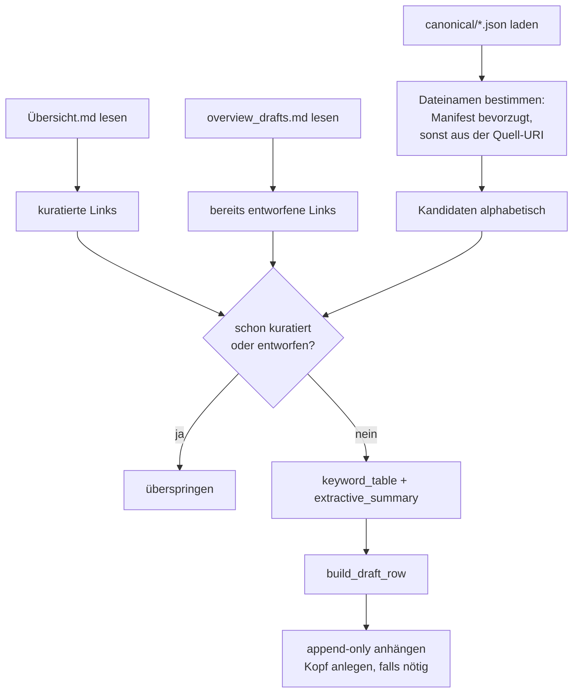
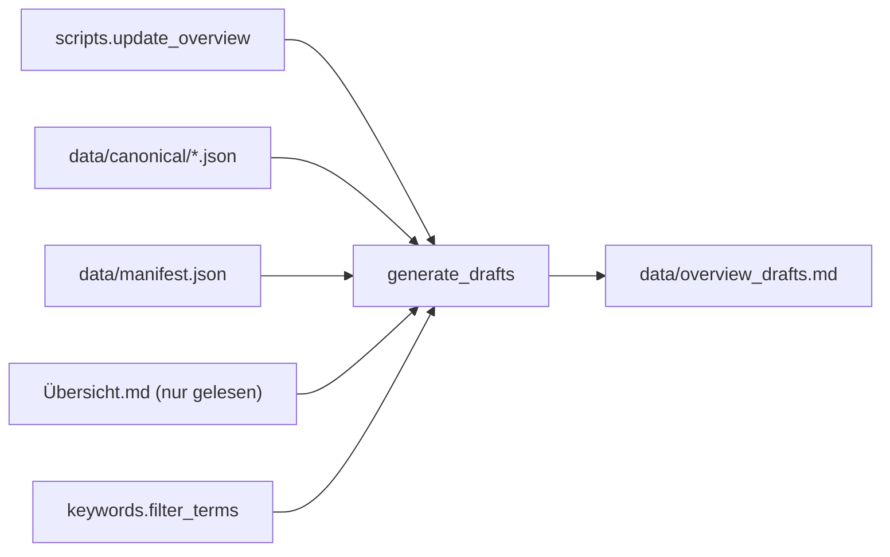

# Modul-Doku: `drafts.py`

| Feld | Wert |
| --- | --- |
| **Modul** | `src/research_graphrag/overview/drafts.py` |
| **Paket** | `overview` – Entwürfe für die kuratierte Literaturübersicht |
| **Phase** | 2 (eingeführt), 7 / A5 (Keyword-Politik) |
| **Grundlagen** | [ADR 0006](../../../../docs/adr/0006-canonical-model-phase2-scope.md), [ADR 0015](../../../../docs/adr/0015-noise-reduction-keywords-and-sections-phase7.md) |

---

## 1. Zweck

Erzeugt **Entwurfszeilen** für die kuratierte Literaturübersicht: Name, interner Link,
Identifikator, extraktive Keywords und eine Kurzzusammenfassung – für Paper, die dort noch
fehlen.

Die Leitidee ist eine strikte Arbeitsteilung: Die Maschine füllt, was sich **belegen** lässt; der
Mensch füllt, was **bewertet** werden muss (Relevanz, Themenfokus, Zuordnung zu
Forschungsfragen).

## 2. Öffentliche Schnittstelle

| Symbol | Art | Aufgabe |
| --- | --- | --- |
| `generate_drafts` | Funktion | Erzeugt fehlende Entwurfszeilen und hängt sie an |
| `build_draft_row` | Funktion | Baut eine einzelne Tabellenzeile |
| `keyword_table` | Funktion | Extraktive Top-Terme je Dokument im Korpus-Kontext |
| `extractive_summary` | Funktion | Kurztext aus Abstract oder erstem Fließtext |
| `parse_internal_links` | Funktion | Liest die verlinkten Dateinamen einer Markdown-Tabelle |
| `DraftReport` | Dataclass | Zählwerte eines Laufs |

## 3. Ablauf

### Append-only und getrennte Datei

Zwei Schutzregeln, die zusammen die kuratierte Arbeit sichern:

1. Geschrieben wird in eine **eigene** Staging-Datei, nie in die kuratierte Übersicht.
2. Geschrieben wird **nur angehängt** – bestehende Zeilen werden nie geändert oder gelöscht.

Damit kann ein versehentlicher Lauf keine Handarbeit zerstören. Der vorgesehene Weg ist: Zeile
prüfen, wertende Spalten ergänzen, in die kuratierte Übersicht übernehmen, aus dem Staging
entfernen.

### Idempotenz über die internen Links

Ob ein Paper schon erfasst ist, wird nicht über eine ID entschieden, sondern über den **internen
Link** in beiden Dateien. Der Vorteil: Die Prüfung funktioniert auch für kuratierte Zeilen, die
nie durch dieses Modul gelaufen sind.

Für das Parsen der Links ist wichtig, dass der Link-Ausdruck **gierig** liest: Dateinamen im
Korpus enthalten runde Klammern, an denen eine sparsame Variante vorzeitig abbräche.

### Keywords im Korpus-Kontext

`keyword_table` bewertet **alle** Dokumente gemeinsam. Nur so entsteht ein aussagekräftiger
Kontrast: Ein Term ist charakteristisch, weil er in diesem Paper häufig und im übrigen Korpus
selten ist.

Anschließend greift dieselbe Keyword-Politik wie bei den Community-Keywords – **vor** dem
Anschnitt, damit frei werdende Plätze aufgefüllt werden.

Das Token-Muster verlangt Wörter aus mindestens drei Buchstaben ohne Ziffern. Das hält
Seitenzahlen, Jahreszahlen und Formelreste aus der Liste.

### Zusammenfassung: Abstract bevorzugt

`extractive_summary` nimmt den Abstract, falls einer erkannt wurde, sonst den ersten Chunk mit
Abschnittstitel – also den ersten „echten" Fließtext statt einer Titelseite. Der Text wird
gekürzt und ausdrücklich als Entwurf gekennzeichnet.

### Sichere Tabellenzellen

Jede Zelle wird einzeilig gemacht und enthaltene Trennzeichen maskiert – sonst zerbräche eine
Zeile die Tabelle. Für unausgefüllte Spalten steht ein Platzhaltertext; spitze Klammern werden
bewusst vermieden, weil Markdown sie als Auszeichnung interpretieren würde.

## 4. Zusammenspiel

Das Modul ist der einzige Teil des Systems, der **außerhalb** von `data/` etwas liest – die
kuratierte Übersicht – und selbst dort nur lesend.

## 5. Fehler und Grenzfälle

| Situation | Verhalten |
| --- | --- |
| `canonical/` fehlt | `not_found` |
| Übersicht fehlt | **kein** Fehler – Warnung im Protokoll, alle Paper gelten als unkuratiert |
| Staging-Datei fehlt | wird mit Kopf angelegt |
| Manifest fehlt | Dateinamen kommen aus der Quell-URI |
| Korpus ohne verwertbaren Text | leere Keyword-Listen statt Ausnahme |

Der Warnhinweis bei fehlender Übersicht hat einen praktischen Hintergrund: Wird der Pfad falsch
übergeben, gilt plötzlich der gesamte Korpus als unkuratiert – ohne Hinweis wäre die Ursache
schwer zu finden.

## 6. Determinismus

- Kandidaten werden alphabetisch nach Dateiname verarbeitet.
- Keywords werden nach Gewicht sortiert, bei Gleichstand alphabetisch.
- Alle Inhalte sind extraktiv; es gibt keine Generierung.

Zwei Läufe über denselben Stand erzeugen identische Zeilen – und der zweite Lauf erzeugt gar
keine, weil er die Zeilen des ersten erkennt.

## 7. Grenzen

- **Kein Titel und keine Autoren.** Der Name ist der Dateiname-Stamm.
- **Extraktive Zusammenfassung.** Sie ist ein Textausschnitt und explizit vor der Übernahme zu
  prüfen.
- **Keine Bewertung.** Relevanz, Themenfokus und Zuordnung bleiben Handarbeit – bewusst
  ([ADR 0006](../../../../docs/adr/0006-canonical-model-phase2-scope.md)).
- **Kein Entfernen.** Verschwindet ein Paper aus dem Korpus, bleibt seine Entwurfszeile stehen.
