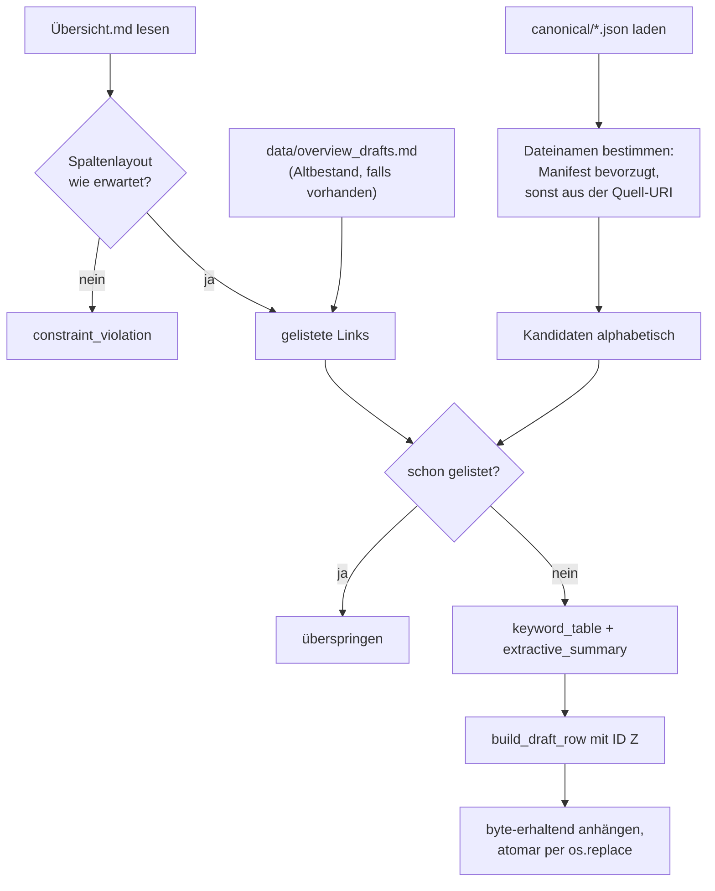
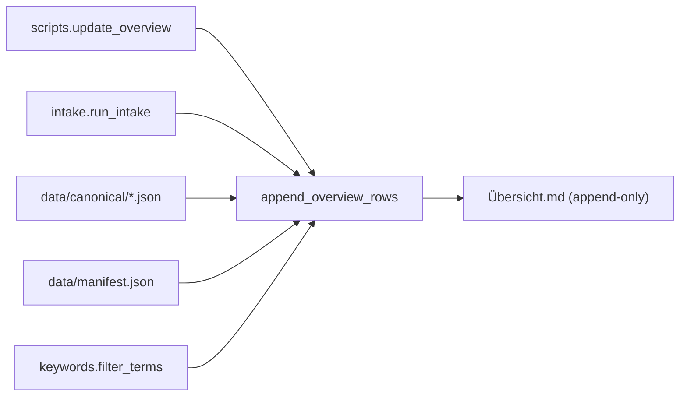

# Modul-Doku: `drafts.py`

| Feld | Wert |
| --- | --- |
| **Modul** | `src/research_graphrag/overview/drafts.py` |
| **Paket** | `overview` – Entwürfe für die kuratierte Literaturübersicht |
| **Phase** | 2 (eingeführt), 7 / A5 (Keyword-Politik), 8 (Übersicht als einzige Senke) |
| **Grundlagen** | [ADR 0006](../../../../docs/adr/0006-canonical-model-phase2-scope.md), [ADR 0015](../../../../docs/adr/0015-noise-reduction-keywords-and-sections-phase7.md), [ADR 0019](../../../../docs/adr/0019-corpus-intake-new-papers-phase8.md) |

---

## 1. Zweck

Erzeugt **Entwurfszeilen** für die kuratierte Literaturübersicht: Name, interner Link,
Identifikator, extraktive Keywords und eine Kurzzusammenfassung – für Paper, die dort noch
fehlen.

Die Leitidee ist eine strikte Arbeitsteilung: Die Maschine füllt, was sich **belegen** lässt; der
Mensch füllt, was **bewertet** werden muss (Relevanz, Themenfokus, Zuordnung zu
Forschungsfragen).

## 2. Öffentliche Schnittstelle

| Symbol | Art | Aufgabe |
| --- | --- | --- |
| `append_overview_rows` | Funktion | Hängt fehlende Entwurfszeilen an die kuratierte Übersicht an |
| `ensure_overview_target` | Funktion | Prüft die Zieldatei vorab (Existenz + Spaltenlayout) |
| `build_draft_row` | Funktion | Baut eine einzelne Tabellenzeile (mit vergebener ID) |
| `next_draft_number` | Funktion | Ermittelt die nächste freie Nummer der ID-Reihe `Z1`, `Z2`, … |
| `keyword_table` | Funktion | Extraktive Top-Terme je Dokument im Korpus-Kontext |
| `extractive_summary` | Funktion | Kurztext aus Abstract oder erstem Fließtext |
| `parse_internal_links` | Funktion | Liest die verlinkten Dateinamen einer Markdown-Tabelle |
| `link_column` | Funktion | Spaltenindex von `Interner Link` (Layout-Prüfung) |
| `split_row` | Funktion | Zellen einer Markdown-Tabellenzeile (auch vom Bibliografie-Paket genutzt) |
| `OverviewReport` | Dataclass | Zählwerte eines Laufs samt vergebener IDs |
| `DRAFT_ID_PREFIX`, `INTERNAL_LINK_COLUMN` | Konstanten | Präfix der ID-Reihe (`Z`) und erwarteter Spaltenindex des internen Links |

## 3. Ablauf

### Eine Senke, byte-erhaltend und atomar

Seit [ADR 0019](../../../../docs/adr/0019-corpus-intake-new-papers-phase8.md) gibt es nur noch
**ein** Ziel: die kuratierte Übersicht. Damit das gefahrlos möglich ist, gelten drei Regeln:

1. **Nur anhängen.** Bestehende Zeilen werden nie geändert, gelöscht oder umsortiert.
2. **Byte-erhaltend.** Der vorhandene Inhalt wird **binär** übernommen und das vorgefundene
   Zeilenende weiterverwendet. Würde stattdessen der Text neu geschrieben, ersetzte Windows jedes
   `\n` durch `\r\n` – jede kuratierte Zeile wäre verändert, obwohl sich inhaltlich nichts tut.
3. **Atomar.** Geschrieben wird in eine Temporärdatei, die per `os.replace` an ihren Platz rückt;
   ein Abbruch hinterlässt keine halbfertige Übersicht.

Dazu kommt eine **Layout-Prüfung**: Steht `Interner Link` nicht an der erwarteten Stelle, wird
gar nichts geschrieben. Das verhindert, dass ein falscher `--uebersicht`-Pfad eine fremde Tabelle
zerschreibt.

### Eigene ID-Reihe

Die kuratierten IDs (`A1`, `B2`, …) sind Themencluster – eine Zuordnung, die ein Automat nicht
vornehmen kann. Neue Zeilen bekommen daher die Reihe `Z1`, `Z2`, …, fortlaufend hinter der
höchsten bereits vergebenen Nummer. Beim Kuratieren werden sie umsortiert und umbenannt.

### Idempotenz über die internen Links

Ob ein Paper schon erfasst ist, wird nicht über eine ID entschieden, sondern über den **internen
Link**. Der Vorteil: Die Prüfung funktioniert auch für kuratierte Zeilen, die nie durch dieses
Modul gelaufen sind. Eine noch vorhandene Alt-Staging-Datei wird mitgelesen, damit ein nicht
übernommener Altbestand nicht ein zweites Mal erscheint.

Für das Parsen der Links ist wichtig, dass der Link-Ausdruck **gierig** liest: Dateinamen im
Korpus enthalten runde Klammern, an denen eine sparsame Variante vorzeitig abbräche.

### Keywords im Korpus-Kontext

`keyword_table` bewertet **alle** Dokumente gemeinsam. Nur so entsteht ein aussagekräftiger
Kontrast: Ein Term ist charakteristisch, weil er in diesem Paper häufig und im übrigen Korpus
selten ist.

Anschließend greift dieselbe Keyword-Politik wie bei den Community-Keywords – **vor** dem
Anschnitt, damit frei werdende Plätze aufgefüllt werden.

Das Token-Muster verlangt Wörter aus mindestens drei Buchstaben ohne Ziffern. Das hält
Seitenzahlen, Jahreszahlen und Formelreste aus der Liste.

### Zusammenfassung: Abstract bevorzugt

`extractive_summary` nimmt den Abstract, falls einer erkannt wurde, sonst den ersten Chunk mit
Abschnittstitel – also den ersten „echten" Fließtext statt einer Titelseite. Der Text wird
gekürzt und ausdrücklich als Entwurf gekennzeichnet.

### Sichere Tabellenzellen

Jede Zelle wird einzeilig gemacht und enthaltene Trennzeichen maskiert – sonst zerbräche eine
Zeile die Tabelle. Für unausgefüllte Spalten steht ein Platzhaltertext; spitze Klammern werden
bewusst vermieden, weil Markdown sie als Auszeichnung interpretieren würde.

## 4. Zusammenspiel

Das Modul ist der einzige Teil des Systems, der **außerhalb** von `data/` schreibt – und dort nur
anhängend.

## 5. Fehler und Grenzfälle

| Situation | Verhalten |
| --- | --- |
| `canonical/` fehlt | `not_found` |
| Übersicht fehlt | `not_found` – die kuratierte Datei wird **nicht** erfunden |
| Spaltenlayout weicht ab | `constraint_violation`, es wird nichts geschrieben |
| Manifest fehlt | Dateinamen kommen aus der Quell-URI |
| Korpus ohne verwertbaren Text | leere Keyword-Listen statt Ausnahme |

Dass eine fehlende Übersicht ein **Fehler** ist (und keine Warnung wie früher), folgt direkt aus
der Einzel-Senke: Früher wurde in eine regenerierbare Staging-Datei geschrieben, heute in ein
kuratiertes Artefakt – ein falscher Pfad darf hier nicht stillschweigend durchgehen.

## 6. Determinismus

- Kandidaten werden alphabetisch nach Dateiname verarbeitet.
- Keywords werden nach Gewicht sortiert, bei Gleichstand alphabetisch.
- Alle Inhalte sind extraktiv; es gibt keine Generierung.

Zwei Läufe über denselben Stand erzeugen identische Zeilen – und der zweite Lauf erzeugt gar
keine, weil er die Zeilen des ersten erkennt.

## 7. Grenzen

- **Kein Titel und keine Autoren.** Der Name ist der Dateiname-Stamm.
- **Extraktive Zusammenfassung.** Sie ist ein Textausschnitt und explizit vor der Übernahme zu
  prüfen.
- **Keine Bewertung.** Relevanz, Themenfokus und Zuordnung bleiben Handarbeit – bewusst
  ([ADR 0006](../../../../docs/adr/0006-canonical-model-phase2-scope.md)).
- **Kein Entfernen.** Verschwindet ein Paper aus dem Korpus, bleibt seine Entwurfszeile stehen.
