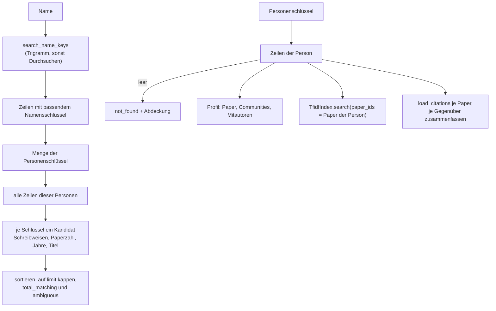
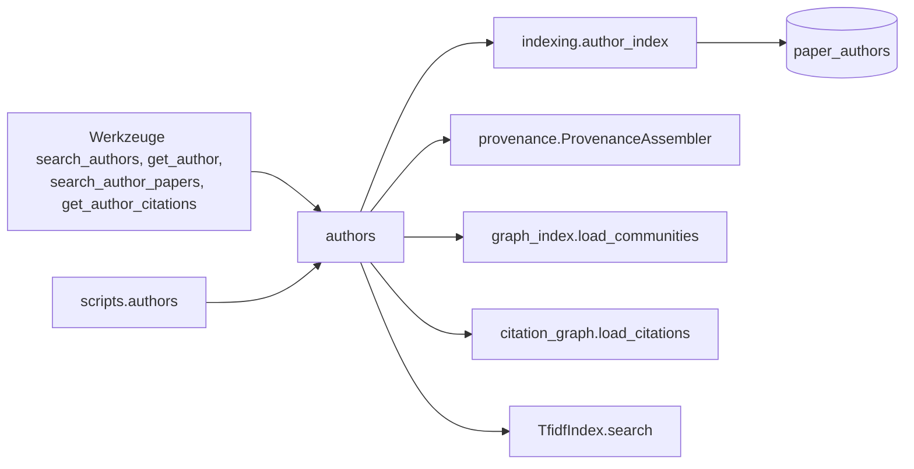

# Modul-Doku: `authors.py`

| Feld | Wert |
| --- | --- |
| **Modul** | `src/research_graphrag/retrieval/authors.py` |
| **Paket** | `retrieval` – Suchmodi und Provenienz |
| **Phase** | 17 / A4 |
| **Grundlagen** | [ADR 0043](../../../../docs/adr/0043-author-index-and-person-tools.md), [ADR 0041](../../../../docs/adr/0041-author-identity-and-schema.md), [ADR 0037](../../../../docs/adr/0037-mcp-tool-response-size-ceiling.md) |

---

## 1. Zweck

Macht Personen zu einer eigenen Rechercheebene. Vier Fragen werden beantwortet:

| Funktion | Frage |
| --- | --- |
| `search_authors` | „Wer ist gemeint?“ |
| `get_author` | „Was hat X im Korpus?“ |
| `search_author_papers` | „Was schreibt X über Y?“ |
| `get_author_citations` | „Wer zitiert X, wen zitiert X?“ |

Grundlage ist die Tabelle `paper_authors` aus [indexing/author_index](../../indexing/doc/author_index.md).
Sie enthält nur Autoren **belegter** (`strong`) Zitierdaten. Deshalb trägt jede Antwort einen
`coverage`-Block, der die Lücke ausweist.

## 2. Öffentliche Schnittstelle

| Symbol | Art | Aufgabe |
| --- | --- | --- |
| `search_authors` | Funktion | Name (+ `limit`) → `AuthorSearchResult` |
| `get_author` | Funktion | Personenschlüssel (+ `limit`) → `AuthorProfile` |
| `search_author_papers` | Funktion | Personenschlüssel, Anfrage (+ `k`) → `AuthorPapersResult` |
| `get_author_citations` | Funktion | Personenschlüssel (+ `limit` je Richtung) → `AuthorCitationsResult` |
| `coverage_of` | Funktion | Abdeckung der Personenebene aus dem Index lesen |
| `Coverage` | Dataclass | Volltexte mit Autoren / Volltexte gesamt, Anteil und Klartext (`note`) |
| `PaperBrief` | Dataclass | Kurzangabe eines Papers (Titel, Jahr, Dokumentart, Quelle, Zitierschlüssel, Kennungen) |
| `AuthorCandidate`, `AuthorPaper`, `AuthorCommunity`, `Coauthor`, `AuthorCitationLink` | Dataclasses | Einträge der Ergebnislisten |
| `DEFAULT_CANDIDATE_LIMIT` | Konstante | Standard-Deckel der Kandidatenliste (20) |
| `CORPUS_SCOPE_NOTE`, `SCOPE_CORPUS` | Konstanten | Grenze der Zitationsabfrage im Klartext |

Alle Ergebnisse haben `to_dict()` im Output-Schema der gleichnamigen Werkzeuge
([`specs/`](../../mcp_server/specs)).

## 3. Ablauf

### Ein Kandidat je Personenschlüssel, nie zusammengeführt

Die Namenssuche liefert Namensschlüssel. Daraus entsteht die Menge der **Personenschlüssel**, deren
Nennungen passen. Erst danach werden **alle** Zeilen dieser Personen geladen. Dadurch zählen auch
Paper, auf denen die Person unter einer anderen Schreibweise steht: Die Suche nach „Asai“ findet
über die OpenAlex-ID auch das Paper mit „Asai, Akari“.

Eine Person ohne Kennung (`name:…`) bleibt ein eigener Kandidat, auch wenn der Name mit einer
Kennungs-Identität übereinstimmt. `ambiguous` meldet dann die Mehrdeutigkeit. Die Wahl trifft der
Aufrufer; Gleichnamige trennt der Name allein nicht.

### Paperangaben aus dem Provenienz-Assembler

Titel, Jahr, Quelle, Dokumentart und Zitierschlüssel stammen aus dem prozessweit gecachten
[`ProvenanceAssembler`](provenance.md). Das Modul schreibt kein eigenes SQL für Paperdaten.

### Communities und Mitautoren

- **Communities:** die Louvain-Communities der Paper der Person, mit Anzahl und den ersten fünf
  Keywords. Ohne Ähnlichkeitsgraphen bleibt die Liste leer; das ist kein Fehler.
- **Mitautoren:** alle anderen Personenschlüssel auf den Papern der Person, mit der Zahl
  gemeinsamer Paper. Es gibt keine Gruppenbildung, nur direkte Mitautoren.

### Suche in den Papern einer Person

`search_author_papers` ruft `TfidfIndex.search` mit dem Filter `paper_ids` auf. Das ist dieselbe
Hybrid-Wertung und derselbe `Citation`-Contract wie bei `search_basic`. Local wird nicht angeboten:
Nachbarschaft und Fan-out verlassen die Paper der Person (ADR 0043).

### Zitationsnetz einer Person

Für jedes Paper der Person werden die `CITES`-Kanten geladen und **je Gegenüber** zusammengefasst:

- `via`: die beteiligten eigenen Paper,
- `methods`: die Kriterien der Kanten (`doi`/`arxiv`/`title`),
- `self`: Das Gegenüber ist selbst ein Paper der Person (Selbstzitat).

Sortiert wird nach der Zahl beteiligter eigener Paper, dann nach `paper_id`. Ein Gegenüber, das
mehrere Paper der Person zitiert, steht also oben.

### Kappung und Abdeckung

- Jede Liste hält `MAX_RESULT_COUNT` ein. `total_matching` bzw. `*_total` zählen **vor** der
  Kappung.
- `Coverage.note` benennt die Lücke im Klartext, etwa „Nur 4 von 6 Volltexten (67 %) tragen
  belegte Autoren …“. Bei voller Abdeckung steht dort eine kurze Bestätigung.

## 4. Zusammenspiel

## 5. Fehler und Grenzfälle

| Situation | Ergebnis |
| --- | --- |
| leerer oder zeichenloser Name, leerer Schlüssel, leere Anfrage | `invalid_input` |
| `limit`/`k` `<= 0` oder `> MAX_RESULT_COUNT` | `invalid_input` |
| Index-Datei fehlt | `not_found` |
| kein Kandidat bzw. unbekannter Schlüssel | `not_found`, die Meldung nennt die Abdeckung |
| Index ohne Personenebene (vor Phase 17 / A3) | `not_found` mit Hinweis auf `python -m scripts.ingest` |
| kein Zitationsgraph (`get_author_citations`) | `constraint_violation` |
| kein Ähnlichkeitsgraph (`get_author`) | kein Fehler, `communities` leer |
| kein passender Chunk (`search_author_papers`) | kein Fehler, `citations` leer |

## 6. Determinismus

Nur Index-Reads mit stabiler Sortierung:

- Kandidaten nach Paperzahl, dann Schlüssel,
- Paper nach Jahr (unbekanntes Jahr zuletzt), dann `paper_id`,
- Mitautoren nach gemeinsamen Papern, dann Schlüssel.

Tragen die Nennungen einer Person verschiedene ORCIDs, gewinnt die häufigste, bei Gleichstand die
alphabetisch erste.

## 7. Grenzen

- **Abdeckung:** Paper mit schwach belegten oder fehlenden Zitierdaten fehlen auf der
  Personenebene. Die Werkzeuge sagen das in jeder Antwort.
- **Keine Tippfehlertoleranz** in der Namenssuche (Teilstring bzw. Wortanfang).
- **Keine Bibliometrie**, keine Affiliationen, keine Arbeitsgruppen.
- **Nur innerhalb des Korpus:** Zitationen von oder zu Werken außerhalb fehlen.
- Erwähnungen einer Person im Fließtext (A5) folgen nach Phase 16 / F2.
