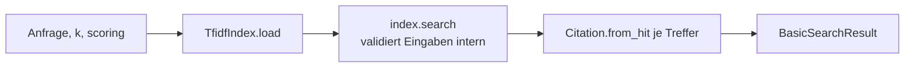
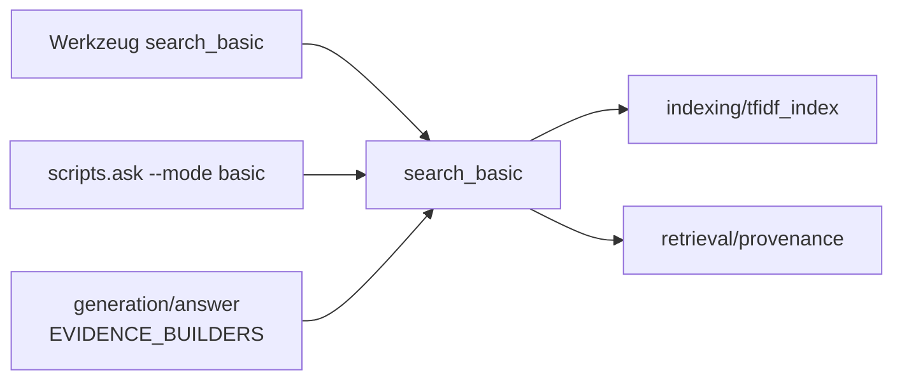

# Modul-Doku: `basic.py`

| Feld | Wert |
| --- | --- |
| **Modul** | `src/research_graphrag/retrieval/basic.py` |
| **Paket** | `retrieval` – Suchmodi und Provenienz |
| **Phase** | 0b (Durchstich), 4 (in die Modi-Familie eingeordnet) |
| **Grundlagen** | [ADR 0008](../../../../docs/adr/0008-retrieval-and-query-router-phase4.md), [ADR 0014](../../../../docs/adr/0014-hybrid-retrieval-bm25-tfidf-phase7.md) |

---

## 1. Zweck

Der einfachste und **belegstärkste** Suchmodus: Top-k-Passagen über den gesamten Chunk-Bestand,
jede mit vollständiger Provenienz. Er ist der Standardweg für exakte Fakten – DOI, Metrik,
Abkürzung, Zahlenwert – und zugleich die Rückfallebene des Routers.

Das Modul ist bewusst **dünn**: Es lädt den Index, ruft die Suche auf und verpackt das Ergebnis.
Die gesamte Ranking-Logik liegt eine Schicht tiefer.

## 2. Öffentliche Schnittstelle

| Symbol | Art | Aufgabe |
| --- | --- | --- |
| `search_basic` | Funktion | Anfrage → `BasicSearchResult` |
| `BasicSearchResult` | Dataclass | Anfrage plus absteigend sortierte Zitate, mit `to_dict()` |
| `Citation` | Re-Export | aus [provenance](provenance.md), damit Aufrufer einen stabilen Importpfad haben |

## 3. Ablauf

Drei Beobachtungen zu dieser Schlichtheit:

**Die Validierung liegt in der Suche.** Leere Anfrage, `k <= 0` und unbekannte Wertung werden
vom Index geprüft. Das Modul dupliziert diese Prüfungen nicht – eine doppelte Validierung wäre
eine zweite Wahrheit über dieselben Regeln.

**Der Modus ist die geteilte Primitive.** Was `search_basic` liefert, ist exakt die Ausgabe der
Index-Suche in Zitat-Form. Genau deshalb wird es in der Evaluation als **Contract-Test** geführt
statt als eigene Kennzahl: Eine Abweichung zwischen beiden wäre ein Fehler, keine Messgröße. Das
gilt auch für die Guardrail: Referenz-Einträge sind bereits in der Primitive nachrangig
([ADR 0031](../../../../docs/adr/0031-reference-contract-and-guardrail-phase13.md)), dieses
Modul kennt die Regel gar nicht.

**Kein Treffer ist kein Fehler.** Passt nichts, ist `citations` leer – der Aufrufer entscheidet,
wie er das darstellt.

## 4. Zusammenspiel

Der Modus ist zugleich das Ziel der Router-Rückfallebene: Ohne strukturelles Signal und bei
Gleichstand landet jede Frage hier.

## 5. Fehler und Grenzfälle

| Situation | Fehlercode |
| --- | --- |
| Index-Datei fehlt | `not_found` |
| Index ohne Chunks | `constraint_violation` |
| leere Anfrage, `k <= 0`, `k > MAX_RESULT_COUNT` (ADR 0037), unbekannte Wertung | `invalid_input` |
| kein Treffer | kein Fehler – leeres Ergebnis |

## 6. Determinismus

Vollständig deterministisch, geerbt aus der Index-Suche: Sortierung nach Score mit Tie-Break über
die Chunk-ID. Zwei identische Aufrufe liefern identische Zitate in identischer Reihenfolge.

## 7. Grenzen

- **Keine Kontexterweiterung.** Was neben der Passage steht, bleibt unsichtbar – dafür gibt es
  [local](local.md).
- **Rein lexikalisch.** Paraphrasen ohne gemeinsame Wörter werden nicht gefunden.
- **Keine Aggregation.** Mehrere Passagen desselben Papers erscheinen einzeln; es gibt keine
  Zusammenfassung je Paper.
