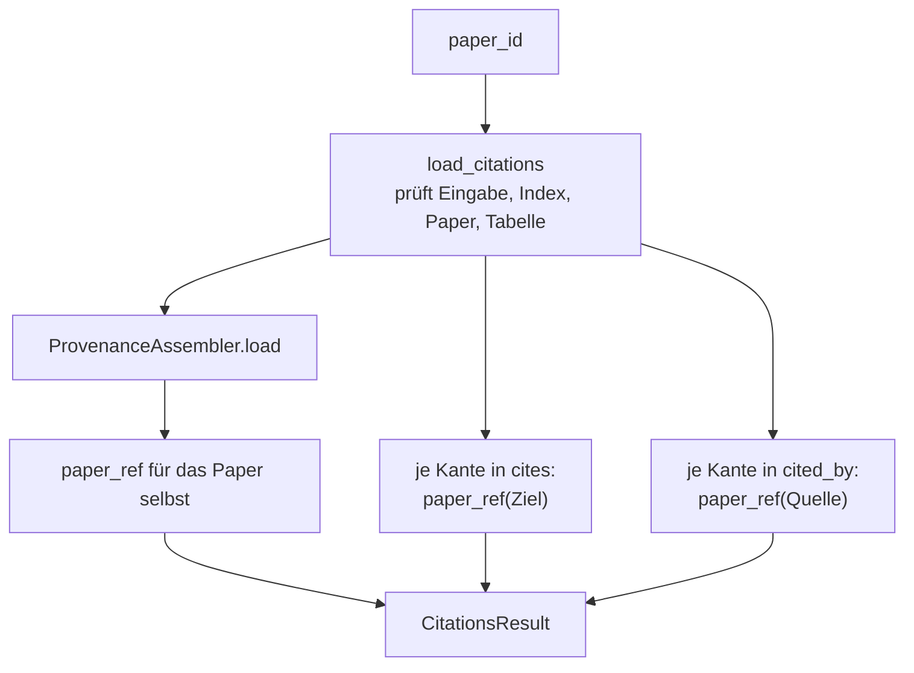
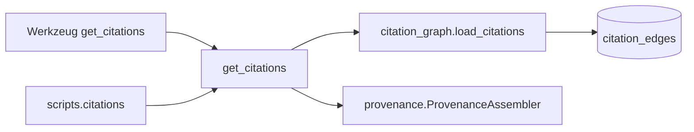

# Modul-Doku: `citations.py`

| Feld | Wert |
| --- | --- |
| **Modul** | `src/research_graphrag/retrieval/citations.py` |
| **Paket** | `retrieval` – Suchmodi und Provenienz |
| **Phase** | 7 / A2 |
| **Grundlagen** | [ADR 0011](../../../../docs/adr/0011-intra-corpus-citation-graph-phase7.md) |

---

## 1. Zweck

Beantwortet „welche Paper bauen auf X auf?" und „worauf stützt sich X?" – in **beide Richtungen**
und sofort zitierfähig. Das Modul reichert die rohen Zitationskanten aus der Indexschicht um
Paper-Provenienz an, sodass keine Folgeaufrufe nötig sind, um die Antwort zu belegen.

## 2. Öffentliche Schnittstelle

| Symbol | Art | Aufgabe |
| --- | --- | --- |
| `get_citations` | Funktion | Paper-ID → `CitationsResult` |
| `CitationsResult` | Dataclass | Das Paper selbst plus `cites` und `cited_by`, mit `to_dict()` |
| `CitationLink` | Dataclass | Ein Gegenüber-Paper plus Match-Kriterium |

## 3. Ablauf

### Die Schichtung

Die Aufgabenteilung ist dieselbe wie zwischen Ähnlichkeitsgraph und Retrieval: Die
**Indexschicht** liefert IDs und Struktur, die **Retrieval-Schicht** liefert Provenienz. Deshalb
kennt dieses Modul kein SQL – es ruft `load_citations` auf und ergänzt aus dem Assembler.

Der Vorteil zeigt sich beim Prüfen: `get_citations` muss für jedes Paper exakt den Rohkanten
entsprechen. Eine Abweichung wäre ein Fehler in der Anreicherung, nicht in der Erkennung.

### Das Feld `method` und warum es sichtbar ist

Jede Beziehung trägt das Kriterium, an dem sie erkannt wurde – DOI, arXiv-ID oder Titel. Das ist
keine Buchhaltung, sondern eine **Belastbarkeitsangabe**: Eine DOI-Kante ist praktisch sicher,
eine Titel-Kante beruht auf einem Zeichenkettenvergleich. Wer die Antwort weiterverwendet, kann
das gewichten.

### Die flache Serialisierung

`CitationLink.to_dict()` legt das Match-Kriterium **neben** die Felder der Paper-Referenz, statt
sie zu verschachteln. Ein Eintrag ist damit direkt als Beleg verwendbar, ohne dass der Aufrufer
zwei Ebenen auspacken muss.

## 4. Zusammenspiel

## 5. Fehler und Grenzfälle

| Situation | Fehlercode |
| --- | --- |
| leere `paper_id` | `invalid_input` |
| Index-Datei fehlt | `not_found` |
| Paper nicht im Index | `not_found` |
| kein Zitationsgraph im Index | `constraint_violation` |
| Paper ohne Kanten | kein Fehler – beide Listen leer |

Ein Paper ohne Kanten ist der Normalfall für Arbeiten, die im Korpus isoliert stehen: Es liefert
sich selbst als `paper` und zwei leere Listen.

## 6. Determinismus

Die Sortierung stammt aus der Indexschicht: `cites` nach der Ziel-ID, `cited_by` nach der
Quell-ID. Die Anreicherung ändert die Reihenfolge nicht.

## 7. Grenzen

- **Nur innerhalb des Korpus.** Zitationen auf externe Arbeiten erscheinen nicht.
- **Kein Kontext der Zitatstelle.** Es gibt keinen Textausschnitt aus der Referenzliste, nur den
  Leit-Ausschnitt des Gegenübers.
- **Ein Hop.** Zitationsketten über mehrere Ebenen müssen durch wiederholte Aufrufe verfolgt
  werden.
- **Erbt die Erkennungsgrenzen** aus [citation_graph](../../indexing/doc/citation_graph.md):
  Ohne erkannten Referenzabschnitt gibt es keine ausgehenden Kanten.
