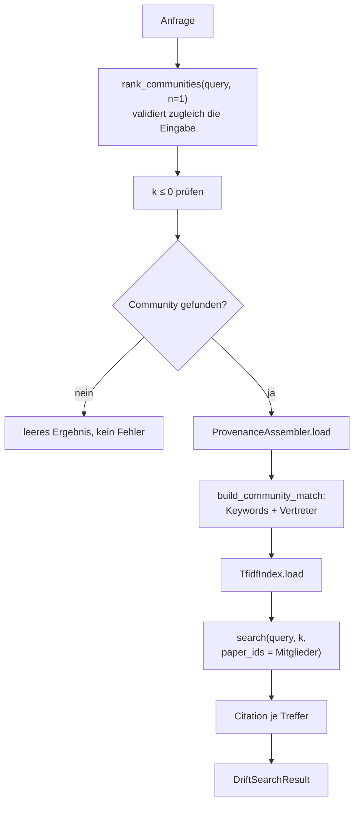

# Modul-Doku: `drift.py`

| Feld | Wert |
| --- | --- |
| **Modul** | `src/research_graphrag/retrieval/drift.py` |
| **Paket** | `retrieval` – Suchmodi und Provenienz |
| **Phase** | 4 |
| **Grundlagen** | [ADR 0008](../../../../docs/adr/0008-retrieval-and-query-router-phase4.md) |

---

## 1. Zweck

Verbindet die corpusweite Sicht mit belegten Einzelpassagen: erst die thematisch passendste
**Community** bestimmen, dann **innerhalb ihrer Mitglieder** die anfragerelevantesten Passagen
suchen.

Das ist der Modus für Widerspruchs- und Vergleichsfragen: Der Vergleich braucht einen gemeinsamen
thematischen Rahmen (die Community) **und** konkrete Belege aus den beteiligten Papern (die
Passagen).

## 2. Öffentliche Schnittstelle

| Symbol | Art | Aufgabe |
| --- | --- | --- |
| `search_drift` | Funktion | Anfrage → gewählte Community plus lokal verfeinerte Zitate |
| `DriftSearchResult` | Dataclass | Ergebnis mit `community`, `citations` und `to_dict()` |
| `DEFAULT_K` | Konstante | Standardzahl der Chunk-Belege |

## 3. Ablauf

### Die Einschränkung auf die Mitglieder

Der entscheidende Schritt ist der Paper-Filter: Gesucht wird nur innerhalb der gewählten
Community. Dadurch gilt die **Invariante**, dass jedes gelieferte Zitat aus einem Mitgliedspaper
stammt – das Ergebnis ist in sich thematisch geschlossen.

Weil der Filter nach der Sortierung wirkt, ist die Rangfolge innerhalb der Community identisch
zur Rangfolge, die dieselben Chunks in einer ungefilterten Suche hätten.

### Die Community-Wahl ist die Sollbruchstelle

Es wird genau **eine** Community gewählt. Die Messung ist hier ungewöhnlich eindeutig: Die lokale
Verfeinerung arbeitet fehlerfrei – Treffer und erreichbare Obergrenze sind identisch –, sodass
**alle** Fehlschläge in der Community-Wahl entstehen, entweder weil keine gewählt wurde oder weil
die falsche gewählt wurde.

Für die Wartung heißt das: Verbesserungen an diesem Modus gehören in die Community-Bildung oder
in das Community-Ranking, nicht in die Verfeinerung
([ADR 0016](../../../../docs/adr/0016-quantitative-retrieval-evaluation-phase7.md)).

### Warum kein iteratives DRIFT

Das Vorbild führt mehrere Verfeinerungsrunden mit Folgefragen aus – jede davon bräuchte ein
Sprachmodell zur Abfragezeit. Die hier umgesetzte Variante ist ein **einstufiger** Global→Local-
Hybrid: bewusst reduziert, dafür deterministisch und ohne Modell lauffähig.

### Die Reihenfolge der Prüfungen

`rank_communities` läuft **vor** der `k`-Prüfung, weil es zugleich Anfrage und Index validiert.
Ein `k <= 0` wird also erst nach einer erfolgreichen Community-Auswahl gemeldet – die
Fehlerkategorie bleibt dieselbe.

## 4. Zusammenspiel

DRIFT ist der einzige Modus, der **beide** Ebenen lädt: den Community-Vektorraum für die Auswahl
und den Chunk-Vektorraum für die Verfeinerung. Er ist deshalb der teuerste Modus.

## 5. Fehler und Grenzfälle

| Situation | Fehlercode |
| --- | --- |
| leere Anfrage | `invalid_input` (aus `rank_communities`) |
| `k <= 0` | `invalid_input` |
| Index-Datei fehlt | `not_found` |
| kein Graph bzw. keine Communities | `constraint_violation` |
| keine Community passt | kein Fehler – `community = None`, keine Zitate |
| Community passt, aber keine Passage | kein Fehler – Community ohne Zitate |

## 6. Determinismus

Beide Stufen sind deterministisch: die Community-Auswahl über das stabile Ranking, die
Verfeinerung über die Sortierung der Index-Suche mit Tie-Break.

## 7. Grenzen

- **Nur eine Community.** Eine Frage, die zwei Themen verbindet, sieht nur eines davon.
- **Kein Nachfassen.** Es gibt keine zweite Runde und keine Folgefragen.
- **Erbt die Grenzen der Community-Bildung.** Ein schlechter Themenschnitt schlägt voll durch.
- **Kein Widerspruchs-Nachweis.** Der Modus liefert Belege aus einem gemeinsamen Rahmen; ob sie
  sich tatsächlich widersprechen, beurteilt der lesende Agent.
