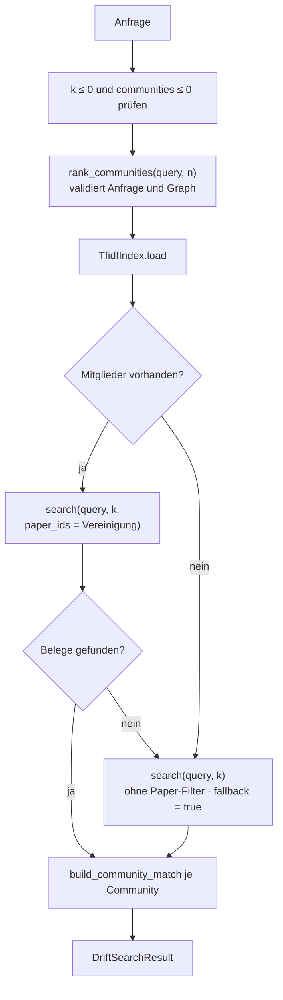
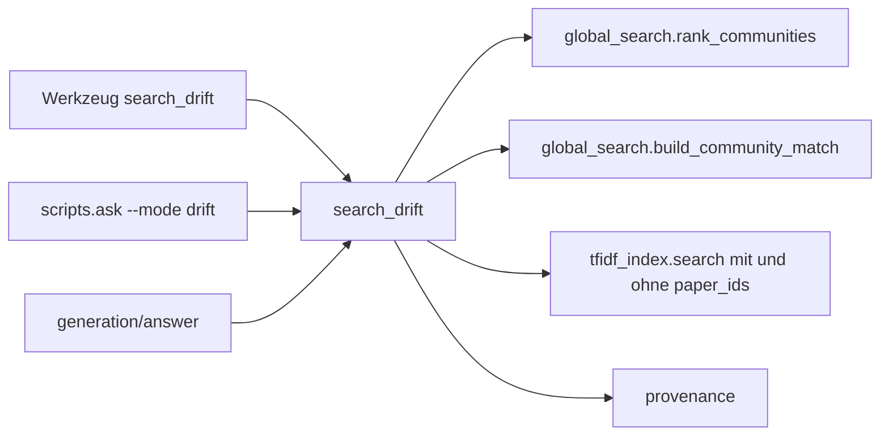

# Modul-Doku: `drift.py`

| Feld | Wert |
| --- | --- |
| **Modul** | `src/research_graphrag/retrieval/drift.py` |
| **Paket** | `retrieval` – Suchmodi und Provenienz |
| **Phase** | 4 (Community-Vereinigung und Fallback: Phase 10 / V2) |
| **Grundlagen** | [ADR 0008](../../../../docs/adr/0008-retrieval-and-query-router-phase4.md) · [ADR 0022](../../../../docs/adr/0022-drift-community-union-and-fallback-phase10.md) |

---

## 1. Zweck

Verbindet die corpusweite Sicht mit belegten Einzelpassagen: erst die thematisch passendsten
**Communities** bestimmen, dann **innerhalb der Vereinigung ihrer Mitglieder** die
anfragerelevantesten Passagen suchen.

Das ist der Modus für Widerspruchs- und Vergleichsfragen: Der Vergleich braucht einen gemeinsamen
thematischen Rahmen (die Communities) **und** konkrete Belege aus den beteiligten Papern (die
Passagen).

## 2. Öffentliche Schnittstelle

| Symbol | Art | Aufgabe |
| --- | --- | --- |
| `search_drift` | Funktion | Anfrage → gewählte Communities plus lokal verfeinerte Zitate |
| `DriftSearchResult` | Dataclass | Ergebnis mit `communities`, `citations`, `fallback` und `to_dict()` |
| `DEFAULT_K`, `DEFAULT_COMMUNITIES` | Konstanten | Standardzahl der Chunk-Belege bzw. der Communities |

## 3. Ablauf

### Die Einschränkung auf die Mitglieder

Der entscheidende Schritt ist der Paper-Filter: Gesucht wird nur innerhalb der gewählten
Communities. Dadurch gilt die **Invariante**, dass jedes gelieferte Zitat aus einem Mitgliedspaper
stammt – das Ergebnis ist in sich thematisch geschlossen. Die einzige Ausnahme ist der Fallback,
und genau deshalb wird er ausgewiesen.

Weil der Filter nach der Sortierung wirkt, ist die Rangfolge innerhalb der Kandidatenmenge
identisch zur Rangfolge, die dieselben Chunks in einer ungefilterten Suche hätten.

### Warum mehrere Communities – und warum genau fünf

Bis Phase 10 wurde genau **eine** Community gewählt. Gemessen erreichte DRIFT damit nur 8 von 34
Gold-Fragen, und alle Fehlschläge entstanden vor der Verfeinerung. Mit der Vereinigung der Top-5
steigt die erreichbare Deckelung auf **12** und die Trefferzahl auf **11** – ohne dass eine zuvor
gewonnene Frage verloren geht.

Der Wert 5 ist der Default der Global Search. Beide Modi sehen damit dieselbe Auswahl, und DRIFTs
Deckelung ist per Konstruktion Globals Trefferzahl. Ein am Gold-Set **besser** messender Wert (8)
wurde bewusst nicht genommen – eine Frage von 34 rechtfertigt kein Parameter-Tuning
([ADR 0022](../../../../docs/adr/0022-drift-community-union-and-fallback-phase10.md)).

### Die Community-Rangfolge wirkt nur über die Zugehörigkeit

In der Vereinigung entscheidet allein die Chunk-Wertung. Ein Beleg aus der fünftplatzierten
Community kann damit vor einem aus der erstplatzierten stehen. Das ist gewollt: Es gibt genau
**ein** Kriterium für die Reihenfolge der Belege – ihre Relevanz zur Anfrage.

### Der Fallback ist eine Garantie, keine Verbesserung

Liefert der Community-Pfad keine Belege, sucht der Modus im gesamten Korpus weiter – derselbe
Pfad, den die Basic Search nutzt – und setzt `fallback`. Der Grund ist gemessen: Für **12 von 34**
Gold-Fragen scort überhaupt keine Community über 0; dort antwortete DRIFT zuvor **leer**.

Zwei Dinge sind dabei wichtig:

- Der Fallback ist **Basic**, nicht DRIFT. In der Evaluation wird sein Beitrag deshalb getrennt
  ausgewiesen (Diagnose `fallback`), sonst überschätzt die Aggregatzahl den Modus.
- Ein **defekter** Index (kein Graph, keine Communities) wird **nicht** aufgefangen – dort bleibt
  es bei `constraint_violation`. Der Fallback ist eine Antwort auf fehlende Übereinstimmung, nicht
  auf einen kaputten Zustand.

### Warum kein iteratives DRIFT

Das Vorbild führt mehrere Verfeinerungsrunden mit Folgefragen aus – jede davon bräuchte ein
Sprachmodell zur Abfragezeit. Die hier umgesetzte Variante ist ein **einstufiger** Global→Local-
Hybrid: bewusst reduziert, dafür deterministisch und ohne Modell lauffähig.

## 4. Zusammenspiel

DRIFT ist der einzige Modus, der **beide** Ebenen lädt: den Community-Vektorraum für die Auswahl
und den Chunk-Vektorraum für die Verfeinerung. Er ist deshalb der teuerste Modus.

Die Zahl der Communities ist über die Python-API (`communities`) wählbar, **nicht** am
MCP-Werkzeug – und vorerst auch nicht über die CLI (Begründung im ADR).

## 5. Fehler und Grenzfälle

| Situation | Fehlercode |
| --- | --- |
| `k <= 0`, `communities <= 0` | `invalid_input` (vor dem Index geprüft) |
| leere Anfrage | `invalid_input` (aus `rank_communities`) |
| Index-Datei fehlt | `not_found` |
| kein Graph bzw. keine Communities | `constraint_violation` – **nicht** vom Fallback aufgefangen |
| keine Community passt | kein Fehler – `communities = ()`, `fallback = true`, corpusweite Belege |
| Communities passen, aber keine Passage | kein Fehler – `fallback = true`, corpusweite Belege |
| auch corpusweit kein Treffer | kein Fehler – `fallback = true`, keine Zitate |

## 6. Determinismus

Beide Stufen sind deterministisch: die Community-Auswahl über das stabile Ranking (Tie-Break über
die `community_id`), die Verfeinerung und der Fallback über die Sortierung der Index-Suche mit
Tie-Break über die `chunk_id`.

## 7. Grenzen

- **Kein Nachfassen.** Es gibt keine zweite Runde und keine Folgefragen.
- **Erbt die Grenzen der Community-Bildung.** Für 12 von 34 Gold-Fragen scort keine Community über
  0, für 7 weitere genau eine – die Vereinigung kann also nur bei einer Minderheit wirken. Der
  Grund ist das dünne Community-Dokument; das ist Gegenstand von V4.
- **Die Kandidatenmenge kann groß werden.** Im Mittel rund zehn Paper, im Einzelfall 33 – dort
  scheitert die Verfeinerung erstmals trotz erreichter Deckelung.
- **Kein Widerspruchs-Nachweis.** Der Modus liefert Belege aus einem gemeinsamen Rahmen; ob sie
  sich tatsächlich widersprechen, beurteilt der lesende Agent.
- **`answer_question` weist den Fallback nicht aus.** Dort ist nur der Modus vermerkt; die Belege
  selbst tragen ihre Provenienz korrekt.
