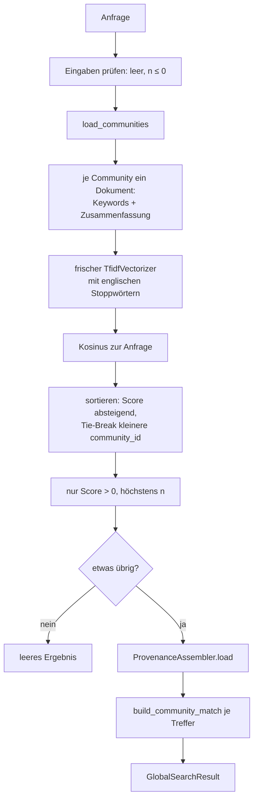
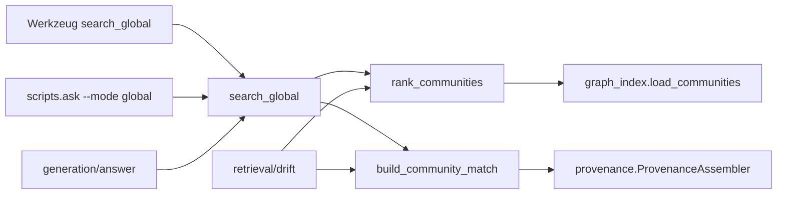

# Modul-Doku: `global_search.py`

| Feld | Wert |
| --- | --- |
| **Modul** | `src/research_graphrag/retrieval/global_search.py` |
| **Paket** | `retrieval` – Suchmodi und Provenienz |
| **Phase** | 4 |
| **Grundlagen** | [ADR 0008](../../../../docs/adr/0008-retrieval-and-query-router-phase4.md), [ADR 0007](../../../../docs/adr/0007-graphrag-index-phase3-option-b.md) |

---

## 1. Zweck

Beantwortet **corpusweite** Fragen – „welche Forschungsrichtungen zeichnen sich ab?" – auf der
Themen- statt auf der Passagen-Ebene. Statt Chunks zu durchsuchen, rankt der Modus die
**Communities** des Ähnlichkeitsgraphen und liefert je Community ihre Keywords und
repräsentativen Paper.

Das ist das Offline-Gegenstück zum Map-Reduce über Community-Reports: Die Verdichtung existiert
bereits im Index (Keywords und extraktive Zusammenfassung), sodass zur Abfragezeit kein Modell
nötig ist.

> **Namenshinweis:** Das Modul heißt `global_search.py`, weil `global` ein Python-Schlüsselwort
> ist. Funktion und Werkzeug heißen `search_global`.

## 2. Öffentliche Schnittstelle

| Symbol | Art | Aufgabe |
| --- | --- | --- |
| `search_global` | Funktion | Anfrage → gerankte Communities mit Paper-Provenienz |
| `rank_communities` | Funktion | Nur das Ranking, ohne Provenienz – von DRIFT wiederverwendet |
| `build_community_match` | Funktion | Reichert eine gerankte Community mit Vertretern an – von DRIFT wiederverwendet |
| `GlobalSearchResult`, `CommunityMatch` | Dataclasses | Ergebnis-Typen mit `to_dict()` |
| `DEFAULT_TOP_COMMUNITIES` | Konstante | Standardzahl der Communities |

## 3. Ablauf

### Ein eigener Vektorraum – und warum

Das Ranking benutzt **nicht** den Chunk-Index, sondern baut einen kleinen, frischen Vektorraum
über den Community-Dokumenten. Das ist angemessen, weil es hier nur wenige, kurze Dokumente gibt
– und es hat einen praktischen Vorteil: Der teure Chunk-Vektorraum muss gar nicht geladen werden.

Anders als im Chunk-Index werden hier **englische Stoppwörter entfernt**. Community-Dokumente
bestehen aus Keywords und einem Textausschnitt; Füllwörter tragen dort nichts bei.

### Was `rank_communities` zusätzlich leistet

Die Funktion ist die **Eingangsvalidierung** des Modus: Sie prüft Anfrage und `n`, lädt die
Communities und meldet einen fehlenden Graphen. DRIFT ruft sie deshalb als erstes auf und erbt
damit dieselben Prüfungen.

### Die Filterregel

Nur Communities mit einem Score über null erscheinen. Eine Community ohne gemeinsames Vokabular
mit der Anfrage wird nicht „zur Sicherheit" mitgeliefert – ein leeres Ergebnis ist die ehrlichere
Antwort. Für abstrakte Fragen an einen kleinen Korpus ist ein leeres Ergebnis daher korrekt und
kein Fehler.

### Provenienz auf Paper-Ebene

Die Vertreter einer Community kommen als `PaperRef` zurück – mit Quelle und Leit-Ausschnitt, aber
**ohne** Seiten- oder Chunk-Anker. Das ist bewusst so: Eine Aussage über ein corpusweites Thema
lässt sich nicht auf eine einzelne Textstelle zurückführen; ein präziser Seitenanker wäre
Scheingenauigkeit.

## 4. Zusammenspiel

Dass DRIFT beide Bausteine wiederverwendet, ist der Grund dafür, dass sie öffentlich sind: Die
Community-Auswahl und ihre Darstellung existieren nur **einmal** im Code.

## 5. Fehler und Grenzfälle

| Situation | Fehlercode |
| --- | --- |
| leere Anfrage, `n <= 0` | `invalid_input` |
| Index-Datei fehlt | `not_found` |
| kein Graph bzw. keine Communities | `constraint_violation` |
| keine Community passt | kein Fehler – leeres Ergebnis |

## 6. Determinismus

Der Vektorraum entsteht aus den gespeicherten Community-Dokumenten und ist damit reproduzierbar.
Bei gleichem Score entscheidet die kleinere Community-ID – nie die Speicherreihenfolge.

## 7. Grenzen

- **Keine Passagen-Provenienz** – konstruktionsbedingt.
- **Extraktive Zusammenfassungen.** Die Community-Beschreibung ist ein Textausschnitt, kein
  generierter Report.
- **Die Auswahl ist selektiv, nicht erschöpfend.** Wie gut sie ist, zeigt erst der Lift gegen
  Trivial-Baselines; die nackte Trefferabdeckung würde in die Irre führen
  ([ADR 0016](../../../../docs/adr/0016-quantitative-retrieval-evaluation-phase7.md)).
- **Abhängig von der Community-Qualität.** Eine schlecht geschnittene Community lässt sich hier
  nicht mehr reparieren.
