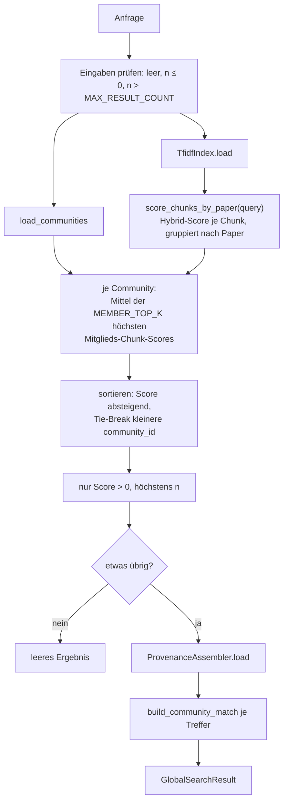
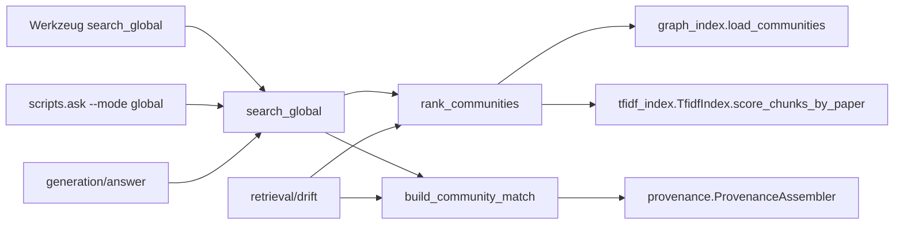

# Modul-Doku: `global_search.py`

| Feld | Wert |
| --- | --- |
| **Modul** | `src/research_graphrag/retrieval/global_search.py` |
| **Paket** | `retrieval` – Suchmodi und Provenienz |
| **Phase** | 4 |
| **Grundlagen** | [ADR 0008](../../../../docs/adr/0008-retrieval-and-query-router-phase4.md), [ADR 0007](../../../../docs/adr/0007-graphrag-index-phase3-option-b.md), [ADR 0036](../../../../docs/adr/0036-global-community-ranking-over-member-chunks-phase10.md) (Community-Ranking über Mitglieds-Chunks, Phase 10 / V4) |

---

## 1. Zweck

Beantwortet **corpusweite** Fragen – „welche Forschungsrichtungen zeichnen sich ab?" – auf der
Themen- statt auf der Passagen-Ebene. Statt Chunks einzeln zurückzugeben, rankt der Modus die
**Communities** des Ähnlichkeitsgraphen und liefert je Community ihre Keywords und
repräsentativen Paper.

Das ist das Offline-Gegenstück zum Map-Reduce über Community-Reports. Seit Phase 10 / V4
([ADR 0036](../../../../docs/adr/0036-global-community-ranking-over-member-chunks-phase10.md))
entsteht der Community-**Score** aus derselben Hybrid-Chunk-Wertung, die Basic/Local/DRIFT
teilen – Keywords und Zusammenfassung bleiben als **Anzeige**-Verdichtung erhalten, tragen aber
nicht mehr das Ranking. Grund: Zehn Keywords plus ein Satz sind zu dünn, um die Textmasse der
Mitglieder zu vertreten (Befund aus [ADR 0016](../../../../docs/adr/0016-quantitative-retrieval-evaluation-phase7.md)
und [ADR 0028](../../../../docs/adr/0028-similarity-graph-degree-phase11.md)).

> **Namenshinweis:** Das Modul heißt `global_search.py`, weil `global` ein Python-Schlüsselwort
> ist. Funktion und Werkzeug heißen `search_global`.

## 2. Öffentliche Schnittstelle

| Symbol | Art | Aufgabe |
| --- | --- | --- |
| `search_global` | Funktion | Anfrage → gerankte Communities mit Paper-Provenienz |
| `rank_communities` | Funktion | Nur das Ranking, ohne Provenienz – von DRIFT wiederverwendet |
| `build_community_match` | Funktion | Reichert eine gerankte Community mit Vertretern an – von DRIFT wiederverwendet |
| `GlobalSearchResult`, `CommunityMatch` | Dataclasses | Ergebnis-Typen mit `to_dict()` |
| `DEFAULT_TOP_COMMUNITIES` | Konstante | Standardzahl der Communities |

## 3. Ablauf

### Aggregation aus den Mitglieds-Chunks (Phase 10 / V4)

Der Community-Score ist das **Mittel der `MEMBER_TOP_K` (= 5) höchsten Hybrid-Chunk-Scores**
ihrer Mitgliederpaper – berechnet über `TfidfIndex.score_chunks_by_paper`, dieselbe Score-Quelle
wie Basic/Local/DRIFT. Ein Top-*k*-Mittel statt einer Summe ist bewusst gewählt: Eine Summe
bevorzugt strukturell große Communities (in der Wegwerf-Messung stieg die Selektivität dabei auf
0,276 bei gesunkenem Lift 1,91, gegenüber 3,2–3,5 der Top-*k*-Mittel-Varianten). `MEMBER_TOP_K`
folgt der bestehenden `k=5`-Konvention der übrigen Modi statt eines separat getunten Werts –
*top_k* ∈ {3, 5, 10} erwies sich am 34-Fragen-Gold-Set als praktisch gleichwertig
([ADR 0036](../../../../docs/adr/0036-global-community-ranking-over-member-chunks-phase10.md)).

Vor V4 baute das Ranking einen eigenen, frischen `TfidfVectorizer` über Keywords + Zusammenfassung
je Community. Dieser Vektorraum entfällt vollständig – Keywords und Zusammenfassung bleiben nur
noch als Anzeige-Felder in `CommunityMatch` erhalten.

### Was `rank_communities` zusätzlich leistet

Die Funktion ist die **Eingangsvalidierung** des Modus: Sie prüft Anfrage und `n`, lädt die
Communities und meldet einen fehlenden Graphen. DRIFT ruft sie deshalb als erstes auf und erbt
damit dieselben Prüfungen.

### Die Filterregel

Nur Communities mit einem Score über null erscheinen. Eine Community ohne gemeinsames Vokabular
mit der Anfrage wird nicht „zur Sicherheit" mitgeliefert – ein leeres Ergebnis ist die ehrlichere
Antwort. Für abstrakte Fragen an einen kleinen Korpus ist ein leeres Ergebnis daher korrekt und
kein Fehler.

### Provenienz auf Paper-Ebene

Die Vertreter einer Community kommen als `PaperRef` zurück – mit Quelle und Leit-Ausschnitt, aber
**ohne** Seiten- oder Chunk-Anker. Das ist bewusst so: Eine Aussage über ein corpusweites Thema
lässt sich nicht auf eine einzelne Textstelle zurückführen; ein präziser Seitenanker wäre
Scheingenauigkeit.

## 4. Zusammenspiel

Dass DRIFT beide Bausteine wiederverwendet, ist der Grund dafür, dass sie öffentlich sind: Die
Community-Auswahl und ihre Darstellung existieren nur **einmal** im Code.

## 5. Fehler und Grenzfälle

| Situation | Fehlercode |
| --- | --- |
| leere Anfrage, `n <= 0`, `n > MAX_RESULT_COUNT` (ADR 0037) | `invalid_input` |
| Index-Datei fehlt | `not_found` |
| kein Graph bzw. keine Communities | `constraint_violation` |
| keine Community passt | kein Fehler – leeres Ergebnis |

## 6. Determinismus

Die Aggregation entsteht aus dem persistierten, tokenisierten Zustand des Chunk-Index
(`TfidfIndex`) und ist damit reproduzierbar. Bei gleichem Score entscheidet die kleinere
Community-ID – nie die Speicherreihenfolge.

## 7. Grenzen

- **Keine Passagen-Provenienz** – konstruktionsbedingt.
- **Extraktive Zusammenfassungen.** Die Community-Beschreibung (Anzeige, nicht mehr Ranking) ist
  ein Textausschnitt, kein generierter Report.
- **Die Auswahl ist selektiv, nicht erschöpfend.** Wie gut sie ist, zeigt erst der Lift gegen
  Trivial-Baselines; die nackte Trefferabdeckung würde in die Irre führen
  ([ADR 0016](../../../../docs/adr/0016-quantitative-retrieval-evaluation-phase7.md)). Seit V4
  liegt die Selektivität bei `n=5` strukturell höher als vor V4 (0,163 statt 0,037) – der Lift
  bleibt aber bei jeder gemessenen Community-Zahl klar über beiden Trivial-Baselines
  ([ADR 0036](../../../../docs/adr/0036-global-community-ranking-over-member-chunks-phase10.md)).
- **Mitglieds-Chunks können Referenz-Einträge (Abstracts ohne Volltext) sein.** Ihre Chunk-Scores
  gehen wie jeder andere Mitglieds-Chunk in die Aggregation ein; ein eigener Ausschluss ist (noch)
  nicht gemessen.
- **Abhängig von der Community-Qualität.** Eine schlecht geschnittene Community lässt sich hier
  nicht mehr reparieren.
- **`n` ist gedeckelt.** Seit [ADR 0037](../../../../docs/adr/0037-mcp-tool-response-size-ceiling.md)
  gilt dieselbe geteilte Obergrenze wie bei den übrigen Retrieval-Werkzeugen
  (`research_graphrag.limits.MAX_RESULT_COUNT`).
