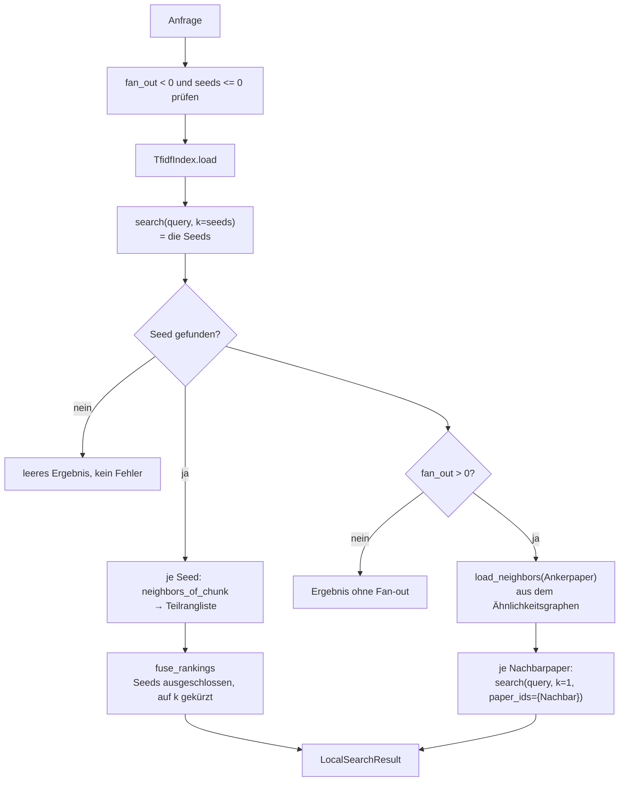
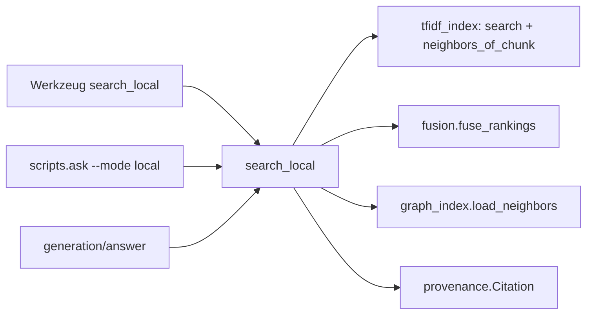

# Modul-Doku: `local.py`

| Feld | Wert |
| --- | --- |
| **Modul** | `src/research_graphrag/retrieval/local.py` |
| **Paket** | `retrieval` – Suchmodi und Provenienz |
| **Phase** | 4 (Multi-Seed: Phase 10 / V1) |
| **Grundlagen** | [ADR 0008](../../../../docs/adr/0008-retrieval-and-query-router-phase4.md) · [ADR 0021](../../../../docs/adr/0021-local-multi-seed-phase10.md) |

---

## 1. Zweck

Beantwortet Detailfragen **und** Netz-Fragen, indem es von den besten Passagen aus in zwei
Richtungen ausgreift: in die inhaltliche Nachbarschaft desselben Textes und in die thematische
Nachbarschaft anderer Paper.

Damit bildet der Modus zwei Aspekte ab, die GraphRAG unter „Local" zusammenfasst: den Kontext um
eine Fundstelle und den Hop zu benachbarten Dokumenten.

## 2. Öffentliche Schnittstelle

| Symbol | Art | Aufgabe |
| --- | --- | --- |
| `search_local` | Funktion | Anfrage → Seeds, Chunk-Nachbarschaft, Paper-Fan-out |
| `LocalSearchResult` | Dataclass | Ergebnis mit `seeds`, `neighborhood`, `fan_out` und `to_dict()` |
| `NeighborPaper` | Dataclass | Ein Nachbarpaper mit Kantengewicht und optionalem Beleg |
| `DEFAULT_SEEDS`, `DEFAULT_NEIGHBORHOOD`, `DEFAULT_FANOUT` | Konstanten | Standardgrößen der drei Bausteine |

## 3. Ablauf

### Die drei Bausteine

| Baustein | Woher | Wozu |
| --- | --- | --- |
| **Seeds** | die besten Passagen zur Anfrage (Top-*m*) | die Anker des gesamten Ergebnisses |
| **Chunk-Nachbarschaft** | ähnlichste Chunks **je Seed**, rang-fusioniert | der Kontext um die Fundstellen |
| **Paper-Fan-out** | Nachbarpaper des Ankerpapers im Graphen | der Sprung in andere Dokumente |

Die Chunk-Nachbarschaft wird **zur Abfragezeit** berechnet; es gibt keinen persistierten
Chunk-Graphen. Der Paper-Fan-out dagegen nutzt den persistierten Ähnlichkeitsgraphen aus dem
Index-Bau.

### Warum mehrere Seeds

Bis Phase 10 hing alles an **einem** Treffer: War er falsch, waren Nachbarschaft und Fan-out
zwangsläufig ebenfalls daneben – auch wenn die richtige Passage auf Rang 2 stand. Gemessen war
das die dominierende Fehlerquelle: 17 von 34 Gold-Fragen hatten einen Seed-Treffer, während die
Basic Search 30 erreichte. Mit fünf Seeds sind es 30
([ADR 0021](../../../../docs/adr/0021-local-multi-seed-phase10.md)).

Der Wert 5 ist **gemessen, nicht gesetzt**: Er ist das kleinste *m*, mit dem Local der Basic
Search auf Hit@5 und MRR@5 nicht unterlegen ist.

### Warum die Nachbarschaften fusioniert werden

Jeder Seed liefert eine eigene Nachbarschaftsliste. Ihre Kosinuswerte sind **nicht vergleichbar**
– sie beziehen sich auf unterschiedliche Ausgangs-Chunks. Zusammengeführt wird deshalb über die
Ränge (Reciprocal Rank Fusion, dieselbe Mechanik wie in der Hybrid-Wertung). `k` begrenzt die
**gesamte** Nachbarschaft, nicht die je Seed; Chunks, die selbst Seed sind, entfallen.

Der ausgewiesene `score` ist deshalb auch hier der **Fusionswert** und nicht der Kosinus – sonst
würde eine korrekt sortierte Liste mit springenden Zahlen angezeigt und sähe wie ein Fehler aus.
Der Kosinus zum best platzierten Seed bleibt in `score_tfidf` erhalten
([ADR 0014](../../../../docs/adr/0014-hybrid-retrieval-bm25-tfidf-phase7.md)).

Bei genau einem Seed erhält die Fusion die ursprüngliche Reihenfolge – das Verhalten vor V1 ist
mit `seeds = 1` exakt reproduzierbar und in einem Test festgehalten.

### Warum der Fan-out nur einem Anker folgt

Die Erweiterung „Nachbarn aller Seed-Paper vereinigen" wurde gemessen und veränderte **keine**
der 34 Gold-Fragen. Der Fan-out bleibt deshalb am Paper des **ersten** Seeds verankert. Das ist
keine Aussage über seinen Nutzen, sondern über die Messgrenze: Das heutige Gold-Set enthält nur
lexikalisch verankerte Fragen.

### Warum der Fan-out je Nachbar erneut sucht

Ein Nachbarpaper allein ist kein Beleg. Deshalb wird für jeden Nachbarn die **anfragerelevanteste
Passage** gesucht – über den Paper-Filter der Index-Suche. Findet sich keine, bleibt der Nachbar
mit seinem Kantengewicht erhalten, aber ohne Zitat: Die Kante ist dann eine Information über
Ähnlichkeit, kein Beleg für eine Aussage.

### Warum die Nachbarschaft beim reinen Kosinus bleibt

BM25 ist ein Anfrage-Dokument-Modell. Für die Ähnlichkeit **zwischen zwei Chunks** ist es nicht
gedacht, deshalb wirkt die Wertungs-Umschaltung nur auf Seeds und Fan-out-Belege
([ADR 0014](../../../../docs/adr/0014-hybrid-retrieval-bm25-tfidf-phase7.md)).

### `fan_out = 0` braucht keinen Graphen

Ohne Fan-out wird der Ähnlichkeitsgraph nicht angefasst. Der Modus funktioniert damit auch auf
einem Index, für den nur die Chunk-Ebene gebaut wurde – nützlich für Tests und schlanke Setups.

## 4. Zusammenspiel

Die Zahl der Seeds ist über CLI (`--seeds`) und Python-API wählbar, **nicht** am MCP-Werkzeug: Sie
beschreibt die interne Ankerbildung, nicht die gewünschte Ergebnisgröße.

## 5. Fehler und Grenzfälle

| Situation | Fehlercode |
| --- | --- |
| `fan_out < 0`, `seeds <= 0` | `invalid_input` (vor dem Index geprüft) |
| leere Anfrage, `k <= 0`, unbekannte Wertung | `invalid_input` (aus der Index-Suche) |
| Index fehlt | `not_found` |
| Index ohne Chunks, oder `fan_out > 0` ohne Graph | `constraint_violation` |
| kein Treffer gefunden | kein Fehler – leeres Ergebnis mit `seeds = ()` |

## 6. Determinismus

Deterministisch in allen drei Bausteinen: Die Seeds folgen der Sortierung der Index-Suche, die
Nachbarschaft dem Fusionswert mit Tie-Break über die Chunk-ID, der Fan-out der stabilen
Kantenordnung des Graphen.

## 7. Grenzen

- **Ein Hop.** Der Fan-out geht genau eine Kante weit; es gibt keine Multi-Hop-Traversierung.
- **Ähnlichkeit statt Zitation.** Die Kanten sagen „thematisch benachbart", nicht „zitiert" –
  echte Zitationen liefert [citations](citations.md).
- **Kein iteratives Nachfassen.** Der Modus fragt einmal und gibt zurück.
- **Der Zugewinn durch die Seeds ist teilweise definitorisch:** Mit `seeds = k` enthält das Bündel
  die Top-*k* der Chunk-Suche und damit dasselbe wie [basic](basic.md). Nachbarschaft und Fan-out
  tragen zur Trefferquote wenig bei; ihr Wert ist der Kontext.
