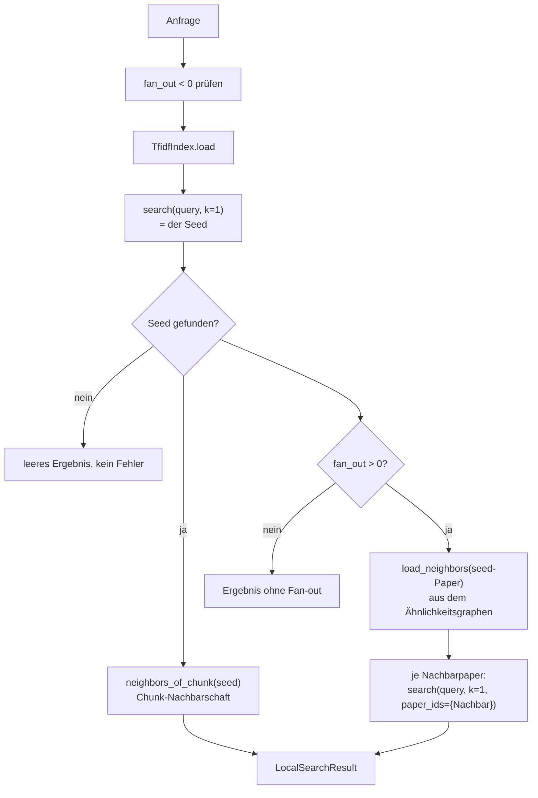
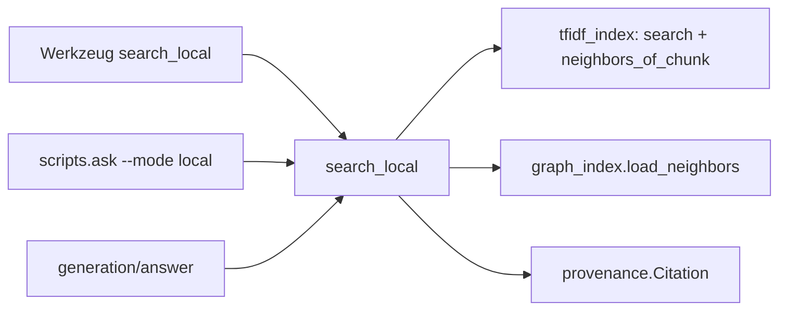

# Modul-Doku: `local.py`

| Feld | Wert |
| --- | --- |
| **Modul** | `src/research_graphrag/retrieval/local.py` |
| **Paket** | `retrieval` – Suchmodi und Provenienz |
| **Phase** | 4 |
| **Grundlagen** | [ADR 0008](../../../../docs/adr/0008-retrieval-and-query-router-phase4.md) |

---

## 1. Zweck

Beantwortet Detailfragen **und** Netz-Fragen, indem es von der besten Passage aus in zwei
Richtungen ausgreift: in die inhaltliche Nachbarschaft desselben Textes und in die thematische
Nachbarschaft anderer Paper.

Damit bildet der Modus zwei Aspekte ab, die GraphRAG unter „Local" zusammenfasst: den Kontext um
eine Fundstelle und den Hop zu benachbarten Dokumenten.

## 2. Öffentliche Schnittstelle

| Symbol | Art | Aufgabe |
| --- | --- | --- |
| `search_local` | Funktion | Anfrage → Seed, Chunk-Nachbarschaft, Paper-Fan-out |
| `LocalSearchResult` | Dataclass | Ergebnis mit `seed`, `neighborhood`, `fan_out` und `to_dict()` |
| `NeighborPaper` | Dataclass | Ein Nachbarpaper mit Kantengewicht und optionalem Beleg |
| `DEFAULT_NEIGHBORHOOD`, `DEFAULT_FANOUT` | Konstanten | Standardgrößen der beiden Erweiterungen |

## 3. Ablauf

### Die drei Bausteine

| Baustein | Woher | Wozu |
| --- | --- | --- |
| **Seed** | beste Passage zur Anfrage | der Anker des gesamten Ergebnisses |
| **Chunk-Nachbarschaft** | ähnlichste Chunks zum Seed-Chunk | der Kontext um die Fundstelle |
| **Paper-Fan-out** | Nachbarpaper des Seed-Papers im Graphen | der Sprung in andere Dokumente |

Die Chunk-Nachbarschaft wird **zur Abfragezeit** berechnet; es gibt keinen persistierten
Chunk-Graphen. Der Paper-Fan-out dagegen nutzt den persistierten Ähnlichkeitsgraphen aus dem
Index-Bau.

### Der Seed ist die Sollbruchstelle

Alles hängt an **einem** Treffer. Ist der Seed falsch, sind Nachbarschaft und Fan-out
zwangsläufig ebenfalls daneben – auch wenn die richtige Passage auf Rang 2 gestanden hätte.

Das ist gemessen und dokumentiert: Bei Fakt-Fragen liegt Local deutlich hinter Basic, und der
Fan-out rettet nur einen Bruchteil der Fälle. Die Diagnose der Evaluation unterscheidet deshalb
explizit, welcher Baustein einen Treffer beigesteuert hat
([ADR 0016](../../../../docs/adr/0016-quantitative-retrieval-evaluation-phase7.md)).

### Warum der Fan-out je Nachbar erneut sucht

Ein Nachbarpaper allein ist kein Beleg. Deshalb wird für jeden Nachbarn die **anfragerelevanteste
Passage** gesucht – über den Paper-Filter der Index-Suche. Findet sich keine, bleibt der Nachbar
mit seinem Kantengewicht erhalten, aber ohne Zitat: Die Kante ist dann eine Information über
Ähnlichkeit, kein Beleg für eine Aussage.

### Warum die Nachbarschaft beim reinen Kosinus bleibt

BM25 ist ein Anfrage-Dokument-Modell. Für die Ähnlichkeit **zwischen zwei Chunks** ist es nicht
gedacht, deshalb wirkt die Wertungs-Umschaltung nur auf Seed und Fan-out-Belege
([ADR 0014](../../../../docs/adr/0014-hybrid-retrieval-bm25-tfidf-phase7.md)).

### `fan_out = 0` braucht keinen Graphen

Ohne Fan-out wird der Ähnlichkeitsgraph nicht angefasst. Der Modus funktioniert damit auch auf
einem Index, für den nur die Chunk-Ebene gebaut wurde – nützlich für Tests und schlanke Setups.

## 4. Zusammenspiel

## 5. Fehler und Grenzfälle

| Situation | Fehlercode |
| --- | --- |
| `fan_out < 0` | `invalid_input` (vor dem Index geprüft) |
| leere Anfrage, `k <= 0`, unbekannte Wertung | `invalid_input` (aus der Index-Suche) |
| Index fehlt | `not_found` |
| Index ohne Chunks, oder `fan_out > 0` ohne Graph | `constraint_violation` |
| kein Seed gefunden | kein Fehler – leeres Ergebnis mit `seed = None` |

## 6. Determinismus

Deterministisch in allen drei Bausteinen: Der Seed folgt der Sortierung der Index-Suche, die
Nachbarschaft dem Kosinus mit Tie-Break über die Chunk-ID, der Fan-out der stabilen
Kantenordnung des Graphen.

## 7. Grenzen

- **Ein Hop.** Der Fan-out geht genau eine Kante weit; es gibt keine Multi-Hop-Traversierung.
- **Ähnlichkeit statt Zitation.** Die Kanten sagen „thematisch benachbart", nicht „zitiert" –
  echte Zitationen liefert [citations](citations.md).
- **Keine Seed-Alternativen.** Es wird nur der beste Treffer verfolgt, nicht die besten drei.
- **Kein iteratives Nachfassen.** Der Modus fragt einmal und gibt zurück.
