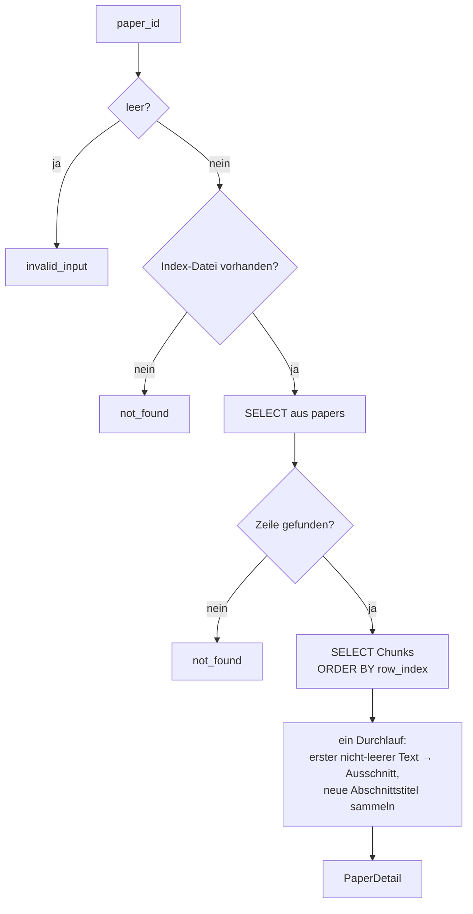
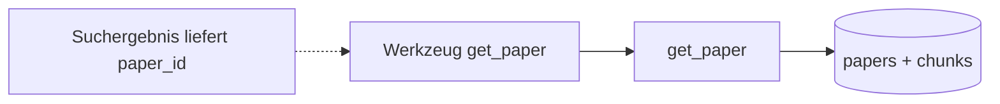

# Modul-Doku: `paper.py`

| Feld | Wert |
| --- | --- |
| **Modul** | `src/research_graphrag/retrieval/paper.py` |
| **Paket** | `retrieval` – Suchmodi und Provenienz |
| **Phase** | 5 |
| **Grundlagen** | [ADR 0009](../../../../docs/adr/0009-mcp-server-stdio-phase5.md) |

---

## 1. Zweck

Liefert die **Metadaten eines einzelnen Papers** – Quelle, Identifikatoren, Umfang,
Abschnittsfolge und ein Leit-Ausschnitt. Es ist das Nachschlagewerk, das ein Agent aufruft,
nachdem eine Suche ihm eine Paper-ID geliefert hat.

## 2. Öffentliche Schnittstelle

| Symbol | Art | Aufgabe |
| --- | --- | --- |
| `get_paper` | Funktion | Paper-ID → `PaperDetail` |
| `PaperDetail` | Dataclass | Metadaten mit `to_dict()`, inkl. `document_kind` |

## 3. Ablauf

### Nur die Paper-ID, niemals ein Pfad

Das ist die sicherheitsrelevante Entscheidung dieses Moduls. Die Eingabe ist ausschließlich eine
**Paper-ID**, kein Dateipfad. Damit gibt es an dieser Stelle keine Möglichkeit, über
Pfadangaben aus dem Index auszubrechen – Verzeichniswechsel-Angriffe laufen ins Leere, weil kein
nutzerbestimmter Pfad in eine Dateisystem-Operation gelangt.

Aus demselben Grund liest das Modul **nicht** aus `data/canonical/`, obwohl dort mehr Details
lägen: Der Index ist die Quelle der Wahrheit, und der Canonical-Cache ist nicht versioniert und
könnte fehlen.

### `document_kind` trennt „unvollständig" von „defekt"

Ein Referenz-Eintrag ohne Volltext liefert `n_pages = 0`, `n_chunks = 1` und genau einen
Abschnitt. Ohne die Dokumentart sähe das nach einer misslungenen Extraktion aus; mit ihr ist es
die vollständige Auskunft über ein Paper, dessen Volltext nicht beschaffbar war. Die
Literaturangabe in `reference` bleibt davon unberührt vollständig
([ADR 0031](../../../../docs/adr/0031-reference-contract-and-guardrail-phase13.md)).

### Die Abschnittsfolge

Die Abschnittstitel entstehen als **eindeutige Titel in Dokumentreihenfolge**: Beim Durchlauf der
Chunks wird jeder neue Titel einmal angehängt. Das ergibt eine kompakte Gliederung, die zeigt,
worüber ein Paper überhaupt spricht – ohne den Volltext zu übertragen.

Wiederholungen entfallen, weil ein Abschnitt in der Regel mehrere Chunks umfasst. Die Reihenfolge
bleibt die des Dokuments.

### Ein Durchlauf für zwei Ergebnisse

Leit-Ausschnitt und Abschnittsfolge entstehen in derselben Schleife über die Chunk-Zeilen. Der
Ausschnitt ist der Text des ersten **nicht-leeren** Chunks – derselbe extraktive Anker, den auch
der Provenienz-Assembler verwendet.

### Kein Vektorraum

Das Modul greift direkt per SQL zu. Es lädt weder `sklearn` noch eine Matrix und ist deshalb um
Größenordnungen schneller als ein Suchaufruf.

## 4. Zusammenspiel

Typischer Ablauf in Copilot: Eine Suche liefert Zitate mit Paper-IDs; für das interessanteste
Paper folgt `get_paper`, um Kontext und Identifikatoren zu bekommen.

## 5. Fehler und Grenzfälle

| Situation | Fehlercode |
| --- | --- |
| leere oder nur aus Leerzeichen bestehende `paper_id` | `invalid_input` |
| Index-Datei fehlt | `not_found` |
| Paper-ID unbekannt | `not_found` |
| Paper ohne Abschnittstitel | kein Fehler – leere Abschnittsliste |
| Paper ohne Identifikatoren | kein Fehler – leeres Dict |

Die Prüfung der leeren ID läuft **vor** dem Dateizugriff: Eine offensichtlich ungültige Eingabe
soll nicht als „Index fehlt" gemeldet werden.

## 6. Determinismus

Feste Sortierung über `row_index`; die Abschnittsfolge ist damit stabil. Identifikatoren werden
aus dem gespeicherten JSON gelesen, das bereits mit sortierten Schlüsseln geschrieben wurde.

## 7. Grenzen

- **Kein Volltext.** Nur ein Ausschnitt; für Inhalte sind die Suchmodi zuständig.
- **Zwei Sichten auf Identifikatoren.** `identifiers` ist die **extrahierte** Rohsicht aus der
  Tabelle `papers`; der aufgelöste, zitierfähige Datensatz steht seit Phase 12 unter `reference`
  (siehe [reference](reference.md) und
  [ADR 0025](../../../../docs/adr/0025-citable-paper-metadata.md)). Beide können abweichen – das
  ist gewollt und in `reference.origins` nachvollziehbar.
- **Abschnittstitel sind heuristisch** und können ungenau sein
  ([ADR 0006](../../../../docs/adr/0006-canonical-model-phase2-scope.md)).
- **Keine Zitationen.** Dafür gibt es [citations](citations.md).
