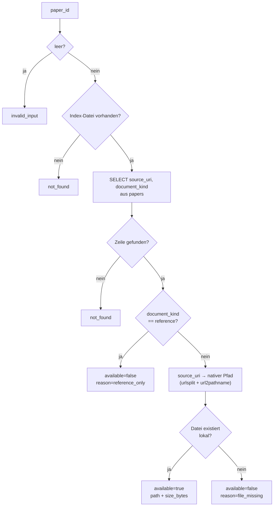
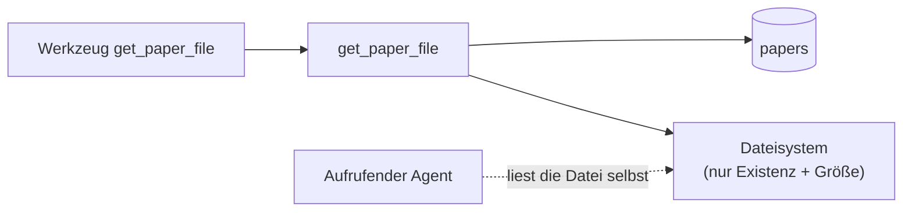

# Modul-Doku: `paper_file.py`

| Feld | Wert |
| --- | --- |
| **Modul** | `src/research_graphrag/retrieval/paper_file.py` |
| **Paket** | `retrieval` – Suchmodi und Provenienz |
| **Phase** | – (ADR-getrieben, außerhalb der Roadmap-Phasenzählung) |
| **Grundlagen** | [ADR 0039](../../../../docs/adr/0039-correction-tool-and-pdf-file-access.md), [ADR 0009](../../../../docs/adr/0009-mcp-server-stdio-phase5.md), [ADR 0037](../../../../docs/adr/0037-mcp-tool-response-size-ceiling.md) |

---

## 1. Zweck

Löst zu einer `paper_id` den **lokalen Dateisystem-Pfad** des Original-PDFs auf – für einen
Zugriff auf das vollständige Dokument über die Chunk-/Snippet-Auszüge der übrigen Werkzeuge
hinaus. Das Modul liest nur Metadaten aus dem Index und prüft die Existenz der Datei auf der
Platte; es öffnet die PDF-Datei selbst nie.

## 2. Öffentliche Schnittstelle

| Symbol | Art | Aufgabe |
| --- | --- | --- |
| `get_paper_file` | Funktion | Paper-ID → `PaperFileResult` |
| `PaperFileResult` | Dataclass | Ergebnis mit `to_dict()` |
| `REASON_REFERENCE_ONLY` | Konstante | `reason`-Wert für Referenz-Einträge |
| `REASON_FILE_MISSING` | Konstante | `reason`-Wert für ein lokal fehlendes Volltext-PDF |

## 3. Ablauf

### Zwei „kein Fehler"-Fälle statt eines Fehlercodes

Ein Referenz-Eintrag (`document_kind = "reference"`) hat konstruktionsbedingt kein lokales PDF;
ein Volltext-Eintrag kann sein PDF verlieren, weil `papers/` ein nicht versionierter Symlink auf
ein externes Verzeichnis ist. Beide Fälle laufen auf **denselben** weichen Ausgang
(`available = false` + `reason`) statt auf zwei unterschiedliche Antwortformen (Erfolg vs.
strukturierter Fehler) für denselben Sachverhalt „kein Zugriff auf den Inhalt möglich" – dieselbe
Regel wie beim DRIFT-`fallback` oder `list_topics`s `truncated`.

### Stdlib-URI-Auflösung statt eigenem Parsing

`_path_from_file_uri` nutzt `urllib.parse.urlsplit` + `urllib.request.url2pathname` – dieselben
Bausteine, die auch `Path.as_uri()`/`Path.from_uri()` intern verwenden. Das deckt sowohl lokale
Laufwerkspfade (`file:///C:/…`, inkl. Prozent-Kodierung wie `%20`) als auch UNC-Freigaben
(`file://host/share/…`) korrekt ab, ohne eigene Regex-Heuristik.

## 4. Zusammenspiel

Das Modul überträgt **keine** Datei-Bytes. Der aufrufende Agent (GitHub Copilot in VS Code) liest
die Datei über sein eigenes Dateisystem-Werkzeug, sobald er den Pfad kennt.

## 5. Fehler und Grenzfälle

| Situation | Fehlercode / Ergebnis |
| --- | --- |
| leere oder nur aus Leerzeichen bestehende `paper_id` | `invalid_input` |
| Index-Datei fehlt | `not_found` |
| Paper-ID unbekannt | `not_found` |
| `document_kind = "reference"` | kein Fehler – `available=false`, `reason="reference_only"` |
| Volltext-Eintrag, PDF lokal nicht auffindbar | kein Fehler – `available=false`, `reason="file_missing"` |
| `source_uri` ohne `file://`-Schema (theoretisch) | kein Fehler – wie „nicht auffindbar" behandelt |

## 6. Determinismus

Deterministisch bis auf den Dateisystem-Zustand: Zwei Aufrufe mit unverändertem `papers/`-Ordner
liefern identische Ergebnisse. Kein Netz, kein Zufall, kein Datum.

## 7. Grenzen

- **Kein Dateiinhalt.** Nur Pfad, Dokumentart und Größe – siehe ADR 0039 (Alternativen: Base64,
  MCP Resources).
- **Kein Datei-Pfad als Eingabe.** Ausschließlich `paper_id`, damit derselbe
  Pfad-Traversal-Schutz wie bei [paper](paper.md) gilt.
- **Keine Existenzgarantie über den Aufruf hinaus.** `papers/` liegt außerhalb der
  Versionskontrolle.
