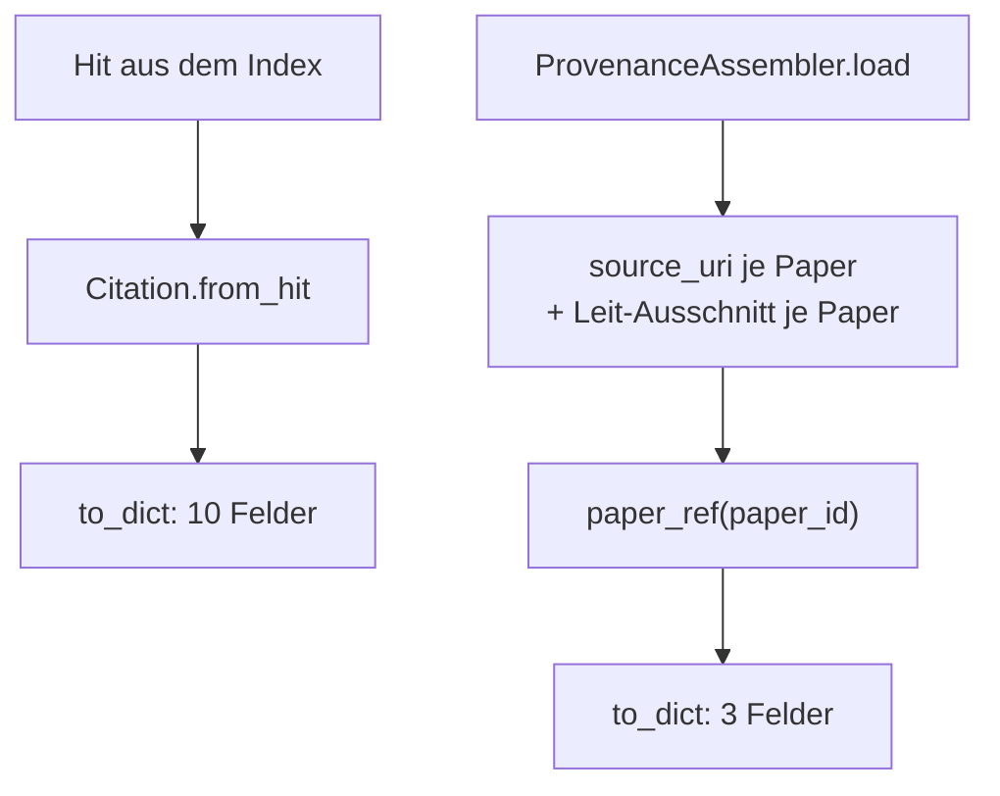
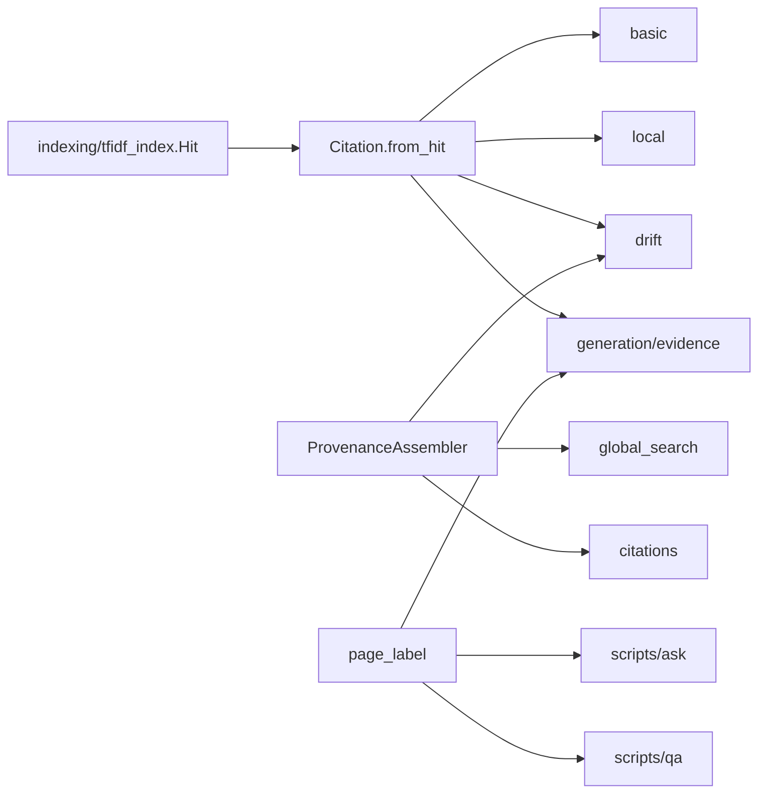

# Modul-Doku: `provenance.py`

| Feld | Wert |
| --- | --- |
| **Modul** | `src/research_graphrag/retrieval/provenance.py` |
| **Paket** | `retrieval` – Suchmodi und Provenienz |
| **Phase** | 4 (eingeführt), 7 / A3 + A4 (erweitert) |
| **Grundlagen** | [ADR 0008](../../../../docs/adr/0008-retrieval-and-query-router-phase4.md), [ADR 0013](../../../../docs/adr/0013-chunking-refinement-phase7.md), [ADR 0014](../../../../docs/adr/0014-hybrid-retrieval-bm25-tfidf-phase7.md) |

---

## 1. Zweck

Das **gemeinsame Vokabular der Belege**. Alle vier Suchmodi liefern ihre Provenienz über
dieselben zwei Typen – dadurch sehen Zitate überall gleich aus, egal welcher Modus sie erzeugt
hat.

Das ist die technische Umsetzung des wichtigsten Projektgrundsatzes: **keine Aussage ohne
Quellenanker**.

## 2. Öffentliche Schnittstelle

| Symbol | Art | Aufgabe |
| --- | --- | --- |
| `Citation` | Dataclass | Beleg auf **Chunk-Ebene**: Paper, Abschnitt, Seiten-Range, Chunk, Scores, Ausschnitt |
| `PaperRef` | Dataclass | Beleg auf **Paper-Ebene**: Paper, Quelle, Leit-Ausschnitt |
| `ProvenanceAssembler` | Klasse | Lädt Paper-Provenienz direkt aus dem Index und beantwortet `paper_ref()` |
| `page_label` | Funktion | Anzeigeform der Seiten-Provenienz: „Seite 7" bzw. „Seiten 7–8" |

## 3. Ablauf

### Zwei Belegebenen

`Citation` beantwortet „wo genau steht das?", `PaperRef` beantwortet „welches Paper ist gemeint?".
Die Trennung ist keine Bequemlichkeit, sondern inhaltlich begründet: Eine corpusweite Aussage ist
**nicht** auf eine einzelne Passage zurückführbar. Ein `PaperRef` ohne Seitenanker ist daher die
ehrlichere Angabe als eine willkürlich gewählte Seite.

### Der Assembler liest ohne Vektorraum

`ProvenanceAssembler.load` holt in **zwei** SQL-Abfragen alles, was es braucht: die Quell-URI je
Paper und den Text des jeweils ersten Chunks als Leit-Ausschnitt. Es wird kein `sklearn` geladen
und keine Matrix rekonstruiert.

Das ist der Grund, warum Global- und Zitations-Abfragen deutlich schneller sind als die
Chunk-Modi: Sie brauchen den Vektorraum gar nicht.

### Die Score-Felder

Ein Zitat trägt drei Zahlen: den Gesamt-Score der verwendeten Wertung sowie die beiden
Teil-Scores. Damit bleibt nachvollziehbar, welches Verfahren einen Treffer getragen hat.

> **Interpretationshinweis:** Bei der Standard-Wertung ist `score` ein **Fusionswert** aus Rängen,
> keine Ähnlichkeit. Er ordnet innerhalb einer Antwort und ist zwischen Anfragen nicht
> vergleichbar.

### Die Seiten-Range und ihre Invariante

`__post_init__` normalisiert eine Endseite, die vor der Startseite läge, auf die Startseite –
über `object.__setattr__`, weil die Dataclass `frozen` ist. Dieselbe Invariante garantiert
`Chunk` im Canonical-Modell; beide Ebenen können daher nicht auseinanderlaufen.

`page_label` ist die **einzige** Stelle, an der aus der Range ein Anzeigetext wird. Alle
Ausgabekanäle – Kommandozeile, QS-Harness, Evidenz-Aufbereitung – benutzen sie, damit dieselbe
Range überall gleich erscheint.

## 4. Zusammenspiel

Das Modul ist die **unterste** Schicht des Pakets: Es importiert nur den `Hit`-Typ und die
Fehlertaxonomie, kennt aber keinen Suchmodus. Deshalb kann jeder Modus es benutzen, ohne
Zyklen zu erzeugen.

## 5. Fehler und Grenzfälle

| Situation | Fehlercode |
| --- | --- |
| Index-Datei fehlt beim Laden des Assemblers | `not_found` |
| `paper_ref` mit unbekannter Paper-ID | `not_found` |
| Paper ohne Chunk-Text | kein Fehler – der Leit-Ausschnitt bleibt leer |

Die Dataclasses selbst validieren nicht; sie sind Träger, keine Torwächter.

## 6. Determinismus

- Der Leit-Ausschnitt ist immer der **erste** Chunk nach Zeilenreihenfolge, nie ein zufälliger.
- Ausschnitte werden auf eine feste Länge gekürzt und im Whitespace vereinheitlicht.
- `to_dict` liefert eine feste Feldreihenfolge – die Serialisierung ist damit vergleichbar.

## 7. Grenzen

- **Keine Bounding-Boxen.** Die feinste Auflösung ist Abschnitt und Seiten-Range
  ([ADR 0006](../../../../docs/adr/0006-canonical-model-phase2-scope.md)).
- **Der Abschnittstitel ist heuristisch** und kann leer oder ungenau sein.
- **Der Ausschnitt ist ein Anfangsausschnitt**, keine auf die Anfrage zugeschnittene Passage.
- **Keine Zitations-Formatierung.** Es entsteht kein Literaturstil, sondern strukturierte
  Provenienz.
