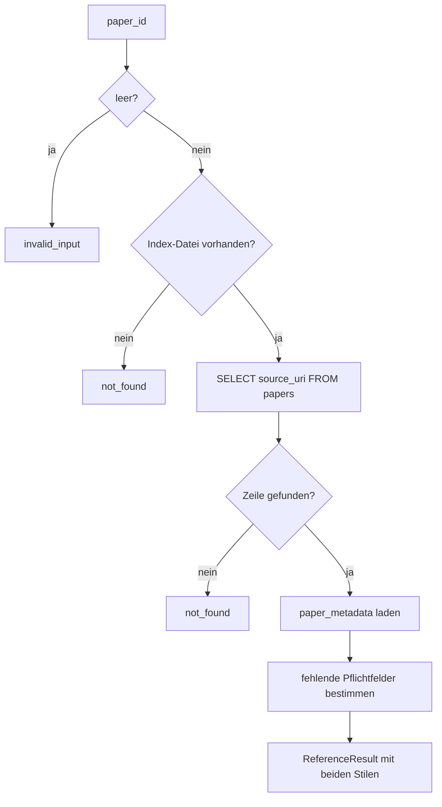
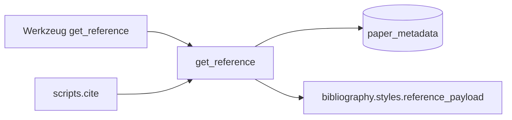

# Modul-Doku: `reference.py`

| Feld | Wert |
| --- | --- |
| **Modul** | `src/research_graphrag/retrieval/reference.py` |
| **Paket** | `retrieval` – Suchmodi und Provenienz |
| **Phase** | 12 / K1 |
| **Grundlagen** | [ADR 0025](../../../../docs/adr/0025-citable-paper-metadata.md) |

---

## 1. Zweck

Beantwortet genau eine Frage: **„Wie zitiere ich dieses Paper?"** Es liefert den aufgelösten
bibliografischen Datensatz samt fertiger Angabe in Harvard und APA – und sagt ausdrücklich, wenn
etwas fehlt.

## 2. Öffentliche Schnittstelle

| Symbol | Art | Aufgabe |
| --- | --- | --- |
| `get_reference` | Funktion | Paper-ID → `ReferenceResult` |
| `ReferenceResult` | Dataclass | Angabe, fehlende Felder und Klartext-Diagnose |
| `COMPLETION_HINT` | Konstante | Hinweis, wie fehlende Felder ergänzt werden |

## 3. Ablauf

### Unvollständigkeit ist ein Ergebnis, kein Fehler

Fehlen Titel, Autoren oder Jahr, entsteht trotzdem eine Angabe – nach den Regeln des jeweiligen
Stils (`n.d.` bzw. `no date`, Titel an Autorenstelle). Zusätzlich nennt `missing` die fehlenden
Felder und `note` erklärt im Klartext, **wie** sie ergänzt werden. Ein Agent kann daran erkennen,
dass er die Angabe nicht ungeprüft in eine Arbeit übernehmen sollte.

### Warum beide Stile immer geliefert werden

Der Stil ist **kein** Eingabeparameter. Ein Agent müsste sonst raten, welchen Stil die Arbeit
verlangt, und bei falscher Wahl ein zweites Mal anfragen. Beide Formen sind billig – sie
entstehen aus denselben Feldern.

### Abgrenzung zu `get_paper`

[paper](paper.md) beschreibt das **Dokument** (Umfang, Abschnitte, Leit-Ausschnitt) und trägt die
Literaturangabe seit Phase 12 als Zusatzfeld. Dieses Modul beantwortet ausschließlich die
Zitierfrage und liefert dafür zusätzlich die Diagnose.

## 4. Zusammenspiel

## 5. Fehler und Grenzfälle

| Situation | Fehlercode |
| --- | --- |
| leere `paper_id` | `invalid_input` (geprüft **vor** dem Dateizugriff) |
| Index-Datei fehlt | `not_found` |
| Paper-ID unbekannt | `not_found` |
| Tabelle `paper_metadata` fehlt (Index vor Phase 12) | kein Fehler – leerer Datensatz, `citable = false` |

## 6. Determinismus

Direkte Index-Reads und rein funktionale Formatierung; kein Netz, kein Datum, kein Zufall.

## 7. Grenzen

- **Keine Auflösung zur Abfragezeit.** Fehlende Felder werden gemeldet, nicht beschafft; das
  leistet der separate Lauf `python -m scripts.resolve_metadata`.
- **Keine Prüfung**, ob die Angabe sachlich stimmt – nur, ob sie vollständig ist.
- **Nur Harvard und APA** (siehe [styles](../../bibliography/doc/styles.md)).
