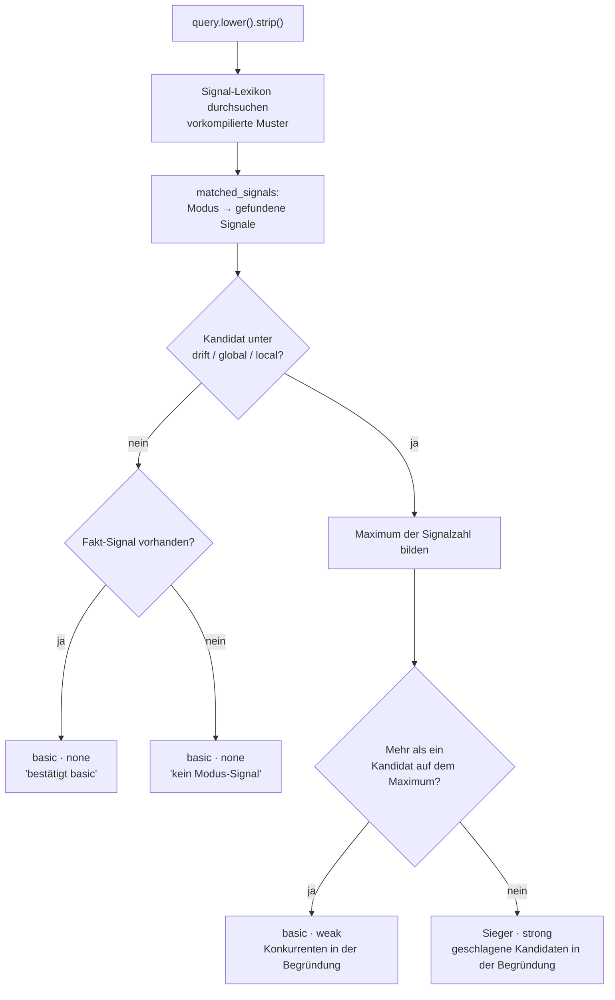
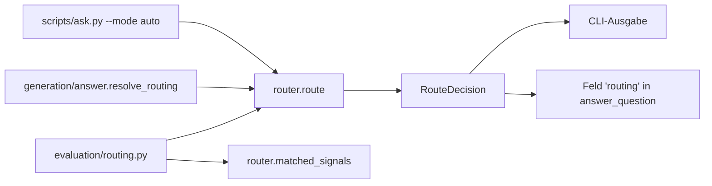

# Modul-Doku: `router.py`

| Feld | Wert |
| --- | --- |
| **Modul** | `src/research_graphrag/retrieval/router.py` |
| **Paket** | `retrieval` – Suchmodi und Provenienz |
| **Phase** | 4 (eingeführt), 7 / A7 (gehärtet) |
| **Grundlagen** | [ADR 0008](../../../../docs/adr/0008-retrieval-and-query-router-phase4.md), [ADR 0017](../../../../docs/adr/0017-router-hardening-phase7.md) |

---

## 1. Zweck

Der Router ordnet eine natürlichsprachige Frage einem der vier Suchmodi zu – **ohne
Datenbankzugriff, ohne Modell, allein anhand des Fragetextes**. Er existiert für den Komfort von
`--mode auto` und `answer_question`; die explizite Modus-Wahl bleibt gleichwertig.

Die Kernidee: Statt eines undurchsichtigen Scores liefert der Router eine **nachvollziehbare
Entscheidung** – Modus, Konfidenzstufe, die auslösenden Signale und eine Begründung im Klartext.

## 2. Öffentliche Schnittstelle

| Symbol | Art | Aufgabe |
| --- | --- | --- |
| `route` | Funktion | Ordnet eine Frage einem Modus zu und liefert die vollständige Begründung |
| `matched_signals` | Funktion | Liefert je Modus die in der Frage gefundenen Signale (Grundlage für Messung und Diagnose) |
| `RouteDecision` | Dataclass | Entscheidung mit `mode`, `confidence`, `signals`, `rationale` und `to_dict()` |
| `Signal` | Dataclass | Ein Lexikon-Eintrag: Text, Zielmodus, Match-Art |
| `SIGNALS` | Konstante | Das Signal-Lexikon in Auswertungsreihenfolge – die Single Source of Truth |
| `MODES` | Konstante | Die vier gültigen Modi (zugleich die Auswahl der Kommandozeile) |
| `STRUCTURAL_MODES` | Konstante | Die Modi, die als Kandidaten antreten dürfen |
| `DEFAULT_MODE` | Konstante | Die Rückfallebene |
| `CONFIDENCE_STRONG` / `_WEAK` / `_NONE` | Konstanten | Die drei Konfidenzstufen |
| `CONFIDENCES` | Konstante | Dieselben drei Stufen als Tupel (Prüfung gültiger Werte) |
| `MatchKind` | Typ-Alias | `word` · `prefix` · `stem` |

## 3. Ablauf

### Die drei Match-Arten

Jedes Signal deklariert selbst, wie es treffen darf – das ist der Kern der Härtung:

| Art | Muster | Wofür |
| --- | --- | --- |
| `word` | `\bsignal\b` | Wortformen, bei denen verwandte Formen eine **andere** Bedeutung tragen |
| `prefix` | `\bsignal\w*` | englische Wortfamilien mit einheitlicher Bedeutung samt Beugung |
| `stem` | Teilwort, unverankert | ausschließlich deutsche Wortstämme (Komposita, Beugung) |

Die Muster werden beim Import **einmal** kompiliert; `route` selbst führt nur noch Suchen aus.

### Die Entscheidungsregel

Drei Festlegungen, die zusammen das Verhalten ergeben:

1. **Nur strukturelle Modi sind Kandidaten.** `drift`, `global` und `local` beschreiben eine
   *Frageform*. `basic` beschreibt keine Form, sondern ist der belegstärkste Standardweg.
2. **Fakt-Signale bestätigen nur.** Sie erscheinen in `signals`, verschieben aber keine
   Entscheidung – sonst zöge „Vergleiche den F1-Score" wegen `score` zu `basic`, obwohl
   „vergleich" eindeutig eine Vergleichsfrage markiert.
3. **Gleichstand fällt zurück, statt zu würfeln.** Haben zwei Kandidaten gleich viele Signale,
   gewinnt keiner: Das Ergebnis ist `basic` mit Konfidenz `weak`, und die Konkurrenten stehen
   samt Signalen in der Begründung.

Damit ist die feste Präzedenz aus [ADR 0008](../../../../docs/adr/0008-retrieval-and-query-router-phase4.md)
abgelöst – sie überstimmte früher auch eine klare Mehrheit.

### Warum einzelne Signale so aussehen, wie sie aussehen

Das Lexikon enthält mehrere Einträge, deren Form auf einem Messbefund beruht und daher nicht
„aufgeräumt" werden sollte:

- `differ`, `compare` und `unterschied` stehen als **ausgeschriebene Wortliste** statt als
  Wortanfang. `different`, `comparable` oder `unterschiedlich` beschreiben keine Vergleichsfrage
  und wären als `prefix` eine Fehlalarm-Quelle.
- `metrik` ist als Wortform geführt, obwohl es ein deutscher Stamm ist: Als Teilwort trifft es
  den Zeitschriftennamen *Biometrika*.
- `trends` steht im Plural, `corpus` nur in Reichweiten-Formulierungen wie `across the corpus` –
  die Singularformen bezeichnen einen Gegenstand, keine Übersichtsfrage.

## 4. Zusammenspiel

Das Modul hat **keine** Abhängigkeit zu Index, Datenbank oder `sklearn` – nur `re` und
`dataclasses`. Deshalb lässt sich die Router-Treue messen, ohne einen Index zu bauen.

`matched_signals` ist öffentlich, weil die Messung die Signal-Abdeckung prüft: Jedes Signal im
Lexikon muss von mindestens einer Gold-Frage ausgelöst werden, sonst ist es unbelegt.

## 5. Fehler und Grenzfälle

Das Modul wirft **keine** `DomainError`. Die Modus-Validierung liegt eine Ebene höher in
`generation/answer.resolve_routing`; `route` selbst liefert für jede Eingabe eine Entscheidung.

| Eingabe | Ergebnis |
| --- | --- |
| leerer String | `basic`, Konfidenz `none` |
| Frage ohne Signal | `basic`, Konfidenz `none` |
| Frage nur mit Fakt-Signal | `basic`, Konfidenz `none`, Signal in der Begründung |
| Signale für zwei Kandidaten, gleich viele | `basic`, Konfidenz `weak` |

Die Konfidenzstufen sind bewusst **benannte Stufen** und keine Fließkommazahl: Eine Zahl würde
eine Wahrscheinlichkeit suggerieren, die eine Substring-Heuristik nicht liefern kann.

## 6. Determinismus

Vollständig deterministisch:

- Die Muster werden aus `SIGNALS` in fester Reihenfolge kompiliert.
- `matched_signals` sammelt Treffer in **Lexikon-Reihenfolge**, nicht in Fundreihenfolge im Text.
- Die Sieger-Ermittlung iteriert über `STRUCTURAL_MODES` in fester Reihenfolge, sodass auch die
  Liste der Anführenden stabil ist.
- Es gibt keinen Zufall, keinen Zeitbezug und keine Abhängigkeit von der Umgebung.

## 7. Grenzen

- **Lexikalisch, nicht semantisch.** Eine Frage ohne bekanntes Signalwort landet bei `basic`,
  auch wenn sie inhaltlich corpusweit gemeint ist. Das ist die bewusste Grenze eines
  Heuristik-Routers.
- **Der Fallback ist konservativ.** Bei Gleichstand wird nicht der „wahrscheinlichere" Modus
  gewählt, sondern der belegstärkste – nachvollziehbar, aber nicht immer optimal.
- **Ein bekannter Gold-Fall bleibt offen.** Der einzige Fehlgriff im Router-Gold-Set ist genau
  der eine konstruierte Gleichstands-Fall; er ist als bekannte Grenze eingefroren
  ([ADR 0017](../../../../docs/adr/0017-router-hardening-phase7.md)).
- **Das Lexikon ist die Wartungsstelle.** Ein neues Signal wirkt sofort auf alle Aufrufer; es
  gehört deshalb zusammen mit einer Gold-Frage ergänzt, sonst schlägt die Abdeckungsprüfung an.
