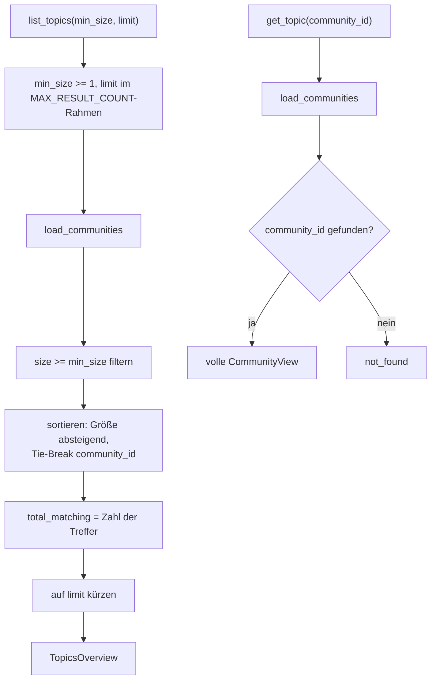
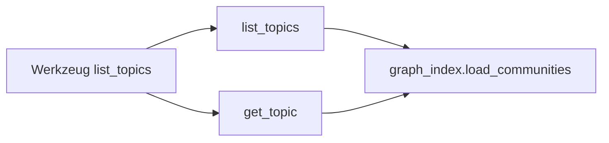

# Modul-Doku: `topics.py`

| Feld | Wert |
| --- | --- |
| **Modul** | `src/research_graphrag/retrieval/topics.py` |
| **Paket** | `retrieval` – Suchmodi und Provenienz |
| **Phase** | ADR 0037 |
| **Grundlagen** | [ADR 0007](../../../../docs/adr/0007-graphrag-index-phase3-option-b.md) · [ADR 0037](../../../../docs/adr/0037-mcp-tool-response-size-ceiling.md) |

---

## 1. Zweck

Liefert die Fachlogik hinter dem MCP-Tool `list_topics`: eine **gefilterte, gedeckelte
Übersicht** der Korpus-Communities für den Überblicks-Zweck, plus einen **Einzelabruf** mit voller
Mitgliederliste für den Moment, in dem ein Aufrufer sie tatsächlich braucht.

Vor diesem Modul lag `list_topics` als einzige Ausnahme direkt im Server, ohne eigene
Fachlogik-Schicht – eine unbedingte Weiterreichung von `graph_index.load_communities`. Mit
Filterung, Deckelung und Einzelabruf hat das Werkzeug genug Fachlogik, um denselben
dünnen-Wrapper-Grundsatz wie die übrigen acht Werkzeuge zu verdienen.

## 2. Öffentliche Schnittstelle

| Symbol | Art | Aufgabe |
| --- | --- | --- |
| `list_topics` | Funktion | Gefilterte, gedeckelte Übersicht → `TopicsOverview` |
| `get_topic` | Funktion | Eine `community_id` → volle `CommunityView` (mit `members`) |
| `TopicsOverview` | Dataclass | `topics`, `total_matching`, `truncated`, mit `to_dict()` |
| `TopicSummary` | Dataclass | Eine Community **ohne** `members`, mit `to_dict()` |
| `DEFAULT_MIN_SIZE`, `DEFAULT_LIMIT` | Konstanten | Standardwerte der Übersicht |

## 3. Ablauf

### Warum zwei Funktionen statt einer mit optionalem Rückgabetyp

`list_topics` und `get_topic` haben **unterschiedliche** Verträge: Die Übersicht ist gefiltert,
gedeckelt und membergelöst; der Einzelabruf ist ungefiltert und vollständig. Eine gemeinsame
Funktion mit einem Union-Rückgabetyp hätte diesen Unterschied verwischt. Der MCP-Wrapper
(`server.py::list_topics_tool`) entscheidet anhand von `community_id`, welche der beiden er ruft –
dieselbe Dispatch-Logik, die ein Aufrufer ohnehin bräuchte.

### Warum `min_size` Singleton-Communities standardmäßig ausblendet

Eine Community aus **einem** Paper trägt keine cross-paper-Synthese – sie ist kein sinnvolles
„Themencluster" im Sinn des Werkzeugs. Am realen Korpus sind 951 von 1.170 Communities Singletons;
ohne den Filter würde die Übersicht zu 81 % aus bedeutungslosen Ein-Paper-Einträgen bestehen, die
zugleich den größten Anteil der Antwortgröße tragen (`keywords`/`summary` **je** Community, nicht
nur `members`, siehe [ADR 0037](../../../../docs/adr/0037-mcp-tool-response-size-ceiling.md)).
`min_size=1` hebt den Filter auf, wenn ein Aufrufer wirklich jede Community sehen will.

### Warum `members` nur im Einzelabruf steht

Die volle Mitgliederliste **aller** Communities war der ursprüngliche Auslöser der 555-KB-Antwort.
Da ein Aufrufer nach der Übersicht ohnehin gezielt **eine** Community auswählt (für
`search_global`/`search_drift`), verschiebt `get_topic` die teure Information genau dorthin, wo sie
gebraucht wird – selbst die größte Community (105 Mitglieder) kostet dort nur 2,5 KB.

### Warum `truncated`/`total_matching` und nicht nur eine gekürzte Liste

Eine gekürzte Liste ohne Kennzeichnung sähe wie eine vollständige aus. `total_matching` nennt die
Zahl **vor** `limit`, `truncated` macht die Kürzung explizit – dasselbe Transparenz-Muster wie
DRIFTs `fallback` und `get_citations`s `cites_total`/`cited_by_total`.

## 4. Zusammenspiel

## 5. Fehler und Grenzfälle

| Situation | Fehlercode |
| --- | --- |
| `min_size < 1` | `invalid_input` |
| `limit <= 0` oder `limit > MAX_RESULT_COUNT` | `invalid_input` |
| Index-Datei fehlt | `not_found` (aus `load_communities`) |
| kein Graph/keine Communities gebaut | `constraint_violation` (aus `load_communities`) |
| `get_topic` mit unbekannter `community_id` | `not_found` |
| keine Community erfüllt `min_size` | kein Fehler – `topics = ()`, `total_matching = 0` |

## 6. Determinismus

Die Sortierung ist stabil: absteigend nach `size`, Tie-Break aufsteigend über `community_id` – nie
über die Speicherreihenfolge. `load_communities` selbst ist deterministisch (fixer Louvain-Seed,
Phase 3).

## 7. Grenzen

- **Ein Einzelabruf pro Aufruf.** `get_topic` liefert genau eine Community; mehrere Details
  erfordern mehrere Aufrufe (dieselbe Grenze wie bei `get_citations`/`get_paper`).
- **Keine Query/Relevanz-Filterung.** Die Sortierung ist rein größenbasiert; für query-relevante
  Communities gibt es `search_global`/`search_drift`.
- **`min_size`/`limit` filtern nach der Sortierung, nicht danach.** Eine Änderung von `min_size`
  kann deshalb auch bewirken, dass eine zuvor durch `limit` abgeschnittene kleinere Community jetzt
  gar nicht mehr in Frage kommt, statt nachzurücken – das ist die triviale, erwartete Interaktion
  zweier unabhängiger Filter.
