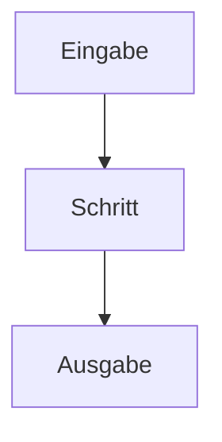

# Modul-Doku: `<modul>.py`

> Vorlage für die **Modul-Dokumentation**. Kopiere diese Datei nach
> `src/research_graphrag/<paket>/doc/<modul>.md` (Top-Level-Module nach
> `src/research_graphrag/doc/`) und fülle sie **gemeinsam mit der Implementierung** aus.
>
> **Zweck:** Die Modul-Doku erklärt die **innere Funktionsweise** des Codes (das *Wie*). Sie
> ergänzt den Docstring (erklärt Symbole), die Tool-Spezifikation (definiert den *Vertrag*)
> und den ADR (begründet das *Warum*).
>
> **Rangordnung:** Diese Datei ist **beschreibend, nicht normativ**. Bei Widerspruch gilt die
> Tool-Spezifikation, dann der Code – diese Datei wird korrigiert
> ([ADR 0018](../docs/adr/0018-code-documentation-architecture.md)).
>
> **Zielgruppe:** Personen und Agenten, die den Code lesen, warten oder erweitern.
> **Sprache:** Deutsch; etablierte englische Fachbegriffe (Retrieval, Provenienz, Chunk …)
> und Code-Bezeichner bleiben englisch.
> **Diagramme:** Mermaid. Pflicht bei mehrstufigem Ablauf, entbehrlich bei reinen
> Datentyp-/Konstanten-Modulen (Right-sizing).
>
> **Nicht hier hinein:** Korpus- und Messzahlen (→ ADR bzw. `python -m scripts.status`),
> Begründungen (→ ADR), Ordnerbäume (→ `docs/repository-structure.md`).
>
> Lösche diesen Hinweisblock nach dem Ausfüllen.

| Feld | Wert |
| --- | --- |
| **Modul** | `src/research_graphrag/<paket>/<modul>.py` |
| **Paket** | `<paket>` – <Verantwortung des Pakets in drei Worten> |
| **Phase** | <Roadmap-Phase der vollen Ausbaustufe> |
| **Grundlagen** | Verlinke die einschlägigen ADRs unter `docs/adr/`. Der relative Pfad geht aus `<paket>/doc/` **vier** Ebenen aufwärts, aus `doc/` **drei**. |

---

## 1. Zweck

Ein bis drei Sätze: Welche Aufgabe erfüllt dieses Modul im System, und was ist die Kernidee
seiner Lösung?

## 2. Öffentliche Schnittstelle

| Symbol | Art | Aufgabe |
| --- | --- | --- |
| `beispiel_funktion` | Funktion | ... |
| `BeispielTyp` | Dataclass | ... |
| `BEISPIEL_KONSTANTE` | Konstante | ... |

## 3. Ablauf

Der Weg von der Eingabe zur Ausgabe. Nenne die beteiligten Funktionen in ihrer
Auswertungsreihenfolge und markiere Stellen, an denen eine Regel eine andere überstimmt.

## 4. Zusammenspiel

Von welchen Modulen wird dieses Modul aufgerufen, welche ruft es selbst auf, und welche
externen Ressourcen (Index-Datei, Canonical JSON, Client-Modell …) berührt es?

## 5. Fehler und Grenzfälle

Welche Fehler wirft das Modul (Kategorien aus `docs/error-model.md`), und wie verhält es sich an
den Rändern (leere Eingabe, fehlende Datei, kein Treffer)?

## 6. Determinismus

Woher kommt die Reproduzierbarkeit: Seeds, Sortier- und Tie-Break-Regeln, stabile
Serialisierung. Falls stochastische Anteile existieren, hier benennen.

## 7. Grenzen

Was dieses Modul bewusst **nicht** tut, mit Verweis auf den ADR, der die Abgrenzung festhält.
