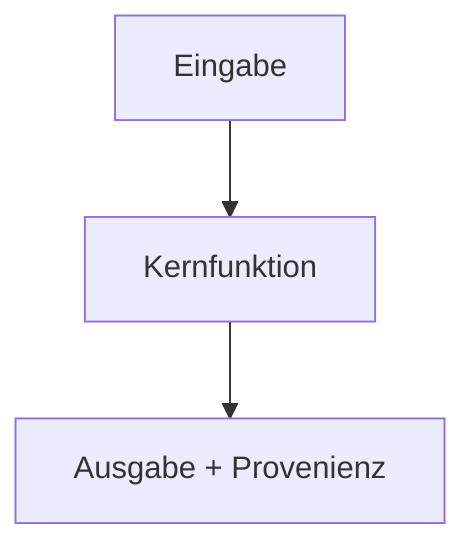
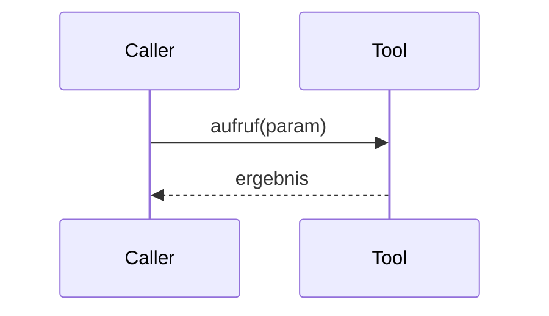

# Code-Walkthrough: `<tool_name>`

> **Abgelöst.** Diese Vorlage wurde durch [templates/module-doc.md](module-doc.md) ersetzt
> ([ADR 0018](../docs/adr/0018-code-documentation-architecture.md)). Die Funktionsweise des Codes
> wird nicht mehr pro Tool als `<tool_name>.code.md`, sondern **pro Modul** unter
> `src/research_graphrag/<paket>/doc/<modul>.md` dokumentiert – passend zum Zuschnitt des Codes,
> dessen Logik in Modulen liegt und dessen Tools nur dünne Wrapper sind. Die Datei bleibt zur
> Nachvollziehbarkeit erhalten und wird nicht mehr verwendet.

> Vorlage für den **Code-Walkthrough** eines Tools. Kopiere diese Datei nach
> `src/research_graphrag/mcp_server/specs/<tool_name>.code.md` und fülle sie **gemeinsam
> mit der Implementierung** aus. Der Walkthrough erklärt die **innere Funktionsweise des
> Codes** (das *Wie*) und ergänzt die Tool-Spezifikation `<tool_name>.md`, die den
> **Vertrag** (das *Was*) beschreibt. Beide Dateien dürfen sich nicht widersprechen.
>
> **Zielgruppe:** Personen, die den Code lesen, warten oder erweitern.
> **Sprache:** Deutsch; etablierte englische Fachbegriffe (AST, Retrieval, Provenienz …)
> und Code-Bezeichner bleiben englisch.
> **Diagramme:** Mermaid, damit sie ohne Zusatzwerkzeuge in der Markdown-Vorschau rendern.

---

## Metadaten

| Feld | Wert |
| --- | --- |
| **Tool-Name** | `<tool_name>` (z. B. `search_local`) |
| **Modul** | `src/research_graphrag/mcp_server/tools/<modul>.py` |
| **Spezifikation** | `<tool_name>.md` |
| **Version** | passend zur Tool-Spezifikation (`MAJOR.MINOR.PATCH`) |

---

## 1. Überblick und Verantwortung

Ein bis drei Sätze: Was macht dieser Code, welche Kernidee steckt dahinter und welche
Design-Entscheidungen (ggf. mit ADR-Verweis) prägen die Umsetzung?

## 2. Modul- und Datenfluss

Grobbild von der Eingabe bis zur Ausgabe. Nenne die beteiligten Funktionen, Hilfsmodule
und externen Ressourcen (Dateien, Index-Artefakte, MCP-Sampling …).

## 3. Zentrale Funktionen und Aufrufsequenz

| Funktion | Verantwortung |
| --- | --- |
| `beispiel_funktion` | ... |

## 4. Zentrale Datentypen

Die für das Verständnis wichtigen Datenstrukturen (Dataclasses, TypedDicts, Protocols).

## 5. Fehlerbehandlung

Wie werden Fehler erkannt und ausgegeben? Zuordnung zu den Fehlerkategorien aus
`docs/error-model.md`.

## 6. Reproduzierbarkeit und Determinismus

Deterministische vs. stochastische Anteile, Seeds, Sortier-/Tie-Break-Regeln,
Versionsabhängigkeiten.

## 7. Grenzen und bewusste Vereinfachungen

Was der Code bewusst **nicht** tut (Abgrenzung zur Tool-Spezifikation, Abschnitt „Grenzen").
